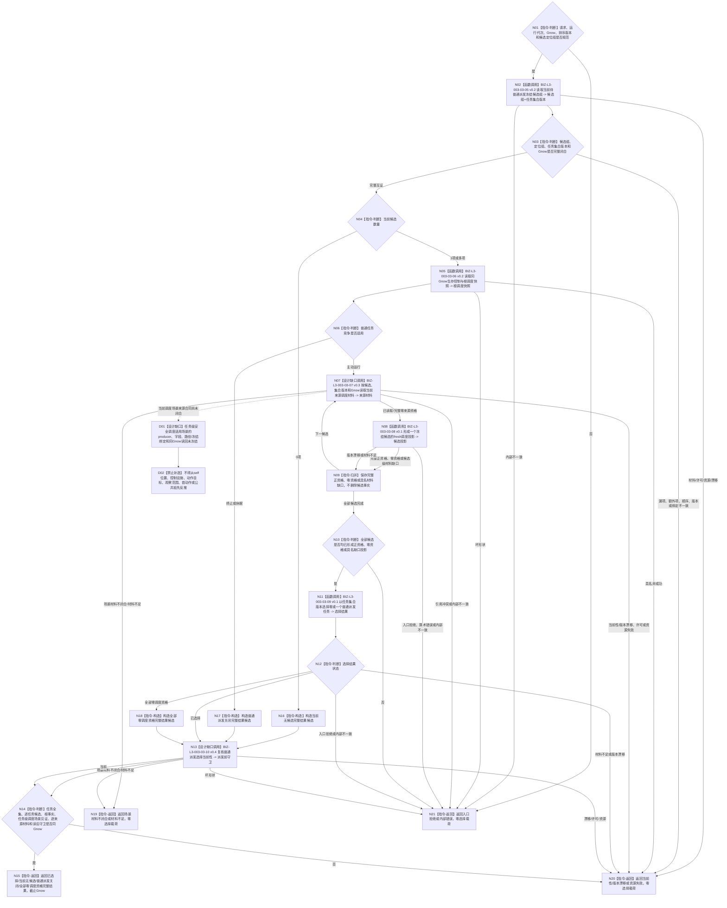

# BIZ-L2-003-03 选择一个冻结后当前可普通派发任务目标函数流程图 v0.5

更新时间：2026-08-28

## 依据

```text
0050 v2.1、3200、5090 v0.7、5200、5230 v1.2、6150 v0.7、6170、8100 v0.7、8200 v0.7
用户场景边界：self、控制设施和受影响存在可属于同一上层场景；不得把控制位置、动作目标和调度场景拆成互不相干的世界
父线程函数：BIZ-L1-T03 v0.6 任务管理线程::运行结果上行循环
前置：任务管理已经接管当前阶段定位；候选权威仍须由本图同Gnow正式重读
后继：只有本图返回已选择，才允许BIZ-L2-004-04冻结并派发所选执行工作包
```

## 身份与边界

正式粗层目标函数替代图。本函数只在执行冻结完成后、真实派发前，读取 task owner 中性的当前任务全集，在BIZ层逐任务读取ARCH-L2当前阶段、正式选择/冻结/实例和排队事实，形成同一 `Gnow` 的完整候选；随后经正式生存安全根读回形成根调度快照，并逐候选读取当前 `T→D`、目标、基础优先级、安全和服务材料，形成fresh投影并选择0..1项。

v0.5保留v0.4的中性任务全集、任务集合版本、生存安全根和逐来源调度结构，但撤回“5230 v1.6 / 6150 v0.12已经冻结共同作用场景”的未发布依据。目标业务要求安全调度发生在能够同时容纳self、控制设施和受影响存在的同一上层场景中；self可以改变该场景内控制设施的特征并因果影响同场景内其它存在。这个边界不允许把self位置、控制设施、动作直接目标分别改写成三个互斥调度场景，也不允许从任一局部对象反推任务级调度场景。

当前发布源码尚未冻结任务级安全调度适用场景的唯一生产者、强类型字段、路径/冻结持久绑定和同Gnow正式读回。因此L3-07的调度场景材料分支保持具名DRIFT；任务全集、控制态、根配额、T→D、目标、基础优先级和其它已冻结材料可继续设计，但不得绕过场景缺口形成可普通派发成功。

本函数不参与需求选择、任务承接、筹办、路径选择、实例形成或执行冻结，也不发布安全值、服务值、任务状态、授权、硬否决或排队事实。列表成员、队列到达顺序、缓存、日志、动作目标、自我位置、调用方子集和旧任务治理状态不得冒充正式输入。

## 函数合同

```text
根函数：任务普通派发选择组合器::选择一个冻结后当前可普通派发任务
归属模块 / 文件 / 目标分解深度：任务普通派发选择 / 海中鱼巣/领域/内部治理/服务.任务普通派发选择.ixx / BIZ-L2
现有或待新增：待新增；发布源码只有字段不闭合且固定返回材料缺口的旧治理骨架
完整签名：任务普通派发选择结果 任务普通派发选择组合器::选择一个冻结后当前可普通派发任务(const 任务普通派发选择请求& 请求) const noexcept
参数：
  请求：只读借用；绑定运行代次、非零Gnow、排序规则版本和任务管理当前全部候选定位组；不接收调用方声明的任务集合版本、A/L/H、基础优先级、self位置、动作目标或裸安全调度场景
  每个候选定位：绑定任务、任务轮次、筹办轮次、执行轮次、执行冻结、实例方法、当前路径和执行绑定冻结材料；定位只作任务管理接管见证，不产生候选资格或调度输入
返回结果：
  状态为已选择、当前无候选、普通派发关闭、全部零调度资格、场景材料不闭合、材料不足、当前性漂移、版本漂移、入口拒绝、资源失败或内部错误
  已选择时恰含一个所选候选、L3-05任务集合版本、完整生存控制态、根调度配额、逐T→D来源投影、任务级安全调度场景正式绑定与同场景成员互证见证、并列最高来源、基础/有效优先级、稳定排序证据和截止Gnow
  当前无候选、普通派发关闭和全部零调度资格是完整读取结果，选择载荷为空、截止等于Gnow；场景材料不闭合及其它非成功选择载荷为空、截止0
被调函数流程图：BIZ-L3-003-03-05 v0.2、06 v0.2、08/09 v0.1；07 v0.3与10 v0.4已经恢复任务级安全调度场景来源DRIFT，当前作为设计缺口子图，不形成普通派发成功；旧BIZ-L3-003-03-01—04及更早版本保持历史冻结
```

## 流程图



## 节点合同

| 节点 | 类型 | 输入绑定 | 输出绑定 | 事实读写 | 后继条件 | 验证 |
| --- | --- | --- | --- | --- | --- | --- |
| N02—N04 | L3-05 v0.2 / 判断 | 定位组、Gnow | 中性任务全集经BIZ筛选的0..N候选与任务集合版本 | 只读任务、存在、状态、冻结和排队事实 | DATA不判断阶段；合法0项有完整覆盖 | 空组、漏、多、重、阶段变化、已有在途 |
| N05/N06 | L3-06 v0.2 / 判断 | 自我、安全根、Gnow、范围和规则版本 | 正式A/L/H、控制态与两类根配额 | 只读生存安全根事实 | A=0/1关闭普通派发；A>1继续 | 0/1/L/H、版本回显、根配额守恒 |
| N07—N09/D01/D02 | L3-07 v0.3设计缺口 / L3-08 / 归并 | 单候选、当前T→D/目标/B、未来正式任务级安全调度场景绑定、安全/服务版本 | 逐来源及任务调度投影或具名DRIFT | 目标为只读任务、场景、需求、因果、安全和服务owner；当前场景分支零调用 | 多来源取最高且保留并列，不求和 | 列表不补入；同一上层场景内成员可因果作用但不生产调度键；来源合同未冻结时零派发 |
| N10—N12 | L3-09 v0.1 / 判断 | 全部候选投影与任务集合版本 | 0..1所选候选和排序证据 | 无写入 | 零资格不删除任务；缺口不伪装零 | 多任务、并列、组5完整比较链 |
| N13/N14 | L3-10 v0.4设计缺口 / 判断 | 原候选/定位/根快照/未来正式场景来源/全部版本 | 派发前当前性守卫 | 当前场景分支零调用 | 任一变化整份选择失效 | 加入/退出、阶段、冻结、排队、B、正式场景和来源漂移 |

## 关键边界

- 任务集合版本只由中性完整任务全集读取产生；调用方不得自报、由数量计算或从安全结果反推。
- 生存控制和根配额唯一来自正式安全根读回；任务、线程和调度器不得声明或缓存覆盖。
- 当前 `T→D` 只取执行冻结本轮实际消费的正式关系；列表其它成员、历史来源和旧投影不得补造。
- 安全调度适用场景是任务级统一执行上下文场景。self、控制设施和受影响存在可以是同一场景内三个存在；self改变控制设施特征并因果影响其它存在，不要求把它们拆成三个场景。
- 当前发布规范 5230 v1.2 / 6150 v0.7没有冻结该场景的producer、路径/冻结字段和同Gnow读回。任务基础优先级DATA读取ABI及调度场景生产合同未闭合前不得宣称本链已实现，也不得以旧权限请求、self位置、动作目标或内部容器取得假PASS。
- 已选择后BIZ-L2-004-04仍须形成不可变工作包；动作开始前还须fresh复核冻结、调度资格、自我授权、技术许可和安全硬否决。

## v0.5 校正记录

- L3-06 v0.2固定复用现有生存安全根读取叶并在函数内计算6170根配额。
- L3-07 v0.3保留当前冻结、T→D、来源目标、服务合同和基础优先级边界；安全来源调度叶恢复场景来源DRIFT。
- 撤回未发布5230 v1.6 / 6150 v0.12依据和“共同作用场景已闭合”声明，恢复当前发布规范版本分账。
- 固定同一上层场景语义：self、控制设施和受影响存在是场景成员，不按动作对象拆分场景；但任务级调度场景来源仍是具名DRIFT。
- L3-10 v0.4继续要求整体守卫根快照、B、未来正式调度场景绑定和逐来源版本；场景合同闭合前零当前成功。
