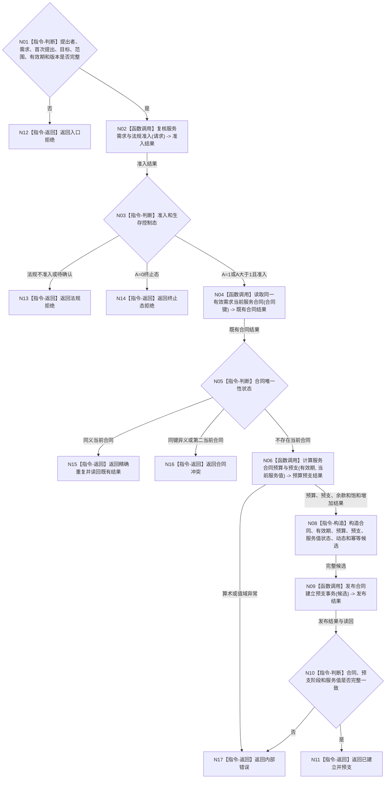

# BIZ-L2-003-04 建立服务合同并结算预支目标函数流程图 v0.1

更新时间：2026-08-03

## 依据

```text
6120、6160、6170、8200
父线程函数：BIZ-L1-T02 自我线程::运行治理循环
```

## 身份与边界

正式目标函数设计图。根函数只对已经正式建立、来源可验证且法规准入的新人类服务需求建立唯一服务合同，并在同一事务冻结预算和结算 30% 预支；它不执行服务任务，也不进行完整秒衰减或生存安全根回归。

## 函数合同

```text
根函数：建立服务合同并结算预支
归属模块 / 文件 / 层级：服务合同治理 / 海中鱼巣/领域/服务.服务合同.ixx / L2
现有或待新增：待新增
完整签名：服务合同建立结果 服务合同服务::建立服务合同并结算预支(const 服务合同建立请求& 请求)
参数：请求：const 服务合同建立请求&，只读借用；必须携带自我、提出者、需求及首次提出事件、目标、范围、法规准入、生存控制态、有效期、当前服务值、时间纪元、事实截止版本、待形成稳定身份和规则版本
返回结果：服务合同建立结果；包含已建立并预支、精确重复、法规拒绝、终止态拒绝、材料不足、有效期拒绝、版本漂移或内部错误，以及合同身份、冻结预算、30%应付值、实际写入值、舍弃值、服务值后状态和发布版本
被调函数流程图：BIZ-L3-003-04-01—04
```

## 流程图



## 节点合同

| 节点 | 类型 | 输入绑定 | 输出绑定 | 事实读写 | 验证 |
| --- | --- | --- | --- | --- | --- |
| N02 | 函数调用 | 正式需求、提出者、来源事件和法规材料 | 服务准入结果 | 只读已发布事实 | 来源、法规和 A=0/1/>1 |
| N04 | 函数调用 | 合同唯一键和截止版本 | 当前合同或空 | 只读服务合同 | 有效期内唯一、同义幂等 |
| N06 | 函数调用 | 有效秒、D0、当前服务值 | B、P0、P1、实际写入和舍弃值 | 无写入 | 30/70、宽整数、饱和增加 |
| N09/N10 | 函数调用 / 判断 | 合同与预支完整候选 | 发布结果与权威读回 | 服务合同、服务值、状态、动态和幂等账同事务 | 全确认、逆序撤销、零半结构 |

## 关键边界

- 同一来源需求有效期内只有一个当前合同；任务拆分、方法重试和补充说明不得重复预支。
- 30%预支是合同成立时的独立原子结算；`维护服务与生存安全` 以后只读取该已发布结果，不重复结算。
- 人类请求、合同或预支不直接把生存安全根值写为主动运行；唤醒只能在后续合法完整秒维护中形成。
- 服务值饱和舍弃的超额不得以后补领。
