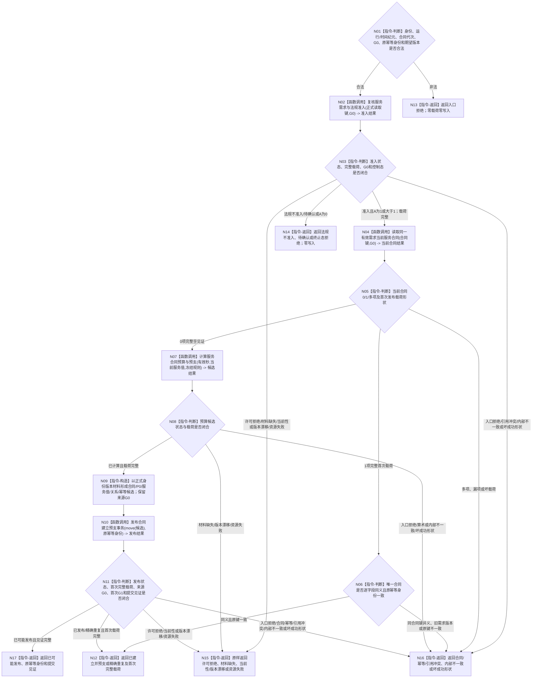

# BIZ-L2-003-04 建立服务合同并结算预支目标函数流程图 v0.2

更新时间：2026-08-27

## 依据

```text
0050、4050、6120、6160、6170
父级调用点：人类服务需求正式准入完成后的合法入口；BIZ-L1-T02 v0.6当前登记来源缺口
```

## 身份与边界

正式目标函数设计图。根函数只为来源可验证、法规准入且当前有效的人类服务需求建立唯一服务合同，并在同一事务冻结预算、结算30%预支和发布服务值变化；同义重放必须读取首次完整结果。它不执行服务任务，不授予普通派发或现实执行权限，也不直接唤醒生存安全根。

## 函数合同

```text
根函数：服务合同服务::建立或读取服务合同
归属模块 / 文件 / 目标分解深度：服务合同治理 / 海中鱼巣/领域/服务.服务合同.ixx / BIZ-L2
现有或待新增：目标组合待实现；发布源码无服务合同生产模块、正式provider、预算算法、事务数据操作或普通应用装配
完整签名：服务合同建立结果 服务合同服务::建立或读取服务合同(const 服务合同建立请求& 请求) noexcept
参数：请求为只读借用；只携带自我、提出者、需求、首次提出事件、合同代次、运行代次、时间纪元、来源事实截止G0、原幂等身份、正式读取键和全部期望版本。目标、范围、有效期、法规结论、生存控制态、当前服务值及合同建立身份版本材料必须按G0正式读回，禁止由调用方补造
返回结果：服务合同建立结果；已建立并预支或精确重复时携带首次完整合同/P0/服务值载荷、来源G0和首次G1。法规拒绝、待确认、终止态拒绝、材料缺失、入口/许可拒绝、当前性/版本漂移、合同/幂等/引用冲突、资源失败、已可能发布或内部不一致结构化分账；非成功零普通载荷
被调函数流程图：BIZ-L3-003-04-01—04 v0.2；01展开两张G0准入读取叶，02展开两张0/N合同读取叶，04展开三张事务/首次读回叶
```

## 流程图



## 节点合同

| 节点 | 类型 | 输入绑定 | 输出绑定 | 事实读写 | 后继条件 | 验证 |
| --- | --- | --- | --- | --- | --- | --- |
| N01—N03 | 判断 / 调用 | 正式读取键、G0和期望版本 | 同G0准入快照 | 只读已发布事实 | A=1允许准入但不授权派发 | 法规三态、A=0/1/大于1、状态×载荷 |
| N04—N06 | 调用 / 判断 | 合同唯一键与G0 | 0项完整见证或唯一首次载荷 | 只读合同、关系、结算与幂等账 | 多项停止；同义必须读回原结果 | 索引漏项、旧版本、同键异义 |
| N07—N09 | 调用 / 判断 / 构造 | 正式有效期、当前V和规则 | B/P0/P1及完整候选 | 仅形成候选 | 固定D0/M；身份版本不由算法生成 | 默认/显式有效期、饱和和安全乘除 |
| N10—N11 | 调用 / 判断 | 候选、G0和原幂等身份 | 一次事务结果与首次G1 | 合同/P0/服务值/关系/幂等同事务 | 全确认、逆序撤销、最后发布 | 提交未知、重复零副作用、首次读回 |
| N12—N17 | 返回 | 已复核结果 | 结构化父级结果 | 无新增写入 | 返回T02 | 成功与非成功载荷形状、G0/G1分账 |

## 关键边界

- 同一来源需求有效期内只有一个当前合同；补充说明、任务拆分、子任务、方法重试和执行回合不得创建第二合同、重复P0或扩大预算。
- `D0`、`I64_MAX`、默认有效期和预算规则由正式版本化规则读取，不是调用方可变输入；纯值候选不能自行宣称权威精确重复。
- 索引、SQL、日志、缓存或当前服务值净值都不能证明合同全集、P0阶段或首次发布结果；精确重复必须回读原幂等账与首次完整载荷。
- 合同/P0独立事务不修改生存安全根。A=1允许合同准入，但普通任务只有后续完整秒已合法形成A大于1且派发/授权均通过后才可执行。
- 发布源码只有治理骨架和相邻中性读取能力，无本图生产实现；目标图闭合不证明详细设计、代码、构建、运行或业务闭环完成。
