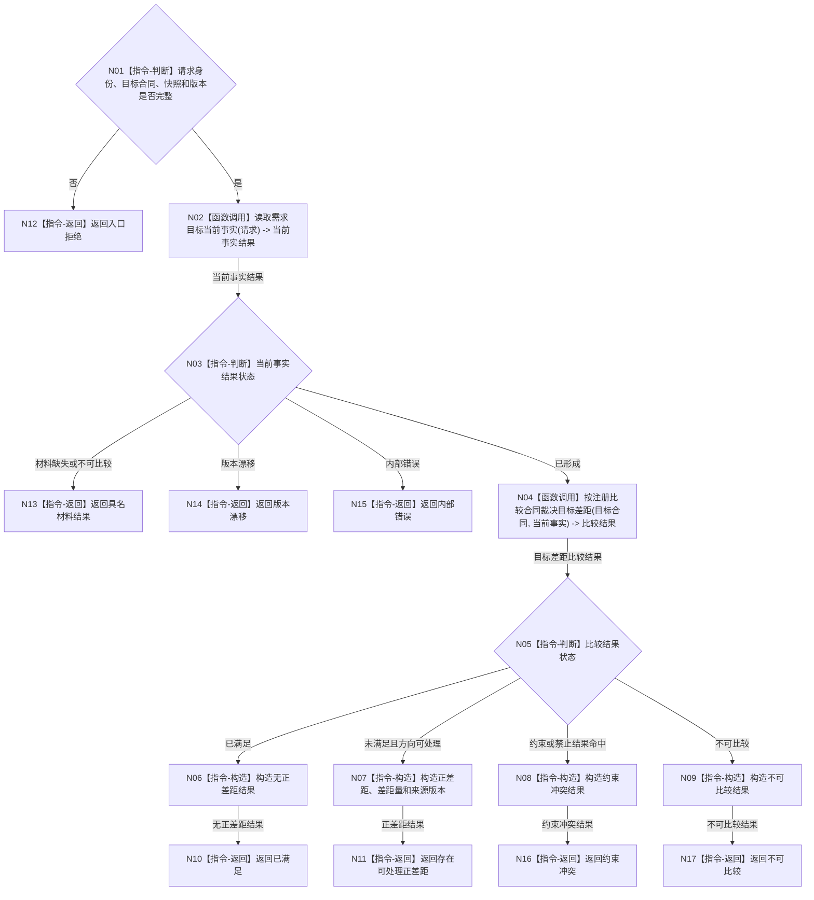

# BIZ-L2-004-01 确认当前正差距目标函数流程图 v0.1

更新时间：2026-08-03

## 依据

```text
3100、4050、4180、5090、5100、5120、6180、8210、8300
父线程函数：BIZ-L1-T02 自我线程::运行治理循环
当前代码：需求业务服务::判定目标状态达成只支持既有需求的等值达成裁决
```

## 身份与边界

正式目标函数设计图。根函数只确认当前目标是否存在可处理正差距，不创建需求、任务或方法，不把目标、预测、执行报告或缓存值当作当前事实。

## 函数合同

```text
根函数：确认当前正差距
归属模块 / 文件 / 层级：需求目标裁决 / 海中鱼巣/领域/服务.需求.ixx / L2
现有或待新增：适配扩展；复用需求业务服务事实所有权，现有判定目标状态达成不覆盖通用比较和无既有需求输入
完整签名：需求正差距结果 需求业务服务::确认当前正差距(const 需求正差距请求& 请求) const
参数：
  请求：const 需求正差距请求&，只读借用，调用期间有效；必须携带自我、目标宿主、场景、目标特征、目标状态合同、当前世界快照身份、事实截止版本和比较合同版本
返回结果：
  需求正差距结果；包含已满足、存在可处理正差距、约束冲突、不可比较、材料缺失、比较未注册、版本漂移、入口拒绝、许可拒绝、资源失败或内部不一致，以及目标、当前事实和完整特征比较结果
被调函数流程图：读取需求目标当前事实、按注册比较合同裁决目标差距；下一层待展开
```

### 当前最早施工叶

```text
SELF-GOV-G05-F0 只建立上述最终公开签名、需求包装 DTO 和稳定状态数值；比较载荷直接复用 COMPARE-F 的最终类型。
骨架阶段对任意输入固定返回：未实现、事实截止代次 0、空载荷、零内存权威发布。
骨架不校验请求，不调用下层函数，不读取 SQL、缓存、线程或世界事实。
COMPARE-F 合同骨架代码是本叶的类型提供者门禁；读取当前事实与真实注册比较仍是后继提供者。各真实结果进入正式代码前，本图下述目标流程保持待激活。
```

## 流程图



## 节点合同

| 节点 | 类型 | 参数 / 输入绑定 | 结果 / 输出绑定 | 事实读写 | 后继条件 | 验证 |
| --- | --- | --- | --- | --- | --- | --- |
| N02 | 函数调用 | 请求中的目标、场景、快照和截止版本 | 当前事实结果 | 只读目标事实所有者 | 具名状态 | 同代次、同主体、同特征 |
| N04 | 函数调用 | 目标状态合同、当前事实、比较合同版本 | 比较结果 | 无写入 | 具名比较状态 | 注册算法、单位和值域一致 |
| N06/N07 | 指令-构造 | 当前事实与比较结果 | 无差距或正差距 DTO | 无写入 | 构造完整 | 差距方向和来源可回查 |
| N08/N09 | 指令-构造 | 约束或比较拒绝材料 | 逻辑内结果 | 无写入 | 构造完整 | 不默认成功或失败 |

## 关键边界

- “正差距”是目标合同与当前已发布事实的结构化比较结果，不是简单 `目标值 - 当前值`。
- 需求尚未建立时仍可确认目标候选差距；不得先创建需求再用需求身份反向证明差距。
- 当前代码的等值判定可以作为等值目标适配候选，但不能覆盖区间、方向、枚举集合和判断收束合同。
- 本函数全程只读；任何需求创建或当前满足提交都由后继需求领域入口负责。
- 调用方必须先冻结同代次事实截止版本并释放消息 / 队列锁；本函数不读取工作线程私有状态，不持有锁等待外部事实。
- 不同目标可以并发读取；同一请求若跨版本或跨代次只能返回漂移，不能拼装混代正差距。
- `未实现` 是稳定逻辑内结果，只允许证明最终 ABI 已编译接入和入口可巡检；不得解释为已满足、无差距、材料缺失或比较成功。
- 差距方向、差距量、单位 / 维度 / 分量角色、比较注册、算法版本、误差量化和输入回执必须直接由完整 `特征比较结果` 承载；禁止建立需求领域的简化比较 DTO，禁止把裸 `I64` 或裸容器当作正差距。
- 比较用途固定为目标判断，左右角色固定为当前事实 / 目标状态；请求中的比较合同只作预期版本门禁，调用方不得借此选择算法或交换左右角色。
