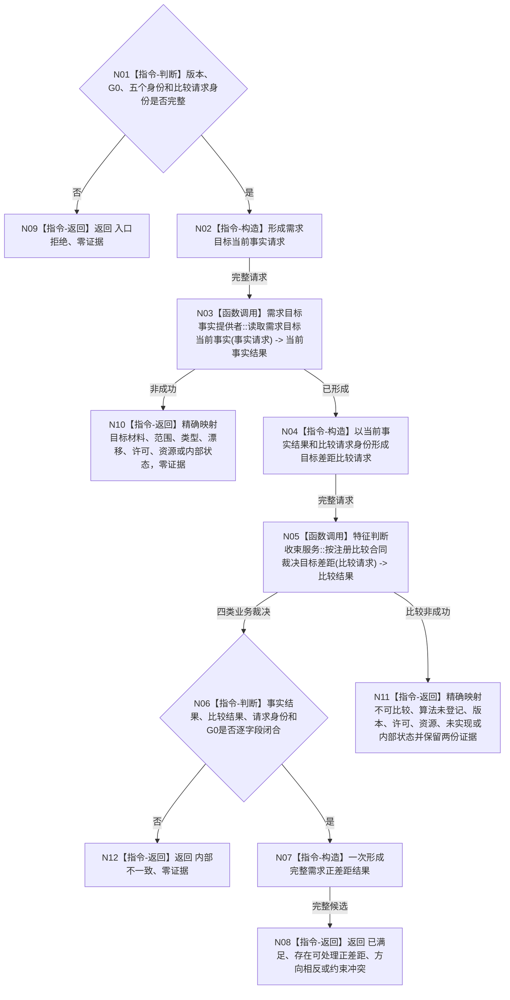

# BIZ-L2-004-01 确认当前正差距目标函数流程图 v0.2

更新时间：2026-08-16

## 依据

```text
0050、3100、4160、4180、5100、5120
BIZ-L3-004-01-01 v0.3、BIZ-L3-004-01-02 v0.2
父线程：BIZ-L1-T02 v0.4
```

## 身份与边界

正式目标函数设计图。根函数只确认一个尚未建立需求的目标候选在调用方给定的非零 `G0` 是否已满足、存在可处理正差距、方向相反或约束冲突；不创建需求、任务或方法，不读取需求结构，不把预测、报告、缓存或线程状态当作当前事实。

v0.2 正式替代 v0.1 的 `需求业务服务`归属、世界快照身份和历史骨架段。目标候选在需求之前存在，本函数没有需求身份也不消费 DATA-EXT-12，因此归属独立 `需求目标裁决服务`；旧需求 owner 入口不得复活。

## 函数合同

```text
根函数：需求目标裁决服务::确认当前正差距
归属模块 / 文件 / 目标分解深度：海中鱼巣.领域.服务.需求目标裁决 / 海中鱼巣/领域/服务.需求目标裁决.ixx / BIZ-L2
现有或待新增：待新增组合服务；按值持有一个需求目标事实提供者和一个特征判断收束服务
完整签名：需求正差距结果 需求目标裁决服务::确认当前正差距(const 需求正差距请求& 请求) const noexcept
参数：合同 / 规则版本、非零G0、场景树 / 场景 / 宿主 / 目标合同 / 特征定义五个强类型身份和非零比较请求身份
返回结果：值式结果；第一叶失败零事实 / 比较证据，第二叶非成功保留完整目标当前事实与结构化比较证据，四类业务裁决携带两份完整证据
被调函数流程图：BIZ-L3-004-01-01 v0.3、BIZ-L3-004-01-02 v0.2
父图：BIZ-L1-T02 v0.4
```

## 流程图



## 节点合同

| 节点 | 类型 | 参数 / 输入绑定 | 结果 / 输出绑定 | 事实读写 | 验证 |
| --- | --- | --- | --- | --- | --- |
| N03 | 函数调用 | 请求版本、G0与五身份 | `需求目标当前事实结果` | 只读 BIZ provider | 恰一次；请求参数与结果回显逐字段相等 |
| N04/N05 | 构造 / 函数调用 | 完整当前事实结果、非零比较请求身份 | `目标差距比较结果` | 只读 BIZ比较服务 | 恰一次；不拆出裸值或复制注册字段为第二权威 |
| N06/N07 | 判断 / 构造 | 两份完整结果 | `需求正差距结果` | 无写入 | G0、身份、注册、当前值和完整比较证据可追溯 |
| N09—N12 | 返回 | 入口或子结果状态 | 结构化非成功 | 无 | 第一叶失败零证据；第二叶失败保留完整前置与比较结果；坏互证零证据 |

## 关键边界

- 本函数只调用两个 BIZ 子服务，零 DATA / L1 直达、零需求 owner、零注册读取、零写、零重试、零缓存或截止重选。
- `需求目标裁决服务`构造时从同一 `L2结构聚合服务`形成两个子服务；普通应用是否持有本服务、专用 getter与 T02 正式接线属于后继。
- 正差距不是裸 `目标值-当前值`。方向、差异、单位 / 维度 / 分量角色、注册、算法、误差和输入回执全部由完整 `L2特征比较结果`承载。
- `方向相反`和`约束冲突`不是可创建需求的正差距；后继需求准入只能消费 `存在可处理正差距`。
- 本叶不实现跨进程恢复，也不声明需求建立、任务树或治理循环闭环。
