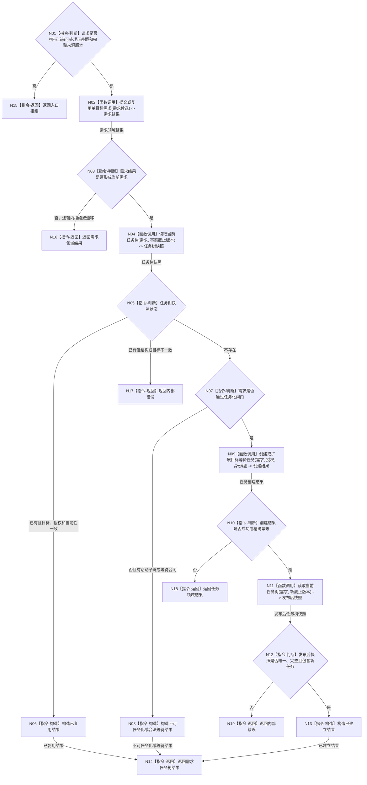

# BIZ-L2-004-02 建立或复用需求任务树目标函数流程图 v0.1

更新时间：2026-08-03

## 依据

```text
3100、3200、5090、5110、5120、8100
父线程函数：BIZ-L1-T03 任务管理线程::运行治理循环
当前代码：需求任务方法组合器::创建需求并承接任务只覆盖单次创建，不覆盖唯一当前任务树复用和多来源等价目标
```

## 身份与边界

正式目标函数设计图。根函数编排需求领域与任务领域的正式入口，建立或复用一个正差距对应的当前需求及唯一任务树；它不裸写需求、任务或世界事实。

## 函数合同

```text
根函数：建立或复用需求任务树
归属模块 / 文件 / 层级：需求任务方法组合 / 海中鱼巣/领域/组合.需求任务方法.ixx / L2
现有或待新增：适配扩展；现有创建需求并承接任务可提供创建候选，但缺当前任务树查询、复用、多来源等价目标和任务化闸门
完整签名：需求任务树结果 需求任务方法组合器::建立或复用需求任务树(const 需求任务树请求& 请求) const
参数：
  请求：const 需求任务树请求&，只读借用，调用期间有效；必须携带正差距结果、需求来源、父需求 / 活动路径、授权、权重与预算版本、事实截止版本、幂等身份组和发生时间
返回结果：
  需求任务树结果；包含已复用、已建立、需求已存在但不可任务化、合法等待、入口拒绝、版本漂移或内部错误，以及需求、任务树根、当前可调度任务组、来源需求集合和冻结版本
被调函数流程图：已由 BIZ-L3-004-02-01、BIZ-L3-004-02-02 与 BIZ-L3-004-02-03 冻结；只在其中仍隐藏非平凡函数调用时继续下钻
```

## 流程图



## 节点合同

| 节点 | 类型 | 参数 / 输入绑定 | 结果 / 输出绑定 | 事实读写 | 后继条件 | 验证 |
| --- | --- | --- | --- | --- | --- | --- |
| N02 | 函数调用 | 正差距、来源、父路径、幂等身份 | 当前需求结果 | 需求领域正式入口 | 已形成或具名返回 | 单目标、去重、无循环 |
| N04/N11 | 函数调用 | 需求、目标语义、截止版本 | 当前任务树快照 | 只读需求 / 任务领域 | 不存在、完整或错误 | 同一有效需求唯一当前任务树 |
| N07 | 指令-判断 | 目标、角色、活动子链、授权和当前性 | 任务化闸门结果 | 无写入 | 可任务化或闭合返回 | 不按拓扑数量和名称裁决 |
| N09 | 函数调用 | 需求集合、单目标、授权、身份组 | 创建结果 | 任务领域正式入口 | 成功、幂等或拒绝 | 唯一运行态治理存在 |
| N12 | 指令-判断 | 发布后快照和创建结果 | 完整性结论 | 无写入 | 完整或内部错误 | 零平行任务根、来源全保留 |

## 关键边界

- 同一有效来源需求复用唯一当前任务树；恢复有效时复用原身份和历史，不新建平行根。
- 目标语义等价的多个需求可以分别授权同一单目标任务，但每个来源的路径、权重、预算、权限和当前性必须保留。
- 管理、逻辑组织、AND / OR 路径和有活动子链的需求不得直接当作普通叶子任务化。
- 当前代码只承接一个来源需求，不能直接证明多来源目标等价、唯一任务树或恢复复用已经实现。
- 自我或治理线程只提交需求和任务意图；需求、任务领域服务分别拥有事实写入权，调用期间不得持有消息或任务队列锁。
- 同一来源需求的并发建立必须按稳定业务身份收束为同义读回或具名冲突；不同需求可以并发，线程编号和到达顺序不参与唯一性。
