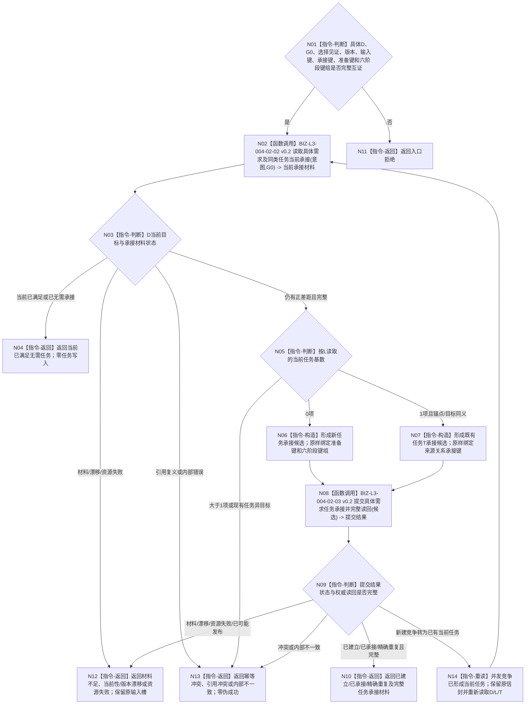

# BIZ-L2-004-02 按具体需求承接或复用任务目标函数流程图 v0.2

更新时间：2026-08-27

## 依据与替代

```text
0050、3200、4260 v0.9、5090、5200 v0.9、8100、8200
BIZ-L1-T03 v0.4
BIZ-L3-004-02-02 v0.2、BIZ-L3-004-02-03 v0.2
```

本图完整替代 v0.1“建立或复用需求任务树”。旧图从正差距重新提交需求、按目标等价建立任务树，并把需求创建、任务父子拓扑和任务承接混为一个入口；这些职责全部退出本图。当前入口只消费上游已经唯一选择并正式交付的一个具体需求 `D`，不得创建需求、枚举列表其它成员或补造任务树。

## 身份与边界

正式目标函数设计图。T03 从单项输入槽取得一份不可变 `具体需求任务承接意图`，先独立读取 `D`、其当前所属列表项 `L` 和按 `L` 查询的 `0..1` 个当前任务。无当前任务时，按完整六阶段幂等信封建立任务专属正式存在 `E`，再分 owner 形成 `T + T→L + T→D + T→E + R1`、阶段实例、首态、`P1/A1` 和第一动态；有当前任务时只按承接关系幂等键新增或精确重复 `T→D`。

本函数不把多 owner 写入伪装成一个事务。每一阶段分别使用自己的写前代次、幂等账、发布未知恢复和正式读回；最终成功必须从公开入口互证完整权威材料。

## 函数合同

```text
根函数：按具体需求承接或复用任务
归属模块 / 文件 / 目标分解深度：任务承接组合 / 海中鱼巣/领域/组合.任务承接.ixx / BIZ-L2
现有或待新增：待新增；HEAD只有旧“形成唯一任务与初次筹办工作包”及按列表项读取，尚无本统一业务入口
完整签名：具体需求任务承接结果 任务承接组合器::按具体需求承接或复用任务(const 具体需求任务承接请求& 请求) noexcept
参数：请求只读借用；含完整具体需求任务承接意图、同一输入槽身份及重试见证。意图必须携带D、自我、治理批次、运行代次、来源G0、选择见证、合同版本、输入幂等身份、既有任务来源关系承接幂等身份、准备幂等身份，以及存在建立/任务核心建立/阶段特征实例建立/首态建立/P1建立/首迁移六阶段幂等身份组；准备幂等身份必须等于P1建立键，六键全部非零且两两不同
返回结果：当前已满足无需任务、已建立并形成首轮初次筹办、已承接既有任务、精确重复、入口拒绝、材料不足、当前性/版本漂移、幂等冲突、引用冲突、资源失败或内部不一致；成功载荷携带T、L、D、T→D、正式E/T→E、R1及新任务分支的全局阶段定义、E阶段实例、首态、P1/A1、后态和第一动态完整读回
被调函数流程图：BIZ-L3-004-02-02 v0.2 读取具体需求及同类任务当前承接；BIZ-L3-004-02-03 v0.2 提交具体需求任务承接并完整读回
线程归属：T03在队列锁外调用；处理期间保留同一输入槽和完整幂等信封
```

## 流程图



## 节点合同

| 节点 | 类型 | 参数 / 输入绑定 | 结果 / 输出绑定 | 事实读写 | 后继条件 | 验证 |
| --- | --- | --- | --- | --- | --- | --- |
| N01 | 指令-判断 | 一个D承接意图和完整幂等信封 | 可进入或入口拒绝 | 无业务读写 | 全字段有效且准备键=P1键 | 六键非零/两两不同；禁止派生或换键 |
| N02/N03 | 函数调用 / 判断 | D、选择见证、G0 | D/L/0..1T、当前目标与既有来源材料 | 只读需求、目标、任务及关系 | 当前已满足、0项、1项或具名非成功 | 不从L其它成员、缓存、消息正文补造D或T |
| N06 | 指令-构造 | 0项当前任务、完整六阶段信封 | 新任务承接候选 | 无写入 | 交03新建分支 | 存在、task核心、实例、首态、P1、首迁移六键原样传递 |
| N07 | 指令-构造 | 唯一当前T及同义目标 | 既有任务承接候选 | 无写入 | 交03复用分支 | 只使用来源关系承接键；不重建E/R1/首态 |
| N08/N09 | 函数调用 / 判断 | 分型候选和原完整信封 | 分owner提交与正式读回 | 只经具名领域服务：新建分支分owner发布业务事实，复用分支只由task owner写入T→D，并分别正式读回 | 完整成功、竞争重读或具名非成功 | 每阶段独立G0/G1、幂等、未知恢复和读回 |
| N10—N14 | 返回 / 重读 | 结构化结果 | 最终承接结果或同槽恢复 | 不新增业务写入 | T03进入任务主阶段治理或保留槽 | 发布返回、消息、日志和兼容虚拟存在均不证明完整成功 |

## 关键边界

- `L`只用于同类任务查询和防重；任务来源权威只有逐次形成的 `T→D`。列表其它成员不得自动承接。
- 新任务的 `E`由存在 owner先建立并读回；task owner只在自己的核心写集中引用E，不创建、退出或修改E。
- 新任务 task-owner核心写集原子形成 `T/T→L/T→D/T→E/R1`；全局阶段定义使用固定`TASKSTAG`键，E阶段实例、首态、`P1/A1`和第一动态属于后继独立owner阶段，不得描述为同一跨owner事务。
- 既有任务分支不得重建任务、E、R1或初次筹办记录，只允许验证同锚点/同目标后幂等新增 `T→D`。
- 新建竞争返回“已有当前任务”时只能保留原D和原完整信封重新读取，不能换承接键、六阶段键或把另一请求的任务身份写回消息。
- 当前已满足只形成零动作/无需任务结果；需求自己的正式满足核算由实际使用时fresh独立核算入口负责，本函数不批量结算需求。

## 当前代码实现对照

- HEAD `需求初次筹办准备请求`只携带一枚旧`任务建立幂等身份`，`形成唯一任务与初次筹办工作包`仍创建task-owner私有虚拟存在；未满足准备键加六阶段键组、正式E/R1/T→D/T→E及分owner读回合同。
- HEAD `L2任务结构服务`仍只有`按需求列表项读取当前任务`和旧`新增任务`；没有已发布的`按同类任务查询锚点读取当前任务`、`承接具体来源需求`及按任务读取正式来源关系组生产ABI。
- HEAD没有`任务承接组合器::按具体需求承接或复用任务`生产入口。因而本图只证明目标业务合同已校正，不证明代码实现、构建或端到端闭环。

## v0.2 校正记录

- 删除正差距到需求创建、目标等价任务树和任务父子拓扑；入口固定为一个已选具体需求D。
- 把一枚模糊承接键拆成既有任务来源关系承接键，以及新任务准备键/六阶段键组；全部由上游一次分配并原样交付。
- 新任务与既有任务分支分账；新增并发竞争重读、分owner事实代次和发布未知恢复边界。
- 最终成功改为正式读回 `T/L/D/T→D/E/T→E/R1`及新任务首态链，不以任务创建返回或兼容虚拟存在代替。
