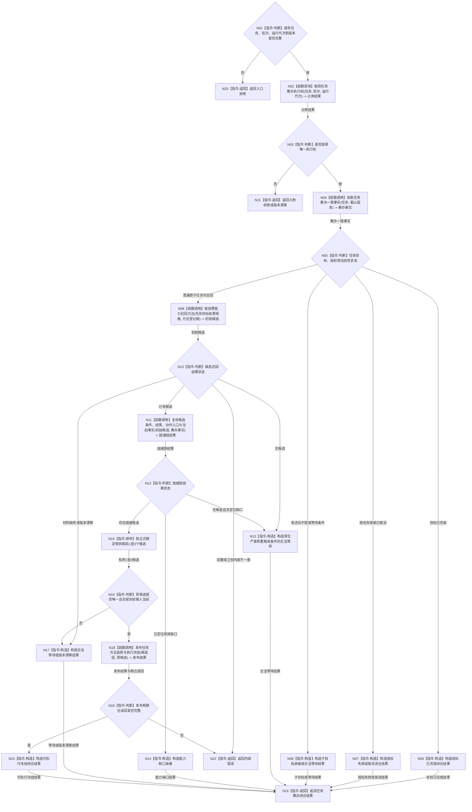

# BIZ-L2-004-03 筹办并冻结方法候选目标函数流程图 v0.1

更新时间：2026-08-03

## 依据

```text
3200、4190、4310、4320、5090、5230、5250、5300、8100、8200
父线程函数：BIZ-L1-T04 任务工作线程::运行工作循环；由筹办 / 重筹办工作包触发
当前代码：方法召回业务服务可重建并排序候选，需求任务方法组合器只在唯一建议时提交一个当前选择
旧鱼巢参考：流程图/鱼巢流程/20260712_旧鱼巢筹办方法与执行现状流程图_v0.1.md
吸收边界：按5250固定为“先按目标结果能力召回方法，再读取候选方法条件并绑定当前事实”；旧因果模板和旧候选实现体不迁移
```

## 身份与边界

正式目标函数设计图。根函数属于任务领域筹办边界：取得任务级唯一筹办执行权，权威重读并形成六类闭合结果之一；可执行结果最多携带三个不可变实例候选和一个明确当前选择。

## 函数合同

```text
根函数：筹办并冻结方法候选
归属模块 / 文件 / 层级：任务筹办 / 海中鱼巣/领域/服务.任务筹办.ixx / L2
现有或待新增：待新增；复用方法召回、任务选择和执行冻结相邻能力，现有组合未覆盖筹办占用、六类闭合结果及最多三个实例候选
完整签名：任务筹办闭合结果 任务筹办服务::筹办并冻结方法候选(const 任务筹办请求& 请求)
参数：
  请求：const 任务筹办请求&，只读借用，调用期间有效；必须携带任务稳定身份、期望筹办轮次、运行代次、事实截止版本、授权 / 权限版本、方法登记根、规则版本和幂等身份组
返回结果：
  任务筹办闭合结果；必须是可执行冻结、子目标承接、能力缺口承接、合法等待、目标已完成、授权失效 / 取消之一，或入口拒绝、版本漂移、资源失败和内部错误；可执行冻结含1—3个有序不可变候选、一个当前选择及完整冻结身份
被调函数流程图：取得任务筹办执行权、读取任务筹办一致事实、按结果能力召回方法、复核候选条件结果动作入口与当前事实、发布任务方法选择与执行冻结；下一层待展开
线程归属：由取得筹办工作包的一个任务工作线程在队列锁外调用；任务管理线程只决定并派发工作种类，不同步调用本函数
```

## 流程图



## 节点合同

| 节点 | 类型 | 参数 / 输入绑定 | 结果 / 输出绑定 | 事实读写 | 后继条件 | 验证 |
| --- | --- | --- | --- | --- | --- | --- |
| N02 | 函数调用 | 任务、轮次、运行代次、幂等身份 | 占用结果 | 任务筹办占用事实 | 唯一取得或拒绝 | 同任务单执行权、旧代次不继承 |
| N04 | 函数调用 | 任务和事实截止版本 | 筹办一致事实 | 只读需求、任务、方法、世界和权限事实 | 具名状态 | 全来源、版本和当前性 |
| N09/N10 | 函数调用 / 判断 | 任务目标结果规格、方法登记根和固定截止 | 初始候选或具名召回结果 | 索引只作候选起点，随后权威回读方法登记、生命周期和结果规格 | 无候选、漂移、错误或已有候选 | 先方法后条件；名称和通用原语不参与命中 |
| N11 | 函数调用 | 初始候选和筹办一致事实 | 逐候选条件、结果、动作入口、参数、禁止项、授权和当前事实复判结果 | 只读方法、世界、授权和因果证据 | 空、缺口或就绪候选 | 每个候选独立读取条件并绑定当前事实 |
| N15 | 指令-排序 | 完整就绪候选 | 有序1—3候选 | 无写入 | 数量1—3 | 不足不补造、稳定同序 |
| N18 | 函数调用 | 候选组、首候选、任务 / 方法版本和来源集合 | 选择与冻结发布结果 | 任务领域事务 | 全确认或撤销 | 关系16、生命周期互证、联合读回 |
| N19 | 指令-判断 | 发布结果和权威读回 | 完整性结论 | 无写入 | 完整或内部错误 | 零半选择、零事后补配 |

## 关键边界

- 任务筹办是任务领域内建动作，不进入普通方法召回，也不建立独立筹办回执。
- 一个回合最多实例化三个候选，不足三个不得补造；只有任务领域明确发布的当前选择可以进入本轮执行。
- 无候选不是能力缺口本身；无法定位具体缺口时必须形成带等待对象、合法生产者和重触发条件的合法等待。
- 当前代码的候选排序和唯一建议可以作为召回适配候选，但没有任务级筹办占用、完整六类闭合结果和三实例冻结，因此不能直接复用为本函数。
- 每轮必须先用任务目标结果规格召回候选方法；只有候选方法已经权威回读成立后，才读取该候选的方法条件、条件结果对和相关因果证据。因果材料不得越过候选方法直接决定条件。
- 零候选方法时只形成带生产者和重触发条件的合法等待，或在缺口角色与合法处理方已经明确时形成能力缺口；不得继续凭空寻找条件或自动建立方法首。
- 执行前既有结构缺口必须在本函数内暴露；不得留到执行期补造后继续。
- 同一任务同一时刻只允许一个有效筹办占用和执行权；不同任务可以并发筹办，即使来源需求或候选方法相同。
- 筹办闭合后只形成同种类的瞬时任务工作回执交回任务管理线程；该回执用于跨线程传递，不建立独立持久化筹办回执事实。
- 占用身份由任务、轮次、运行代次和版本裁决，不保存或恢复裸线程编号；旧运行代次占用不得直接继承为新执行权。
- 筹办调用不得在任务队列锁内执行，候选和当前选择发布后以不可变值式材料交给派发函数。
