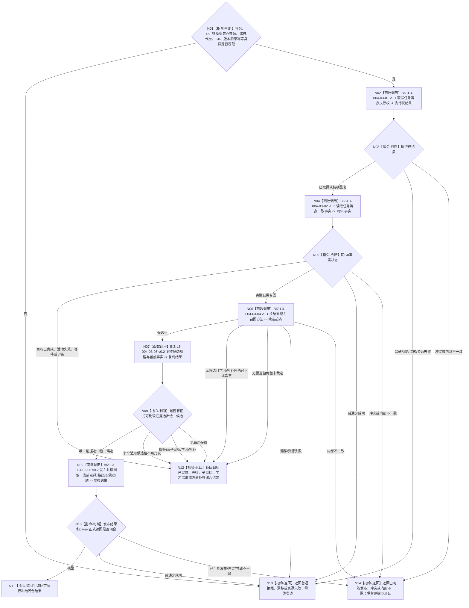

# BIZ-L2-004-03 筹办并冻结方法候选目标函数流程图 v0.2

更新时间：2026-08-28

## 依据与替代

```text
3200、4230、4260 v0.9、5090 v0.7、5210、5230 v1.2、5250、5300
父图：BIZ-L2-004-07 v0.2；输入为T03已经确认入队的不可变筹办工作包
后继：BIZ-L3-004-07-06/07 v0.2形成并提交任务工作结果定位，T03由BIZ-L3-004-08-01独立读回
发布源码：尚无本目标根；不得把目录外未发布WIP计为实现
```

本图替代 v0.1。旧图把1—3个候选同时实例化、把正向授权放入执行冻结，并把闭合结果称为跨线程筹办回执；这些口径均退出。候选组只是本轮值式比较材料。只有存在正式可比较选择证据时，才能采用恰一方法，并由 task owner 的唯一公开入口发布一条路径、一个当前选择、一个实例和一份执行绑定冻结材料。

## 身份与边界

正式目标函数设计图。T04在队列锁外消费一个不可变筹办工作包，取得任务级筹办执行权，在同一 `G0` 读取正式 `T→E`、当前任务轮次、E上的ARCH-L2阶段、完整 `T→D`、逐需求同义目标、方法登记和当前运行/等待材料。目标已经满足、等待、子目标、学习需求或方法补齐都形成结构化闭合结果；只有恰一正式选中方案进入选择/路径/实例/冻结发布。

本函数不创建任务私有存在或治理状态，不建立独立持久化筹办回执，不计算6150/6170普通派发资格，不取得自我现实执行授权，也不执行方法动作。执行冻结只保存5230规定的任务、轮次、路径、方法版本、动作、条件、输入、来源需求、禁止项、验证、归因、作用范围和失效条件；正向授权、技术许可、安全硬否决与普通派发调度均在冻结后分账读取。

## 函数合同

```text
根函数：任务筹办服务::筹办并冻结方法候选
归属模块 / 文件 / 目标分解深度：任务筹办组合 / 海中鱼巣/领域/内部治理/服务.任务筹办当前就绪与执行冻结.ixx / BIZ-L2
现有或待新增：待适配组合；发布源码只有相邻候选和选择发布能力，完整生产根未接线
完整签名：任务筹办闭合结果 任务筹办服务::筹办并冻结方法候选(const 任务筹办请求& 请求) noexcept
参数：不可变筹办工作包所绑定的任务、任务轮次、强类型初次/同轮后继筹办来源、运行代次、G0、规则版本与原幂等身份
返回结果：可执行冻结、目标已完成、合法等待、子目标承接、学习需求承接、方法补齐承接、入口/许可拒绝、当前性/版本漂移、资源失败、已可能发布、引用/幂等冲突或内部不一致；成功载荷携带owner正式读回身份和各自截止，不携带线程回执
被调函数流程图：BIZ-L3-004-03-01 v0.1、03-02 v0.2、03-04 v0.1、03-05 v0.2、03-06 v0.2，共5个直接子函数
线程归属：T04；任何领域调用均在任务工作队列锁外
```

## 流程图



## 完成与非成功边界

- 多个当前适用候选没有正式比较证据时，只保存稳定有序候选组和合法等待；不得按稳定编码、名称、索引顺序或队列顺序选首项。
- task owner 只接收一个正式选中候选；不得为未选候选建立路径、实例、冻结或第二当前关系。
- 发布后读回失败只按原强类型筹办来源和原完整请求收敛，不能换键重筹办或撤销已经发布的事实。
- 本函数返回的闭合结果仍是领域值式结果。跨线程唯一交付由004-07形成 `任务工作结果定位`，T03随后按定位独立读回；不新建筹办回执owner。

## 发布源码实现对照

- 发布源码存在任务选择/路径/实例/冻结的相邻数据与服务，但没有本图同G0筹办组合根和T04生产调用。
- 发布源码旧任务治理存在/状态仍有兼容读取；本图禁止它们参与当前阶段或选择裁决。
- 本图是目标业务合同，不证明公开ABI、T04工作包循环、构建或运行闭环已经完成。
