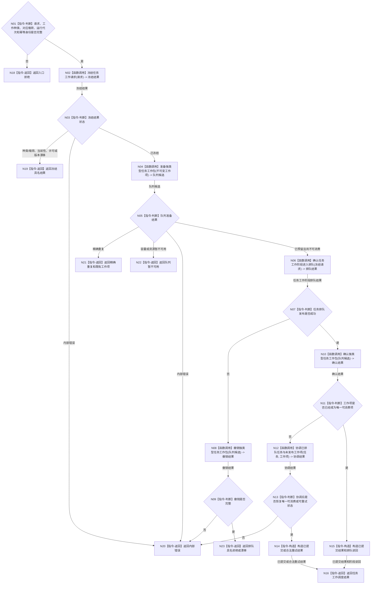

# BIZ-L2-004-04 派发一个不可变任务工作包目标函数流程图 v0.1

更新时间：2026-08-03

## 依据

```text
5090、5230、5300、8100、8200
父线程函数：BIZ-L1-T03 任务管理线程::运行治理循环；异步消费者为 BIZ-L1-T04
当前代码：任务执行调度路由::提交任务执行请求已具备执行类工作包的冻结、队列预留、任务排队迁移、确认和预留撤销相邻路径；筹办类工作包尚需适配扩展
```

## 身份与边界

正式目标函数设计图。根函数把一个强类型不可变筹办或执行工作包合法发布给共享任务工作队列并返回，不在任务管理线程运行筹办 / 方法，也不等待工作线程回执。

## 函数合同

```text
根函数：派发一个不可变任务工作包
归属模块 / 文件 / 层级：任务工作调度 / 海中鱼巣/线程/路由.任务工作调度.ixx / L2
现有或待新增：适配扩展；复用现有执行请求的队列两阶段发布能力，新增筹办 / 执行强类型分支和统一工作身份
完整签名：任务工作调度结果 任务工作调度路由::派发一个不可变任务工作包(const 任务工作调度请求& 请求) const
参数：
  请求：const 任务工作调度请求&，只读借用，调用期间有效；必须携带工作种类、任务稳定身份、筹办轮次、运行代次、任务序号、工作项身份、事实截止版本、截止时间和幂等身份；筹办载荷携带目标 / 授权 / 方法登记版本，执行载荷携带不可变方法实例 / 当前选择 / 一次性许可，两类载荷互斥
返回结果：
  任务工作调度结果；包含已提交、精确重复、队列暂不可用、种类 / 载荷拒绝、许可拒绝、当前性漂移、版本漂移、入口拒绝或内部错误，以及不可变工作项身份、工作种类和任务阶段读回
被调函数流程图：冻结任务工作请求、准备强类型任务工作包、确认任务工作阶段进入排队、确认或撤销队列候选；下一层待展开
线程归属：任务管理编排路径在未持有队列锁和领域锁时调用；任务工作线程不得调用本函数
```

## 流程图



## 节点合同

| 节点 | 类型 | 参数 / 输入绑定 | 结果 / 输出绑定 | 事实读写 | 后继条件 | 验证 |
| --- | --- | --- | --- | --- | --- | --- |
| N02 | 函数调用 | 工作种类、任务、轮次、对应载荷和版本 | 不可变冻结请求 | 只读任务 / 方法权威事实 | 已冻结或具名返回 | 种类载荷互斥、旧轮次、执行许可和方法换代 |
| N04 | 函数调用 | 完整冻结请求和工作项身份 | 不可见队列候选 | 仅队列预留 | 已预留、重复或拒绝 | 值式复制、容量边界 |
| N06 | 函数调用 | 冻结请求及工作种类 | 任务筹办排队或执行排队状态 | 任务领域正式入口 | 成功或具名失败 | 同任务筹办 / 执行互斥和唯一在途权 |
| N08 | 函数调用 | 尚未确认的队列候选 | 撤销结果 | 只撤销不可见预留 | 撤销完整 | 无幽灵工作项 |
| N10 | 函数调用 | 已预留候选 | 可消费工作项 | 发布队列项 | 已确认或异常 | 一份工作项仅消费一次 |
| N12 | 函数调用 | 已排队任务、未发布工作项及派发身份 | 协调结果 | 只通过具名任务 / 队列恢复合同 | 可消费、可重试或内部错误 | 崩溃窗、最终确认失败 |

## 多线程边界

- 队列准备、确认和撤销函数只能短时持有队列锁；任何任务或方法领域调用必须在队列锁外完成。
- 工作项必须是值式不可变快照。工作线程不得持有调用方对象、容器元素、栈引用或可变服务内部指针。
- 同一任务同一时刻只能有一个可消费工作项；筹办、重筹办和执行共用同一在途互斥，精确重复返回既有工作项，不再次发布。
- 不同任务可以并发派发和执行，但每个任务各自使用稳定身份作为隔离键。
- 线程编号、队列槽位和到达先后不进入任务工作身份。

## 关键边界

- 本函数成功只证明筹办或执行工作包已发布，不证明工作线程已运行筹办、方法成功、实际结果成立或需求已满足。
- 筹办包不得携带动作许可或方法实例；执行包不得缺少当前冻结和一次性许可。工作线程只按强类型种类分派，禁止靠空字段推断。
- 当前代码只有执行类请求相邻能力，通用任务工作调度及最终确认失败后的任务阶段协调仍需适配扩展，不能标记当前复用。
