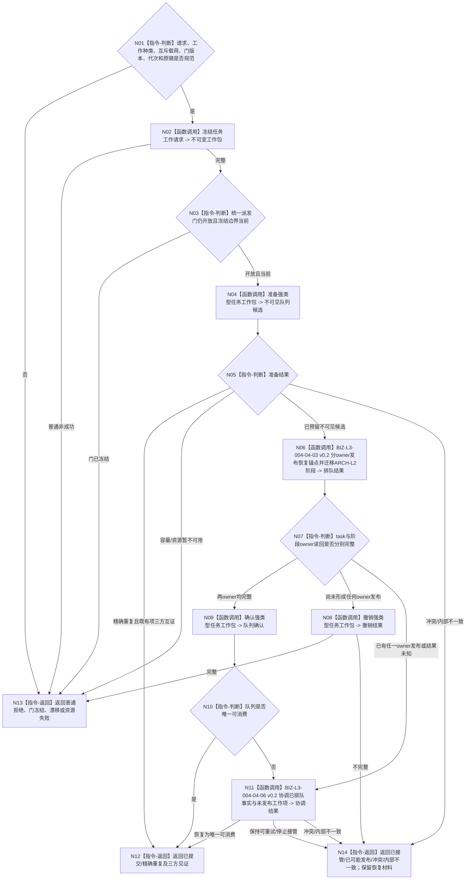

# BIZ-L2-004-04 派发一个不可变任务工作包目标函数流程图 v0.2

更新时间：2026-08-28

## 依据与替代

```text
3200、4230、5090 v0.7、5210、5230 v1.2、6170、8100 v0.7
父图：BIZ-L1-T03 v0.6；执行分支前驱为BIZ-L2-003-03 v0.5已选择结果
异步消费者：BIZ-L1-T04 v0.4 / BIZ-L2-004-07 v0.2
发布源码：仅有相邻执行请求两阶段队列能力，目标统一筹办/执行工作包未实现
```

本图替代 v0.1。旧图把“任务生命周期/排队事实/恢复锚点”写成task owner单事务，形成第二阶段权威。v0.2固定：队列预留、task owner工作项恢复锚点和ARCH-L2阶段迁移属于不同owner；父组合按顺序调用、分别正式读回并保存各自截止，绝不伪称跨owner原子提交。

## 身份与边界

正式目标函数设计图。T03只派发已经由主阶段治理形成的筹办工作包，或由003-03 v0.5在冻结候选全集中fresh选择的一份执行工作包。函数先冻结值式载荷并检查统一派发门，再在队列中准备不可见候选；随后由task owner发布可恢复工作项锚点、由ARCH-L2状态/动态owner按当前E阶段迁移到对应排队状态，最后才把同一候选切换为可消费。各步骤使用各自owner幂等键、CAS代次、发布见证和读回截止。

## 函数合同

```text
根函数：任务工作调度路由::派发一个不可变任务工作包
归属模块 / 文件 / 目标分解深度：任务工作调度 / 海中鱼巣/线程/路由.任务工作调度.ixx / BIZ-L2
现有或待新增：适配扩展；发布源码只有执行请求相邻能力
完整签名：任务工作调度结果 任务工作调度路由::派发一个不可变任务工作包(const 任务工作调度请求& 请求) noexcept
参数：工作种类、T/R/筹办或执行轮次、工作项身份、运行代次、统一派发门版本、截止、原幂等身份及互斥筹办/执行载荷
返回结果：已提交、精确重复、门已冻结、队列暂不可用、入口/许可拒绝、当前性/版本漂移、已接管待恢复、资源失败、已可能发布、幂等/引用冲突或内部不一致；载荷分别保存队列、task owner和ARCH-L2 owner见证
被调函数流程图：BIZ-L3-004-04-01/02/04/05 v0.1、004-04-03 v0.2、004-04-06 v0.2
线程归属：T03；所有领域调用均在队列锁外
```

## 流程图



## 关键边界

- task owner恢复锚点不承担当前阶段权威；ARCH-L2阶段迁移不保存队列地址或线程槽；队列可见性不等于业务阶段。
- 任一owner已经发布后，后继失败不得回写旧当前阶段或删除历史；只能以原工作项和原见证恢复同一派发。
- 筹办包不含普通派发调度或现实授权；执行包只携带003-03 v0.5已选择投影及按5230需要的当前自我授权，004-04不重新计算或换选。
