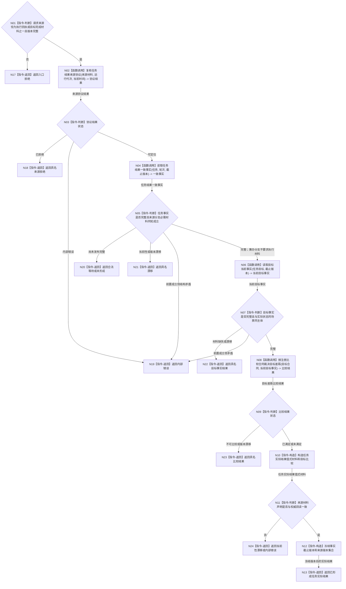

# BIZ-L2-004-05 独立回读任务实际结果目标函数流程图 v0.1

更新时间：2026-08-03

## 依据

```text
5090、5160、5300、8100、8210
父函数：BIZ-L2-004-08；运行于 BIZ-L1-T03 任务管理线程，回读后由上行桥先推进任务再通知自我线程
当前代码：运行期只读查询组合器::复核任务结果已能从任务、方法、状态和动态服务复核强类型回执，但结果仍主要回传回执材料
```

## 身份与边界

正式目标函数设计图。根函数使用工作线程回执或任务筹办“目标已完成”材料定位候选，再从各事实所有者重新读取实际状态、动态、任务、方法、目标和版本；回执、自报值、日志、队列状态均不直接成为实际结果。

## 函数合同

```text
根函数：独立回读任务实际结果
归属模块 / 文件 / 层级：运行期只读查询 / 海中鱼巣/领域/组合.运行期只读查询.ixx / L2
现有或待新增：适配扩展；现有复核任务结果具备主要读取路径，但目标结果需承载完整值式材料、目标比较和事实截止版本
完整签名：任务实际结果回读结果 运行期只读查询组合器::独立回读任务实际结果(const 任务实际结果回读请求& 请求) const
参数：
  请求：const 任务实际结果回读请求&，只读借用，调用期间有效；必须携带任务、来源种类、运行代次、任务轮次、事实截止版本，以及强类型执行回执或筹办目标完成材料二者之一
返回结果：
  任务实际结果回读结果；包含已形成、未形成、合法等待、材料缺失、不可比较、当前性漂移、版本漂移、入口拒绝或内部错误，以及任务、需求、方法实例、实际状态、动态、可选因果、目标比较和全部来源版本的值式材料
被调函数流程图：已由 BIZ-L3-004-05-01、BIZ-L3-004-05-02 以及复用的 BIZ-L3-004-01-01/02 冻结；只在其中仍隐藏非平凡函数调用时继续下钻
线程归属：治理线程在回执队列锁外调用；任务工作线程只发布来源材料，不调用本函数
```

## 流程图



## 节点合同

| 节点 | 类型 | 参数 / 输入绑定 | 结果 / 输出绑定 | 事实读写 | 后继条件 | 验证 |
| --- | --- | --- | --- | --- | --- | --- |
| N02 | 函数调用 | 回执或目标完成材料、运行代次和时间 | 来源准入结果 | 无权威写入 | 可定位、拒绝或错误 | 篡改、旧代次、过期 |
| N04 | 函数调用 | 任务、轮次和截止版本 | 任务、方法、状态、动态一致事实 | 只读各领域事实 | 完整、等待、漂移或错误 | 不采信回执自报 |
| N06 | 函数调用 | 任务目标和截止版本 | 当前目标事实 | 只读目标事实所有者 | 完整或具名返回 | 同场景、同主体、同版本 |
| N08 | 函数调用 | 正式目标合同和当前事实 | 已满足、未满足或不可比较 | 无写入 | 具名比较状态 | 单位、值域、算法版本 |
| N10/N12 | 指令-构造 | 权威读回与比较结果 | 不可变值式结果 | 无写入 | 构造完整 | 全来源可回查 |

## 多线程边界

- 调用方必须先在队列锁内取出并复制一份不可变回执，再释放锁调用本函数。
- 本函数不等待工作线程、不读取工作线程私有内存，也不把线程存活或退出当作任务结果。
- 同一任务的旧轮次回执不得覆盖新轮次事实；不同任务的回读可以并发。
- 事实截止版本必须在本次读取开始时冻结；读取跨代次或跨版本时返回漂移，不拼装混代快照。

## 关键边界

- 工作线程回执只用于定位和防重，不承担任务实际结果权威。
- 筹办阶段的“目标已完成”来源不要求方法选择、动作或动态；这些字段必须保持空，由目标当前事实回读与比较独立证明是否满足。
- 方法返回成功、日志成功和动态存在均不能单独证明目标已满足。
- 当前 `复核任务结果` 返回结构不足以直接供后继结算复用完整权威材料，因此需要适配扩展而不是原样复用。
