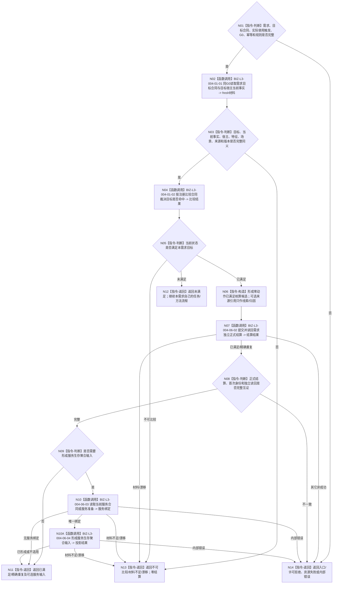

# BIZ-L2-004-06 按需求实际使用时 fresh 独立核算目标函数流程图 v0.2

更新时间：2026-08-26

## 依据与替代

```text
0050、5090 v0.8、5160 v0.5、6160、6170、8100 v0.8、8200
父线程函数：BIZ-L1-T02 v0.4；其它合法需求调度/筹办/继续执行入口也可调用
```

本图替代 v0.1。旧图把“已发布任务结果 + 独立实际结果”当作需求结算的必需直接输入，容易形成任务完成后批量结算。当前正式语义是：任务结果不是可消费或分配的资源；每个需求只在自身实际调度、筹办、继续执行或显式复核时，以自己的目标合同和 fresh 当前状态独立核算。

## 身份与边界

正式目标函数设计图。明确上级调用任务的结果先由 task owner 结算唯一上级调用槽；这不发布上级需求满足。需求进入实际使用时，无论是否携带来源任务结果线索，都必须重新读取自己的目标合同和同一截止当前状态。已满足则零动作发布本需求自己的核算结论；未满足则返回继续自身任务/方法流程。服务合同、价值、预算、奖励和归因继续分账。

## 函数合同

```text
根函数：按需求实际使用时fresh独立核算
归属模块 / 文件 / 目标分解深度：需求独立核算组合 / 海中鱼巣/领域/组合.需求独立核算.ixx / BIZ-L2
现有或待新增：待新增；复用需求目标、当前事实、统一比较和需求正式结算 owner
完整签名：需求独立核算结果 需求独立核算组合器::按需求实际使用时fresh独立核算(const 需求独立核算请求& 请求) const noexcept
参数：请求含需求、目标合同身份/期望版本、实际使用触发、共同事实截止G0、结算幂等身份、规则版本；来源任务结果和轮次级发起调用均为可选引用
返回结果：已满足、精确重复、未满足、不可比较、材料不足、当前性/版本漂移、入口/许可拒绝、资源失败或内部错误；已满足可携带独立需求结算及可选服务生存聚合输入
被调函数流程图：复用 BIZ-L3-004-01-01 v0.3 读取需求目标当前事实、BIZ-L3-004-01-02 v0.2 按注册比较合同裁决目标差距；BIZ-L3-004-06-02 提交并读回需求独立正式结算、004-06-03 读取当前服务合同或服务准备、004-06-04 形成服务生存聚合输入
线程归属：T02或其它合法需求使用入口在锁外调用；不取得任务结果、任务轮次或资源owner写权
```

## 流程图



## 节点合同

| 节点 | 类型 | 输入 | 输出 | 事实读写 | 验证 |
| --- | --- | --- | --- | --- | --- |
| N01—N03 | 判断/读取 | 本需求和实际使用触发 | 同G0目标与当前事实 | 只读需求目标和真实事实owner | 无来源结果、带来源结果、错误G、漂移 |
| N04/N05 | 比较/判断 | 完整fresh材料 | 满足/未满足/不可比较 | 纯值统一比较 | 多需求同一状态、值域边界 |
| N06—N08 | 构造/提交/读回 | 本需求满足证据 | 唯一正式核算结论 | 仅需求owner写入 | 同键重复、异义冲突、读回失败 |
| N09/N10/N10A | 判断/读取/投影 | 正式需求结算和可选来源引用 | 可选服务绑定与服务生存输入 | 只读合同/准备；不写服务值/合同/动态 | 非服务需求、合同失效、准备绑定 |
| N11—N14 | 返回 | 全部结构化结果 | 独立核算结果 | 不创建结果容量或分配记录 | 全失败矩阵 |

## 关键边界

- `0 / 1 / N` 条任务 `T→D` 都不是结果分配集合，也不要求在任务轮次收束时全部核算。
- 来源任务结果和发起调用是可选引用；没有来源结果仍可按目标与当前事实核算，有来源结果也不能跳过 fresh 读取。
- 稀缺数量、独占所有权和冲突动作在执行前由其真实 owner 的 fresh 读回、授权、安全和原子事务裁决，不在结果后结算。
- 同一状态可分别满足多个需求，但价值、预算、奖励、贡献和学习归因必须由各自防重合同分账。

## 当前工作区实现对照

- BIZ-L3-004-01-01 / 02 的目标读取与统一比较合同已经冻结，可直接复用，禁止在本组合器内复制读取或裸值比较。
- 当前工作区 `L2需求结算结构` 仍携带来源任务、来源任务轮次、正式结果和消费分配记录等旧模型字段，不能作为本图 v0.2 已实现证据。
- 当前尚无 `需求独立核算组合器::按需求实际使用时fresh独立核算` 生产入口；因此本图只证明目标业务合同已校正，不证明代码接线或需求结算迁移完成。
