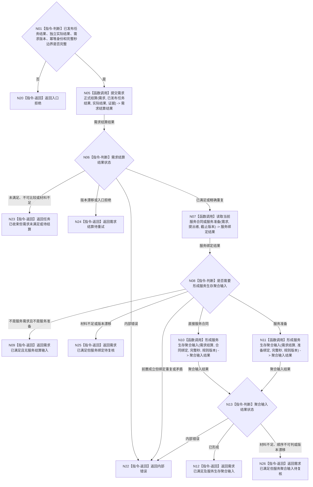

# BIZ-L2-004-06 结算需求并形成服务结算输入目标函数流程图 v0.1

更新时间：2026-08-03

## 依据

```text
5090、5160、6160、6170、8100、8200
父线程函数：BIZ-L1-T02 自我线程::运行治理循环；只消费已提交任务结果和独立回读材料
当前代码：任务结果结算组合器::处理任务执行结果可作为任务 / 需求收束的局部适配来源
```

## 身份与边界

正式目标函数设计图。根函数只消费任务管理线程已经通过任务服务发布的任务结果，再形成需求满足结论；若需求涉及直接服务合同或服务准备，只形成下一轮服务生存聚合入口可消费的值式结算输入，不结算服务值、余款或准备补回。

## 函数合同

```text
根函数：需求服务结算组合器::结算需求并形成服务结算输入
归属模块 / 文件 / 层级：需求服务结算组合 / 海中鱼巣/领域/组合.需求服务结算.ixx / L2
现有或待新增：待新增；适配复用现有任务结果结算组合器的需求收束，任务结果写入权留在任务管理线程
完整签名：需求服务结算结果 需求服务结算组合器::结算需求并形成服务结算输入(const 需求服务结算请求& 请求) const
参数：
  请求：const 需求服务结算请求&，只读借用；必须携带已发布任务结果、独立实际结果、需求预期版本、需求结算幂等身份、事实截止版本、结算完整秒边界、规则版本和可选因果引用
返回结果：
  需求服务结算结果；可返回需求未满足、需求已满足、需求结算待重试、入口拒绝、版本漂移或内部错误，并可携带直接服务合同终态输入或服务准备完成输入
被调函数流程图：BIZ-L3-004-06-02—04
线程归属：自我线程在消息队列锁外调用；只由需求和服务只读合同取得各自权限，不取得任务写入权
```

## 流程图



## 节点合同

| 节点 | 类型 | 参数 / 输入绑定 | 结果 / 输出绑定 | 事实读写 | 后继条件 | 验证 |
| --- | --- | --- | --- | --- | --- | --- |
| N05 | 函数调用 | 需求、来源任务、目标、实际状态、动态和可选因果 | 唯一正式满足结论 | 需求领域事务 | 已满足、未满足或错误 | 5160 唯一记录、同义幂等 |
| N07 | 函数调用 | 需求、提出者、截止版本 | 当前服务合同、准备或无绑定 | 只读服务事实 | 存在、不存在或错误 | 有效期内唯一合同 |
| N10/N11 | 函数调用 | 已发布需求结论、服务绑定、完整秒和规则版本 | 值式同秒聚合输入结果 | 不写服务合同、服务值或动态 | 已形成或具名返回 | 输入身份、确定顺序、完整秒和版本完整 |

## 多线程与事务边界

- 任务结果已经由任务管理线程经任务服务独立发布；本函数不得重复提交或改写任务，需求结算暂时失败也不得撤销任务事实。
- 服务结算输入不是服务结论，也不是服务值候选；它只在下一次 `维护服务与生存安全` 中与合同终态、余款或准备补回、当秒衰减和生存安全根回归共同原子发布。
- 本函数不得调用服务值写入、完工余款结算或准备补回入口。

## 关键边界

- 方法成功不等于任务完成，任务完成不等于需求满足，需求满足不等于服务结算完成。
- 直接服务合同只有在服务生存聚合事务确认合同仍有效时才支付剩余 70%；取消、到期或终止关闭余款且不追回预支。
- 服务准备只形成可补回候选；实际补回量由服务生存聚合事务根据唯一归属衰减段裁决。
