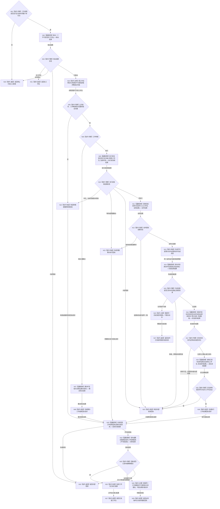

# BIZ-L2-004-07 消费并推进一个不可变任务工作包目标函数流程图 v0.1

更新时间：2026-08-03

## 依据

```text
4190、4220、5090、5230、5300、8100、8200
异步前驱：BIZ-L2-004-04 派发一个不可变任务工作包
当前代码：任务工作线程::受控消费一条任务执行请求已具备执行类消费、执行和回执相邻路径；筹办类分派尚需适配扩展
旧鱼巢参考：流程图/鱼巢流程/20260712_旧鱼巢筹办方法与执行现状流程图_v0.1.md
旧鱼巢参考：流程图/鱼巢流程/20260712_旧鱼巢动态因果结果与结算现状流程图_v0.1.md
吸收边界：筹办包按目标结果能力先召回方法再读取候选条件；执行包保持动作完成消息、独立验真、权威状态回读、动态校准和结果定位分层；旧动态类和旧因果模板不迁移
```

## 身份与边界

正式目标函数设计图。根函数在一个任务工作线程中消费一个不可变工作包，并严格按强类型种类调用筹办链或执行链；它不决定任务当前应筹办还是执行。

## 函数合同

```text
根函数：消费并推进一个不可变任务工作包
归属模块 / 文件 / 层级：任务工作线程 / 海中鱼巣/线程/任务工作线程.ixx / L2
现有或待新增：适配扩展；现有受控消费入口只接既有执行路由，需增加筹办分支、通用工作回执和业务操作完成后的回执重试边界
完整签名：任务工作线程受控消费结果 任务工作线程::消费并推进一个不可变任务工作包(任务工作调度路由& 调度路由, std::uint64_t 当前时间戳)
参数：
  调度路由：任务工作调度路由&，调用期间有效，不转移所有权；只能在取出工作包和发布结果回执时短时使用
  当前时间戳：std::uint64_t，本轮可信单调时间，必须非零且属于当前运行代次
返回结果：
  任务工作线程受控消费结果；包含无工作包、筹办已闭合并发布回执、执行已闭合并发布回执、动作已完成待重发完成消息、业务操作已完成待重发回执、种类 / 许可 / 当前性 / 版本拒绝、停止中或内部错误，以及工作包种类、筹办或执行结果和回执发布材料
被调函数流程图：BIZ-L2-004-03；BIZ-L3-004-07-01—08
线程归属：恰一个任务工作线程；同一函数可以由工作线程池的不同实例并发调用，但同一任务只能被一个实例取得
```

## 流程图



## 节点合同

| 节点 | 类型 | 参数 / 输入绑定 | 结果 / 输出绑定 | 事实读写 | 后继条件 | 验证 |
| --- | --- | --- | --- | --- | --- | --- |
| N02 | 函数调用 | 当前工作线程实例 | 工作包或空 | 只消费任务工作队列 | 取出后立即释放锁 | 多消费者、停止竞争 |
| N04 | 指令-复制 | 队列候选 | 线程局部不可变工作包 | 无业务写入 | 完整或拒绝 | 无跨线程悬空引用 |
| N05/N06 | 判断 | 公共身份、工作种类和互斥载荷 | 筹办或执行唯一分支 | 无写入 | 种类明确或拒绝 | 空字段不推断、未知种类拒绝 |
| N07/N08 | 函数调用 / 构造 | 筹办工作包中的目标、轮次、截止版本和授权 | 筹办闭合结果与瞬时工作回执 | 任务筹办服务按自身合同提交；线程不裸写 | 六类闭合或具名错误 | 唯一筹办权、同任务单在途、无持久化筹办回执 |
| N09/N10 | 函数调用 / 判断 | 执行工作包、许可、任务 / 方法 / 输入场景版本和当前时间 | 执行前复核结果 | 只读 | 可执行、拒绝、等待或内部错误 | 当前性、授权、方法完整和输入场景漂移 |
| N11—N13 | 函数调用 / 判断 / 构造 | 冻结执行工作包和复核结果 | 动作运行报告、预计动作动态和完成消息 | 具体方法动作入口是动作来源候选；预计材料不写正式事实 | 已结束、动作前拒绝或结果未知 | 同任务单执行、外部动作幂等、预计与正式分账 |
| N14/N15/N33 | 函数调用 / 判断 / 记录 | 同一不可变完成消息 | 已验真、待重发或具名非成功 | 只写完成消息传递边界；不写状态或动态 | 已验真才可读实际状态 | 消息身份、动作绑定、重复不重做动作 |
| N16/N17 | 函数调用 / 判断 | 动作前状态、预计动态和验真完成消息 | 权威动作后状态、校准结果及可证明正式动态 | 对应事实所有者和动态领域写入；工作线程不裸写 | 无变化、已发布、待补归因或错误 | 另一途径读取、预计差异、零伪造动态 |
| N34—N36 | 函数调用 / 判断 / 构造 | 校准发布结果和固定截止 | 同代次状态 / 动态定位材料和执行回执请求 | 独立只读 | 完整或内部错误 | 只形成定位，不在工作线程裁决任务实际结果 |
| N29 | 函数调用 | 工作包与筹办 / 执行结果载荷 | 不可变强类型回执 | 无业务写入 | 已形成或内部错误 | 种类载荷恰一、非权威标记 |
| N19 | 函数调用 | 同一种类的不可变回执 | 已发布、重复或拒绝 | 只写共享结果队列 | 发布或保留待重发 | 队列满、停止、重复 |
| N26 | 指令-记录 | 已完成筹办 / 动作及对应回执 | 待重发状态 | 工作线程恢复材料，不重复业务操作 | 后续只重试发布 | 崩溃窗、重复筹办 / 动作防护 |

## 多线程边界

- 队列锁只覆盖工作包取出或回执发布；具体方法执行时不得持有任务队列、回执队列或控制面板锁。
- 一个工作线程一次只处理一个工作包；工作线程池可并发处理不同任务，但同一任务的筹办 / 重筹办 / 执行不能并发。
- 筹办闭合或动作已执行后，无论回执队列满、停止还是短时故障，都不得重复筹办或动作来“重新生成回执”。必须保留同一种类的同一回执。
- 线程异常退出不是任务失败；恢复必须从工作项、动作幂等身份和已发布事实判断，不从线程编号推断。

## 关键边界

- 本函数返回“已处理”不证明任务完成或需求满足，只证明一个筹办 / 执行工作包已闭合或拒绝并形成了可上行材料。
- 任务管理线程决定工作种类；工作线程发现种类与任务正式状态不匹配时只返回具名拒绝，不得自行把筹办改成执行或把执行降级成筹办。
- 固定顺序是“调用动作 -> 形成预计动态 -> 发布完成消息 -> 独立验真 -> 权威读取实际状态 -> 校准并发布可证明动态 -> 形成回执定位”。预计动态、动作返回和完成消息均不得直接写成正式动态。
- 方法返回成功不是实际结果。工作线程只能从已发布事实形成回执定位材料；任务实际结果仍由任务管理侧的独立回读入口重新读取和比较。
- 当前 `受控消费一条任务执行请求` 可以作为主要适配来源，但仍需扩展通用方法实例和回执重发恢复合同。
