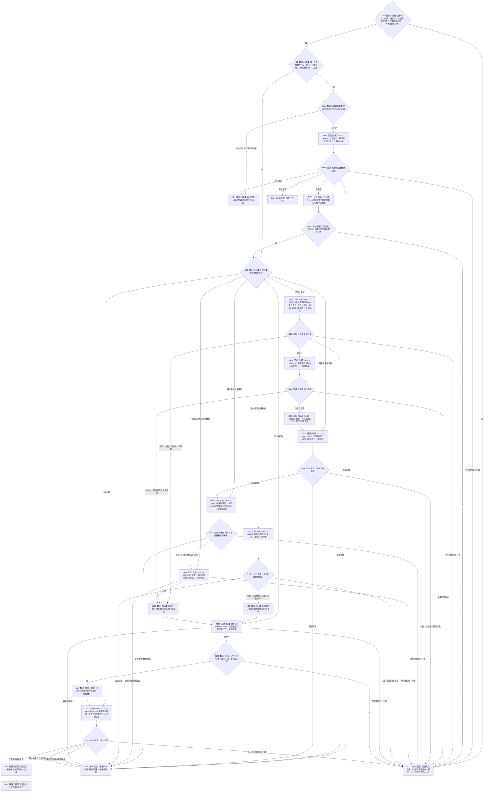

# BIZ-L2-004-07 消费并推进一个不可变任务工作包目标函数流程图 v0.2

更新时间：2026-08-27

## 依据与替代

```text
0050、4190、4220、5090、5230、5300、8100、8200
BIZ-L1-T04 v0.3、BIZ-L2-001-05、BIZ-L2-001-06、BIZ-L2-004-08 v0.3
当前HEAD：任务工作线程::运行结果尾部、形成任务结果回执、任务管理线程::提交任务结果回执
```

本图替代 v0.1。旧图没有把同运行代次接收门放在取包之前，并把非权威任务结果回执作为工作线程的主要交付物。v0.2 固定为“先恢复唯一在途槽；无槽时门开放才取包；所有业务分支只形成并交付结构化任务工作结果定位”。定位只供 T03 独立读回，不成为正式任务结果或第二事实权威。

## 身份与边界

正式目标函数设计图。根函数在一个任务工作线程中至多推进一个不可变工作包。线程对象持有同运行代次接收门和唯一在途槽：已经取出的工作包、动作完成消息、动作后材料或待交定位必须优先恢复；只有在途槽为空且接收门开放时才能取新包。

本函数不决定任务应筹办还是执行，不收束任务轮次，不判断需求满足，也不把方法返回、动作完成消息、旧任务结果回执或线程状态当正式任务结果。

## 函数合同

```text
根函数：消费并推进一个不可变任务工作包
归属模块 / 文件 / 目标分解深度：任务工作线程 / 海中鱼巣/线程/任务工作线程.ixx / BIZ-L2
现有或待新增：目标适配；HEAD只运行已形成结果尾部，未实现工作包接收门、统一工作包、业务推进和结果定位交付
完整签名：任务工作线程受控消费结果 任务工作线程::消费并推进一个不可变任务工作包(std::uint64_t 当前时间戳) noexcept
参数：当前时间戳为本运行代次非零可信单调时间；对象已经冻结运行代次、同代次接收门、工作包来源、筹办/执行端口、定位交付端和唯一在途槽
返回结果：接收门等待、无工作包、筹办已闭合且定位已交付、执行已闭合且定位已交付、动作已完成待重发完成消息、业务已闭合待重交定位、结构化业务拒绝已交付、停止排空中、资源失败、引用/幂等冲突或内部不一致；返回值保留原工作包和首个未完成步骤的恢复身份
被调函数流程图：BIZ-L2-004-03；BIZ-L3-004-07-01—08，其中004-07-06/07为v0.2
线程归属：恰一个任务工作线程；同一任务工作项只允许一个唯一在途槽拥有
```

## 流程图



## 唯一在途槽与接收门合同

- 唯一在途槽状态只允许：空、工作包待推进、完成消息待重发、动作后事实待校准/读回、定位待形成、定位待交付。每个状态保存原工作包、运行代次、工作项身份、执行幂等身份及首个未完成步骤。
- 有在途槽时优先恢复，不再读取新工作包。接收门关闭只禁止新领取，不撤销已经领取的工作，也不允许清空动作后材料或待交定位。
- 无在途槽时必须先读取同运行代次接收门。尚未开放返回等待；停止阶段冻结新领取后返回排空中；两者都不得调用004-07-01。
- 门开放与队列非空不是工作包业务有效性证明。取出后仍须逐字段验证，普通业务拒绝也必须形成定位交给T03。

## 结果定位合同

- 筹办定位只引用筹办闭合事实、任务/轮次/工作项、共同截止和恢复身份；不建立持久化筹办回执。
- 执行定位只引用完成消息三元读取键、动作后权威事实身份、任务/三轮次/冻结/实例、执行幂等身份、运行代次、最后动作顺序和共同截止；不携带正式任务结果正文。
- 动作开始前的等待、拒绝、漂移和材料不足使用同一强类型定位分类，不得退回旧任务结果回执或让线程状态替代业务非成功。
- 定位交付成功只证明T03可独立接管；正式任务结果由BIZ-L2-004-08从完成消息和权威事实重新读取后发布。

## 当前HEAD实现对照

| 能力 | HEAD事实 | 判断 |
| --- | --- | --- |
| 工作包接收门 | `任务工作线程`只有`停止接收_`旧结果队列布尔量 | 未实现同代次启动接收门 |
| 工作包消费 | 只消费调用方已提交的`任务工作结果材料` | 未实现筹办/执行工作包 |
| 唯一在途槽 | 取出后仅局部变量保存；形成或上交非成功后即丢失 | 未实现恢复材料守恒 |
| 动作与事实链 | 文件规则明确禁止执行方法、形成状态动态或裁决任务完成 | 未实现目标业务推进 |
| 上行材料 | `形成任务结果回执`后直接调用T03旧回执入口 | 旧尾部；不是任务工作结果定位 |
| 失败处理 | 形成失败或上交失败只增加拒绝计数 | 实现偏差；不能证明结构化收口 |

## v0.2 校正记录

- 补入“在途槽优先恢复；无槽才检查同代次接收门；门开放才取包”的唯一顺序。
- 把筹办、执行及动作前结构化非成功统一收口为任务工作结果定位，删除旧任务结果回执作为目标上行材料。
- 明确动作已经发生后只恢复完成消息、权威事实和定位步骤，任何上行失败均不得重做动作。
- 保留HEAD只是旧结果尾部的实现分账；本图不把目标接口存在误报为代码已接线。
