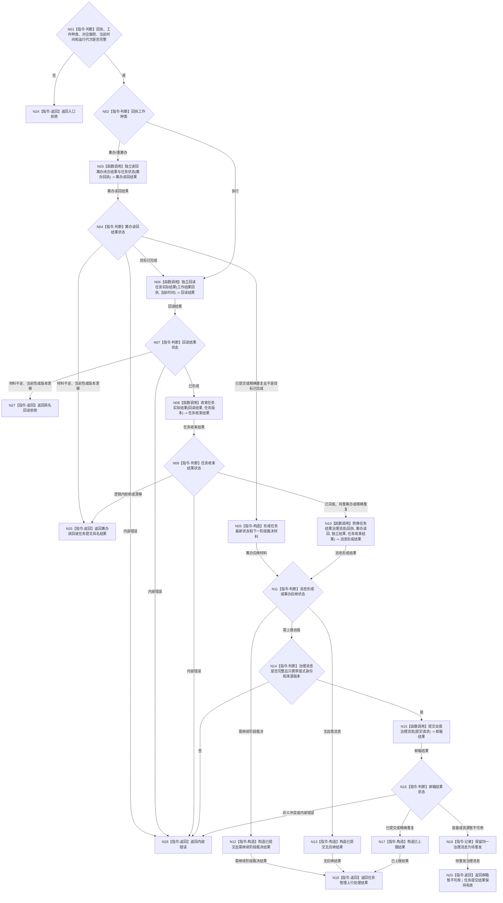

# BIZ-L2-004-08 上报一条任务工作结果目标函数流程图 v0.1

更新时间：2026-08-03

## 依据

```text
5090、8100、8200、8210
父线程：BIZ-L1-T03 任务管理线程治理循环
异步前驱：BIZ-L1-T04 / BIZ-L2-004-07 发布到共享结果队列的筹办或执行不可变回执
当前代码：任务管理上行桥::处理下一条上行具备执行回执取出、只读复核、转换消息和提交邮箱的相邻路径；筹办回执分支及解除具体工作线程对象耦合仍需扩展
```

## 身份与边界

正式目标函数设计图。根函数接收任务管理线程移出共享结果队列的一份不可变筹办或执行回执：筹办回执独立读回筹办服务已经发布的任务状态并触发下一阶段裁决，执行回执先独立回读实际结果再提交任务结果；本函数不重复提交筹办冻结，也不结算需求或服务合同。

## 函数合同

```text
根函数：上报一条任务工作结果
归属模块 / 文件 / 层级：任务管理上行桥 / 海中鱼巣/线程/任务管理上行桥.ixx / L2
现有或待新增：适配扩展；目标接口解除对具体任务工作线程对象的依赖
完整签名：任务管理上行处理结果 任务管理上行桥::上报一条任务工作结果(const 任务工作结果回执& 回执, std::uint64_t 当前时间戳)
参数：
  回执：const 任务工作结果回执&，只读借用；调用方已经从共享结果队列取出值式副本；工作种类必须为筹办 / 重筹办或执行并与载荷匹配
  当前时间戳：std::uint64_t，当前运行代次可信单调时间，必须非零
返回结果：
  任务管理上行处理结果；包含筹办闭合已读回并需继续阶段裁决、执行结果已提交、精确重复、回读拒绝、任务提交拒绝、邮箱暂不可用、停止中或内部错误，以及回执种类、任务最新状态版本、可选独立回读材料、任务结果和治理消息
被调函数流程图：BIZ-L3-004-08-01—02、BIZ-L2-004-05、BIZ-L3-004-06-01、BIZ-L2-004-14
线程归属：任务管理线程唯一上行执行权
```

## 流程图



## 节点合同

| 节点 | 类型 | 输入绑定 | 输出绑定 | 事实读写 | 验证 |
| --- | --- | --- | --- | --- | --- |
| N02 | 判断 | 强类型回执种类和互斥载荷 | 筹办或执行唯一分支 | 无写入 | 未知种类或载荷错配拒绝 |
| N03—N05 | 函数调用 / 判断 / 构造 | 筹办闭合回执、任务和轮次版本 | 已发布任务筹办状态与下一阶段裁决材料 | 独立只读，不重复发布选择或冻结 | 六类筹办闭合、回执篡改和旧轮次；目标已完成转独立结果回读 |
| N06/N07 | 函数调用 / 判断 | 不可变执行回执、运行代次和时间 | 独立实际结果 | 只读业务事实 | 自报篡改、旧轮次 |
| N08/N09 | 函数调用 / 判断 | 权威回读材料 | 任务完成或待重筹办 | 任务领域唯一写入 | 目标达成/未达成/等待/错误 |
| N10 | 函数调用 | 执行回执、回读、任务提交 | 非权威治理消息 | 无业务写入 | 消息不复制第二份任务事实 |
| N15 | 函数调用 | 治理消息和幂等身份 -> 自我治理消息提交请求 | 邮箱结果 | 只写自我治理邮箱 | BIZ-L2-004-14；满载、停止、重复 |
| N18 | 指令-记录 | 已提交任务结果对应消息 | 待重发状态 | 上行桥恢复材料 | 不重复回读或任务提交 |

## 多线程边界

- 共享结果队列锁在调用本函数前已经释放；本函数不持有任务工作线程对象，也不扫描工作线程池。
- 筹办回执通常只独立读回 L2-004-03 已发布的筹办闭合状态；只有闭合种类为“目标已完成”时，才与执行回执一样进入“独立结果回读 -> 任务收束”。
- 邮箱失败后只重发同一治理消息；已发布任务结果不得撤回、重复提交或通过重执行动作重新生成。
- 自我治理消息只携带值式身份、结论引用和来源版本，不携带服务对象引用、锁、事务令牌或工作线程地址。

## 关键边界

- 筹办形成可执行冻结时，本函数返回“需继续阶段裁决”，由任务管理线程重读状态后再派发执行包；工作线程不得直接串行执行方法。
- 任务管理线程先经任务服务发布任务完成或待重筹办；只有任务已完成才通知自我线程触发需求复核并形成服务生存聚合输入，服务值结算仍由 L2-003-02 原子完成。
- 回执不是任务实际结果权威，线程退出也不是任务失败。
- 当前 `处理下一条上行` 只能作为适配来源；其“从具体工作线程取回执”的接口不适合可配置工作线程池目标。
