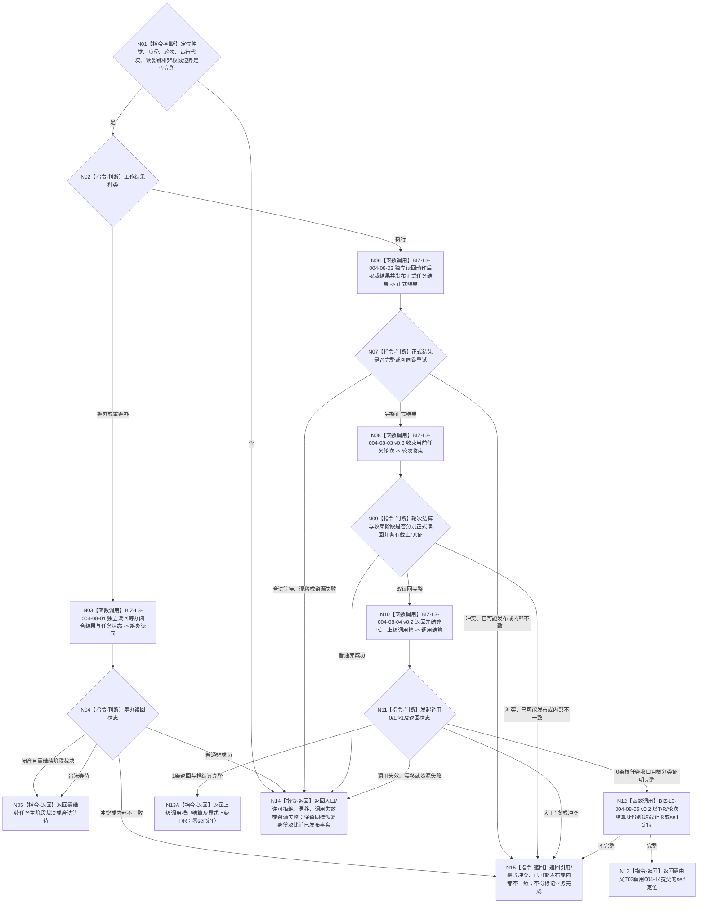

# BIZ-L2-004-08 上报一条任务工作结果目标函数流程图 v0.3

更新时间：2026-08-28

## 依据与替代

```text
0050 v1.9、4260 v0.9、5090 v0.7、5160 v0.4、5230 v1.2、8100 v0.7、8200 v0.7、8210
用户冻结业务边界：恰一正式上级调用只返回并结算该槽；零上级调用根任务才进入self
父线程：BIZ-L1-T03 v0.6 任务管理线程治理循环
异步前驱：BIZ-L1-T04 / BIZ-L2-004-07 发布到共享结果队列的筹办或执行定位
HEAD代码：任务管理线程仍使用任务结果回执/重筹办双队列；任务实际结果上行桥仍直接形成旧治理消息
```

本图替代 v0.2。v0.2 已退出任务结果后批量需求结算，但仍让0条根任务和1条子任务都形成self定位。v0.3固定为“正式读回与任务结果发布 → 本任务轮次收束 → 0..1 上级调用分流”：恰一调用只返回并结算该槽、回显式上级T/R治理槽；零调用根任务才形成self轮次结算定位。需求满足只在 BIZ-L2-004-06 的实际使用时 fresh 独立核算。

## 身份与边界

正式目标函数设计图。根函数消费任务管理线程已经从共享队列取出的一个不可变筹办或执行结果定位。筹办定位只独立读回已发布筹办闭合事实并返回下一阶段材料；执行定位必须从动作完成消息开始，独立读回动作后权威结果、发布并读回正式任务实际结果、收束当前任务轮次，再按正式0/1/>1上级调用分流。只有0条根任务形成交给父T03的self定位；1条子任务返回已结算调用槽及显式上级T/R，父T03据此建立上级主阶段治理槽。

本函数不重新执行方法动作，不批量遍历或结算 `T→D`，不判断需求满足，不形成 self 后继决议，也不直接调用 BIZ-L2-004-14 提交邮箱。

## 函数合同

```text
根函数：上报一条任务工作结果
归属模块 / 文件 / 目标分解深度：任务管理上行桥 / 海中鱼巣/线程/任务管理上行桥.ixx / BIZ-L2
现有或待新增：待适配整合；HEAD相邻执行定位链已能发布正式结果，但在轮次结算前即标记定位完成
完整签名：任务管理上行处理结果 任务管理上行桥::上报一条任务工作结果(const 任务工作结果定位& 定位) noexcept
参数：不可变值式定位；工作种类、任务、任务轮次、筹办/执行轮次、工作项、执行幂等、运行代次、最后动作顺序和恢复身份必须完整
返回结果：筹办闭合需继续阶段裁决、根任务轮次已收束且需提交self定位、子任务轮次已收束且上级调用槽已结算并携带显式上级T/R、合法等待、入口/许可拒绝、当前性/版本漂移、调用失效、引用/幂等冲突、资源失败、已可能发布或内部不一致
被调函数流程图：BIZ-L3-004-08-01—05
线程归属：T03唯一上行执行权；队列锁在调用前释放
```

## 流程图



## 子函数职责

| 子函数 | 唯一职责 | 不得承担 |
| --- | --- | --- |
| 004-08-01 | 独立读回筹办闭合及当前任务状态 | 重做筹办、发布选择/冻结 |
| 004-08-02 | 读取完成消息与动作后权威快照，发布并独立读回正式任务结果 | 轮次结算、需求结算、self消息 |
| 004-08-03 v0.3 | 只以本轮正式结果和必要停止/阶段/冻结收口材料收束当前轮次，分账task/阶段owner截止 | 等待全部 `T→D`、自动下一轮、把后段失败伪装成全程零写 |
| 004-08-04 v0.2 | 按子任务轮次读取0..1发起调用，以实际结果/合法零动作恰一发布返回并结算唯一上级调用槽 | 从需求树、`T→D`或队列猜上级；写上级目标满足；把零动作伪装成实际结果 |
| 004-08-05 v0.2 | 只为正式0条调用根任务将T/R/轮次结算身份、阶段截止和根分类见证形成值式self定位 | 为子任务形成self定位；携带结果/阶段/调用结算正文；提交邮箱；形成继续/结束/等待/取消决议 |

## 重试与完成边界

- 完成消息发布失败或未找到只重试同一消息读取；不得重新执行动作。
- 正式结果、轮次结算、阶段收束、调用返回或槽结算出现 `已可能发布` 时，只按原幂等身份和提交见证收敛；不得假报零写。
- 子任务轮次先收束自身，再处理调用返回；返回失败只重试调用返回/槽结算，不撤销任务结果或重做现实动作。
- 只有轮次收束和0/1调用分支都结构化收口，本次上行槽才可标记完成：0条根任务还须形成self定位；1条子任务必须回显式上级T/R且self定位为空。
- 当前 `BIZ-L4-004-08-04-01 v0.1` 把0条编码为未找到，不能证明合法0项；根分类见证producer、字段、完整枚举和0/1/N矩阵闭合前，0条根任务self分支零施工。1条显式调用返回链可独立继续设计。

## HEAD实现对照

| 能力 | HEAD事实 | 判断 |
| --- | --- | --- |
| 结果输入 | 当前发布源码中的 manager仍消费旧任务结果回执，并与旧重筹办槽组成双队列 | 目标任务工作结果定位三源仲裁未实现 |
| 正式任务结果发布/读回 | HEAD上行桥可记录并独立读回任务实际结果，但随后直接形成旧治理消息 | 相邻能力可复用；目标边界漂移 |
| 轮次结算与阶段收束 | HEAD结果上行主链未形成目标轮次结算/已收束阶段链 | 未接线 |
| 0..1上级调用返回 | 当前发布规范 4260 v0.9及发布源码均无目标公开生产入口 | 设计与实现缺失 |
| 根任务self定位 | HEAD无零上级调用完整证明及root-only定位生产链 | 未实现 |
| 需求结算 | 本函数不得执行；当前旧结果消费/分配WIP不属于目标链 | 退出004-08 |

## v0.3 校正记录

- 删除任务结果后同步需求复核、批量 `T→D` 结算和结果分配路径。
- 删除 004-08 内部直接调用 004-14；self消息提交恢复为父 BIZ-L1-T03 的独立直接根。
- 保留本轮先收束、0..1轮次级发起调用即时返回/槽结算，但只让0条根任务形成self定位；1条子任务只回显式上级T/R。
- 撤回未发布4260 v0.11、5090/8100 v0.8等依据，恢复HEAD正式版本与异主WIP分账。
- 明确HEAD仍是旧回执/重筹办双队列和旧治理消息边界，不能把工作区WIP当已发布接线。
