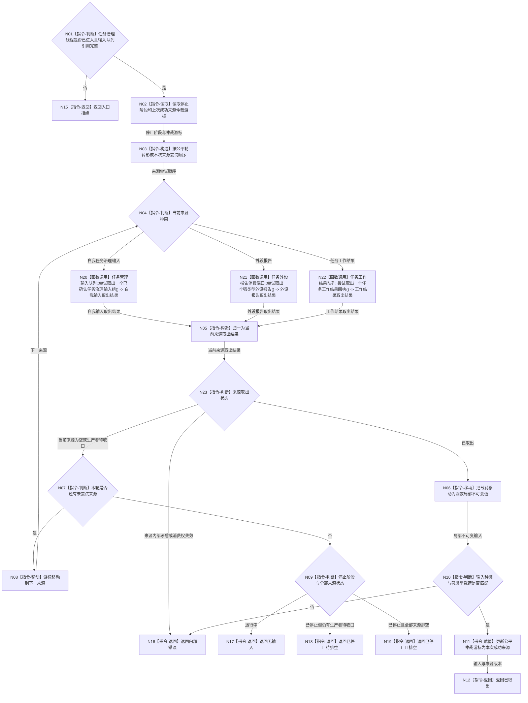

# BIZ-L2-004-09 取出一个不可变任务管理输入目标函数流程图 v0.1

更新时间：2026-08-03

## 依据

```text
4050、5090、8100、8200
父线程函数：BIZ-L1-T03 任务管理线程::运行治理循环
当前代码：任务管理线程已有运行消息队列和执行请求两阶段队列；尚无统一承载自我下行、外设报告和共享工作回执的管理输入
```

## 身份与边界

正式目标函数设计图。根函数只从任务管理线程拥有的输入源中公平取出一个值式不可变输入并立即释放队列锁；不调用领域服务、不裁决工作阶段。

## 函数合同

```text
根函数：取出一个不可变任务管理输入
归属模块 / 文件 / 层级：任务管理线程 / 海中鱼巣/线程/任务管理线程.ixx / L2
现有或待新增：适配扩展；复用现有队列取出能力，新增强类型多源仲裁和停止排空
完整签名：任务管理输入取出结果 任务管理线程::取出一个不可变任务管理输入()
参数：无显式参数；对象拥有自我下行队列、外设报告队列、共享工作结果队列、仲裁游标和停止阶段端口
返回结果：
  任务管理输入取出结果；包含已取出、无输入、已停止待排空、已停止且排空或内部错误，以及输入种类、不可变载荷、来源队列版本和取出顺序材料
被调函数流程图：BIZ-L3-004-09-01 任务管理输入队列::尝试取出一个已确认任务治理输入组；BIZ-L3-004-09-02 任务外设报告消费端口::尝试取出一个强类型外设报告；BIZ-L3-004-09-03 任务工作结果队列::尝试取出一个任务工作结果回执
```

## 流程图



## 节点合同

| 节点 | 类型 | 输入绑定 | 输出绑定 | 事实读写 | 验证 |
| --- | --- | --- | --- | --- | --- |
| N03 | 指令-构造 | 上次成功来源和来源集合 | 公平轮转顺序 | 只读线程局部游标 | 连续单源满载不饿死其它来源 |
| N04 | 指令-判断 | 当前来源 | 三类具名调用分支 | 无写入 | 来源枚举穷尽 |
| N20 | 函数调用 | 自我任务治理输入源 | 自我输入取出结果 | 整组移动一个已确认输入组 | 组原子性、停止与排空 |
| N21 | 函数调用 | 任务域外设报告独占消费端口 | 外设报告取出结果 | 移动一个强类型外设报告 | 多控制域公平、一次消费、生产者收口 |
| N22 | 函数调用 | 共享任务工作结果队列 | 工作结果取出结果 | 移动一个不可变回执 | 停止阶段继续排空 |
| N05/N23 | 指令 | 三类强类型结果 | 统一来源状态 | 无业务写入 | 不丢失具名非成功 |
| N06 | 指令-移动 | 队列项 | 局部不可变输入 | 无业务写入 | 不保留容器引用或锁 |
| N09 | 指令-判断 | 停止阶段和来源状态 | 空、待排空或已排空 | 无业务写入 | 停新输入与排空在途分离 |
| N10 | 指令-判断 | 输入种类和载荷 | 类型完整性 | 无写入 | 不靠空字段推断 |

## 关键边界

- “公平”只决定不同输入源的取出机会，不改变任务优先级、需求权重或工作阶段。
- 队列锁内只取出和移动值式材料；外设承接、任务读回、状态裁决和回执处理全部在锁外。
- 停止后不接收新的自我或外设输入，但必须继续排空已经发布的任务工作结果。
- 输入取出只证明材料到达，不证明其绑定事实、回执结论或任务阶段成立。
