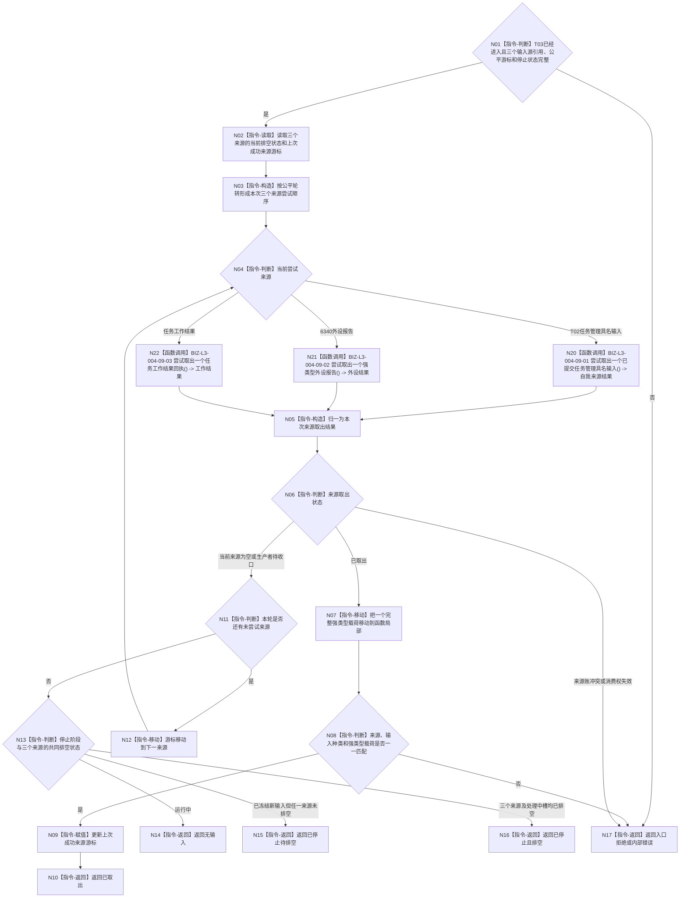

# BIZ-L2-004-09 取出一个不可变任务管理输入目标函数流程图 v0.2

更新时间：2026-08-26

## 依据与替代

```text
4050、5090 v0.7、8100 v0.7、8200 v0.7
BIZ-L1-T03 v0.4、BIZ-L2-002-08 v0.2、BIZ-L2-004-16
```

本图替代 v0.1。旧图把自我来源描述为一个可拆出多类语义的“已确认任务治理输入组”。现行自我来源是单项强类型队列：每次取出一个 `任务管理具名输入`，其载荷只能是具体需求 D 承接意图或 self 后继决议定位。外设报告和任务工作结果继续使用各自独立队列，不与自我输入共用幂等账。

## 身份与边界

正式目标函数设计图。根函数只在三个物理输入源之间公平取出一个值式不可变输入并立即释放来源锁：

1. T02 提交的单项任务管理具名输入；
2. 6340 强类型外设报告；
3. 任务工作结果定位 / 回执。

主阶段治理槽是 T03 已接管输入的线程私有恢复槽，不作为第四个外部队列参与公平仲裁。根函数不调用领域服务、不复核 D / self 决议的权威事实，也不裁决任务阶段。

## 函数合同

```text
根函数：取出一个不可变任务管理输入
归属模块 / 文件 / 目标分解深度：任务管理线程 / 海中鱼巣/线程/任务管理线程.ixx / BIZ-L2
现有或待新增：适配扩展；HEAD只有执行请求、结果上行和旧重筹办槽，没有本三源统一取出入口
完整签名：任务管理输入取出结果 任务管理线程::取出一个不可变任务管理输入() noexcept
参数：无显式参数；对象持有任务管理具名输入队列、外设报告消费端口、任务工作结果队列、公平游标和各来源停止 / 排空状态
返回结果：按值返回；已取出、无输入、已停止待排空、已停止且排空或内部错误，以及输入来源、强类型载荷、来源发布序号 / 版本和取出顺序材料
被调函数流程图：BIZ-L3-004-09-01 v0.2 尝试取出一个已提交任务管理具名输入；BIZ-L3-004-09-02 尝试取出一个强类型外设报告；BIZ-L3-004-09-03 尝试取出一个任务工作结果回执
```

## 流程图



## 节点合同

| 节点 | 类型 | 输入绑定 | 输出绑定 | 事实读写 | 验证 |
| --- | --- | --- | --- | --- | --- |
| N02/N03 | 读取 / 构造 | 三来源状态和上次成功来源 | 三来源公平尝试顺序 | 只读 / 写线程私有游标 | 单一来源持续满载不饿死其它来源；不改变任务优先级 |
| N20 | 函数调用 | T02单项具名输入队列 | 一个 D 承接意图或 self 决议定位 | 只移动队列项 | 不返回消息组；载荷判别明确 |
| N21/N22 | 函数调用 | 外设 / 工作结果独立队列 | 一个强类型报告或工作结果 | 只移动各自队列项 | 不共享自我输入幂等账 |
| N05—N10 | 构造 / 判断 / 移动 / 返回 | 一个来源结果 | 已取出强类型输入 | 无业务写入 | 来源、类型、载荷和发布材料一一匹配 |
| N11—N16 | 判断 / 返回 | 三来源与停止状态 | 空、待排空或已排空 | 无业务写入 | 停新输入与排空已接受材料分离 |

## 取出后的唯一分流

| 取出载荷 | T03唯一后继 | 不得执行 |
| --- | --- | --- |
| 具体需求任务承接意图 | 按 D 正式读取所属 L，再以 L 查询 0..1 当前任务并进入 BIZ-L2-004-02 后继子树 | 不从消息读取当前任务，不把列表其它成员承接，不计算调度 / 许可 |
| 自我任务后继决议定位 | 按显式 T / R / 结算 / 决议 / G 调用 BIZ-L2-004-16 独立读回并消费 | 不使用消息中的决议缓存，不把等待 / 结束改成继续 |
| 强类型外设报告 | 调用 BIZ-L2-004-10 的 6340 正式承接与三路分流 | 无匹配不得创建需求或任务 |
| 任务工作结果 | 调用 BIZ-L2-004-08 独立读回完成消息、动作后权威结果和正式任务结果 | 不把回执或工作线程状态当正式结果 |

## 关键边界

- “公平”只决定三个输入源获得取出机会，不决定需求权重、任务优先级、方法选择或 self 后继分支。
- T02具名输入队列内部保持发布 FIFO；不同来源之间只按公平游标轮转，不建立跨来源全局业务顺序。
- 队列锁内只取出和移动值式材料。D / L / T 读回、self 决议读回、外设承接和任务结果读回全部在锁外。
- 停止后不接受新的普通 T02 输入或外设报告，但必须继续排空门冻结前已提交项和已经发布的工作结果；只有三个来源及 T03 已接管处理中槽共同为空才返回已停止且排空。
- 8100允许但尚未进入当前 T03父图的其它治理消息，不得借“统一输入”名称自动加入本函数。
