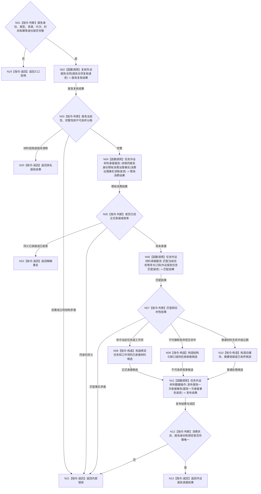

# BIZ-L2-004-10 按6340承接一条外设报告目标函数流程图 v0.1

更新时间：2026-08-03

## 依据

```text
5230、6320、6340—6360、8100
父线程函数：BIZ-L1-T03 任务管理线程::运行治理循环
当前代码：外设采样材料线程和任务执行请求仅有相邻传递能力；跨任务、窗口和代次唯一正式承接尚未形成通用入口
```

## 身份与边界

正式目标函数设计图。根函数由任务领域唯一消费报告稳定身份，匹配当前任务、等待项或订阅项并发布已承接材料引用、结构化缺口或合法舍弃结果；不写世界事实。

## 函数合同

```text
根函数：按6340承接一条外设报告
归属模块 / 文件 / 层级：任务外设材料承接 / 海中鱼巣/领域/服务.任务外设材料承接.ixx / L2
现有或待新增：待新增；复用外设报告协议和任务承接读取能力
完整签名：外设报告承接结果 任务外设材料承接服务::按6340承接一条外设报告(const 外设报告承接请求& 请求)
参数：
  请求：const 外设报告承接请求&，只读借用；必须携带报告稳定身份、强类型报告、生产代次、消费代次、当前时间、任务 / 等待 / 订阅快照版本和幂等身份
返回结果：
  外设报告承接结果；包含正式承接、仅缓存、降级处理、摘要保留、已舍弃、结构化缺口、精确重复、材料拒绝、版本漂移或内部错误，以及绑定任务 / 工作项材料引用、处理原因和消费版本
被调函数流程图：BIZ-L3-004-10-01 复核外设报告合同；BIZ-L3-004-10-02 任务外设材料承接服务::读取同报告身份既有消费治理事实；BIZ-L3-004-10-03 任务外设材料承接服务::匹配当前任务等待与订阅；BIZ-L3-004-10-04 任务外设材料数据操作::发布报告一次承接事务
```

## 流程图



## 节点合同

| 节点 | 类型 | 输入绑定 | 输出绑定 | 事实读写 | 验证 |
| --- | --- | --- | --- | --- | --- |
| N02 | 函数调用 | 强类型报告和时间 | 报告复核结果 | 只读报告材料 | 来源、TTL、产品、成熟度和配置版本 |
| N04 | 函数调用 | 报告稳定身份 | 跨代次消费治理事实 | 只读任务域消费事实 | 同一报告最多一次正式承接 |
| N06 | 函数调用 | 报告、任务 / 等待 / 订阅快照 | 确定匹配结果 | 只读任务治理事实 | 任务、窗口和时效不放宽唯一键 |
| N08—N10 | 指令-构造 | 报告与匹配结果 | 三类互斥候选 | 无写入 | 不可舍弃报告不静默丢弃 |
| N11/N12 | 函数调用 / 判断 | 完整候选和幂等身份 | 消费状态与绑定读回 | 任务域事务 | 全确认或内部错误 |

## 关键边界

- 报告稳定身份是跨任务、窗口和代次的唯一消费竞争键；队列位置和线程编号不参与唯一性。
- 正式承接只产生绑定任务 / 工作项的材料引用或治理结果，不生成存在、场景、特征、状态、动态或因果事实。
- 当前冻结方法只能消费本工作项已承接材料引用，不能再次读取物理报告队列。
- 普通过期无命中材料可以舍弃；安全事件、状态跃迁、跟踪丢失、外设错误和影响目标判断的缺口不得静默舍弃。
