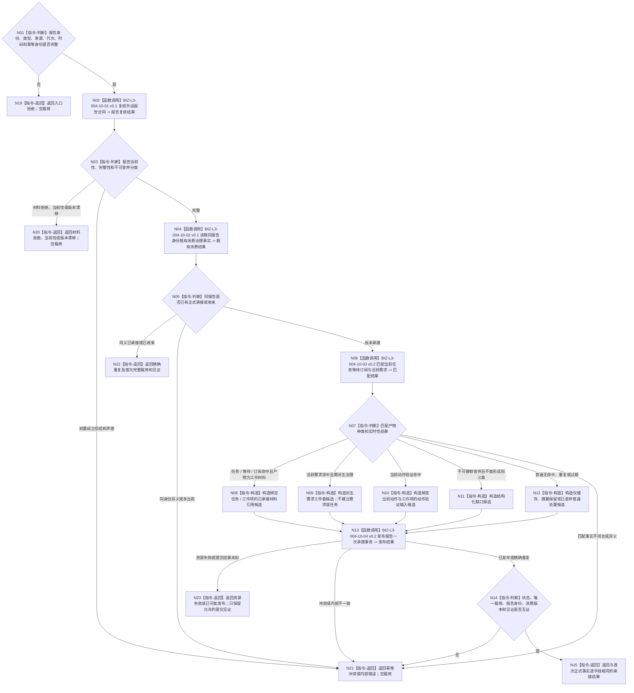

# BIZ-L2-004-10 按6340承接一条外设报告目标函数流程图 v0.2

更新时间：2026-08-27

## 依据与替代

```text
5230、6320、6340—6360、8100
父线程函数：BIZ-L1-T03 v0.5 任务管理线程::运行结果上行循环
当前代码：外设采样材料线程和任务执行请求仅有相邻传递能力；跨任务、窗口和代次唯一正式承接尚未形成通用入口
```

本图完整替代 v0.1。v0.1 只匹配任务、等待与订阅，并把发布结果压缩为“任务 / 工作项绑定、结构化缺口、普通处置”三类，遗漏 6340 正式要求的活跃需求、派生需求三件套和动作验证输入。

## 身份与边界

正式目标函数设计图。根函数由任务域唯一消费报告稳定身份，匹配当前任务、等待项、订阅项和活跃需求，形成以下恰一业务承接或普通收束结果：

1. 绑定任务 / 工作项的已承接外设材料引用；
2. 派生需求三件套候选；
3. 动作验证输入；
4. 结构化缺口；
5. 仅缓存、摘要保留或已舍弃的普通处置。

派生需求三件套只是引用同一报告和同截止匹配证据的强类型候选，不是需求、任务或世界事实。004-10 不得调用需求或任务建立入口；父 T03 必须保持该候选的完整强类型身份，经 004-14 的独立派生需求分支交给 self 后继治理，不得改名或装入结构化治理缺口。

## 函数合同

```text
根函数：按6340承接一条外设报告
归属模块 / 文件 / 目标分解深度：任务外设材料承接 / 海中鱼巣/领域/服务.任务外设材料承接.ixx / BIZ-L2
现有或待新增：待新增；复用外设报告协议和任务、等待、订阅、活跃需求正式读取能力
完整签名：外设报告承接结果 任务外设材料承接服务::按6340承接一条外设报告(const 外设报告承接请求& 请求)
参数：
  请求：const 外设报告承接请求&，只读借用；必须携带报告稳定身份、强类型报告、生产代次、消费代次、当前时间、任务 / 等待 / 订阅 / 活跃需求快照版本和幂等身份
返回结果：
  外设报告承接结果；状态为已承接任务或工作项材料、已形成派生需求三件套、已形成动作验证输入、已形成结构化缺口、仅缓存、摘要保留、已舍弃、精确重复、入口拒绝、材料拒绝、当前性漂移、版本漂移、幂等冲突、资源失败、已可能发布或内部错误；成功载荷种类必须与状态恰一对应，并保留报告身份、处理原因、消费版本和正式发布见证
被调函数流程图：BIZ-L3-004-10-01 v0.1 复核外设报告合同；BIZ-L3-004-10-02 v0.1 读取同报告身份既有消费治理事实；BIZ-L3-004-10-03 v0.2 匹配当前任务等待订阅与活跃需求；BIZ-L3-004-10-04 v0.2 发布报告一次承接事务
```

## 流程图



## 节点合同

| 节点 | 类型 | 输入绑定 | 输出绑定 | 事实读写 | 验证 |
| --- | --- | --- | --- | --- | --- |
| N02 | 函数调用 | 强类型报告和时间 | 报告复核结果 | 只读报告材料 | 来源、TTL、产品、成熟度和配置版本 |
| N04 | 函数调用 | 报告稳定身份 | 跨代次消费治理事实 | 只读任务域消费事实 | 同一报告最多一次正式承接或收束 |
| N06 | 函数调用 | 报告及任务 / 等待 / 订阅 / 活跃需求同截止快照 | 确定匹配结果 | 只读任务和需求治理事实 | 四类匹配对象完整；任务、窗口和时效不放宽唯一键 |
| N08—N12 | 指令-构造 | 报告与匹配结果 | 五类互斥候选 | 无写入 | 四类业务承接与普通处置分账；派生候选零需求 / 任务写入 |
| N13—N15 | 函数调用 / 判断 / 返回 | 完整候选和幂等身份 | 首次消费状态、唯一载荷与见证 | 任务域一次承接事务 | 报告身份唯一；状态与载荷逐字段互证 |

## 状态矩阵

| 输入 / 事实形状 | 结果 | 载荷与后继 |
| --- | --- | --- |
| 命中当前任务、等待项或订阅项并形成工作材料 | 已承接任务或工作项材料 | 恰一已承接材料引用；父T03进入当前任务治理 |
| 命中活跃需求但无现成任务 / 工作项承接 | 已形成派生需求三件套 | 恰一强类型候选；父T03经004-14独立派生需求分支交self，不直接建立需求或任务 |
| 命中当前动作验证合同 | 已形成动作验证输入 | 恰一动作验证输入；父T03唤醒相应任务 / 工作项治理 |
| 不可静默舍弃且不能形成前三类 | 已形成结构化缺口 | 恰一缺口定位材料；父T03交self后继治理 |
| 普通材料无命中、重复或过期 | 仅缓存 / 摘要保留 / 已舍弃 | 无业务承接载荷；形成具名普通处置原因后收口 |
| 同报告身份、同完整请求与首次结果同义 | 精确重复 | 返回首次完整状态、载荷、消费版本和见证；零第二次副作用 |
| 同报告身份异义或多份当前结论 | 幂等冲突 / 内部错误 | 空业务载荷；不得降级为普通舍弃 |
| 材料、版本或当前性不成立 | 材料拒绝 / 当前性漂移 / 版本漂移 | 空载荷；零发布 |
| 资源失败或提交结果不确定 | 资源失败 / 已可能发布 | 空业务载荷；只保留允许的提交见证，必须按原身份收敛 |

## 关键边界

- 报告稳定身份是跨任务、窗口和代次的唯一消费竞争键；队列位置和线程编号不参与唯一性。
- 非权威最新报告缓存可以随正式处理刷新，但不能成为第六种业务承接、第二消费位置或重放来源。
- 派生需求三件套、动作验证输入和结构化缺口都是任务域强类型治理材料；只有后继合法 owner 的正式入口可以建立需求、任务或世界事实。
- 当前冻结方法只能消费本工作项已承接材料引用，不能再次读取物理报告队列。
- 普通过期无命中材料可以舍弃；安全事件、状态跃迁、跟踪丢失、外设错误和影响目标判断的缺口不得静默舍弃。
