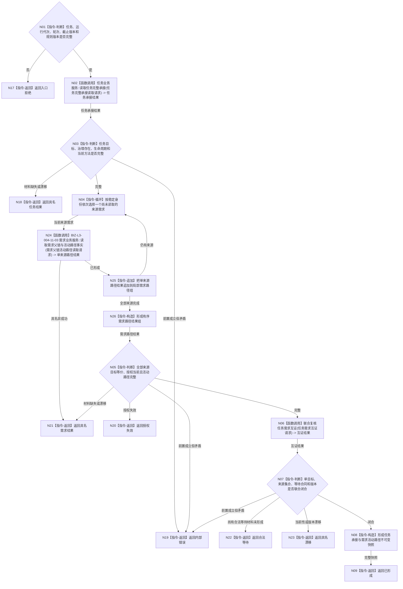

# BIZ-L2-004-11 完整读回任务承接与需求活动路径目标函数流程图 v0.1

更新时间：2026-08-03

## 依据

```text
5090—5120、5200—5230、8100
父线程函数：BIZ-L1-T03 任务管理线程::运行治理循环
当前代码：任务业务服务和需求业务服务已有局部承接读取；缺多来源、活动路径、等待合同和同代次组合快照
```

## 身份与边界

正式目标函数设计图。根函数从任务和需求正式所有者读回任务完整承接、全部目标等价来源需求、活动路径、授权、状态和等待合同；全程只读。

## 函数合同

```text
根函数：完整读回任务承接与需求活动路径
归属模块 / 文件 / 层级：运行期只读查询 / 海中鱼巣/领域/组合.运行期只读查询.ixx / L2
现有或待新增：适配扩展；组合现有任务 / 需求读取并补齐多来源与路径互证
完整签名：任务承接活动路径读回结果 运行期只读查询组合器::完整读回任务承接与需求活动路径(const 任务承接活动路径读回请求& 请求) const
参数：
  请求：const 任务承接活动路径读回请求&，只读借用；必须携带任务、运行代次、任务轮次、事实截止版本和读取规则版本
返回结果：
  任务承接活动路径读回结果；包含已形成、合法等待、材料缺失、授权失效、当前性漂移、版本漂移、入口拒绝或内部错误，以及任务目标、全部来源需求、活动路径、授权、状态、当前方法、等待合同和来源版本
被调函数流程图：BIZ-L3-004-11-01 任务业务服务::读取任务完整承接；BIZ-L3-004-11-03 v0.3 需求业务服务::读取需求父链与活动路径事实并逐来源调用；BIZ-L3-004-11-02 联合复核任务需求互证
```

## 流程图



## 节点合同

| 节点 | 类型 | 输入绑定 | 输出绑定 | 事实读写 | 验证 |
| --- | --- | --- | --- | --- | --- |
| N02 | 函数调用 | 任务和截止版本 | 任务完整承接 | 只读任务事实 | 完整或具名返回 | 治理存在、状态、目标和当前方法 |
| N04/N24/N25/N26 | 循环 / 函数调用 / 追加 / 构造 | 全部来源需求和截止版本 | 有序需求活动路径组 | 逐来源只读需求事实 | 全部完成或具名非成功 | 复用既有读取入口，不建立重复聚合服务 |
| N06/N07 | 函数调用 / 判断 | 任务与需求材料 | 联合互证 | 无写入 | 闭合、等待、漂移或错误 | 双向来源、目标与等待合同 |
| N08 | 指令-构造 | 联合互证材料 | 不可变快照 | 无写入 | 来源版本齐全 | 不返回可写引用 |

## 关键边界

- 任务节点、需求节点和方法列表是独立结构；本函数只组合值式读回，不建立第二份目标或状态。
- 同一任务的多个目标等价来源必须全部保留路径、权重、预算、权限和当前性，不能只取第一来源。
- 半结构不得进入筹办或执行阶段裁决；材料尚未形成时返回合法等待或具名缺失。
- 任务管理线程调用期间不持有输入队列、工作队列或回执队列锁。
