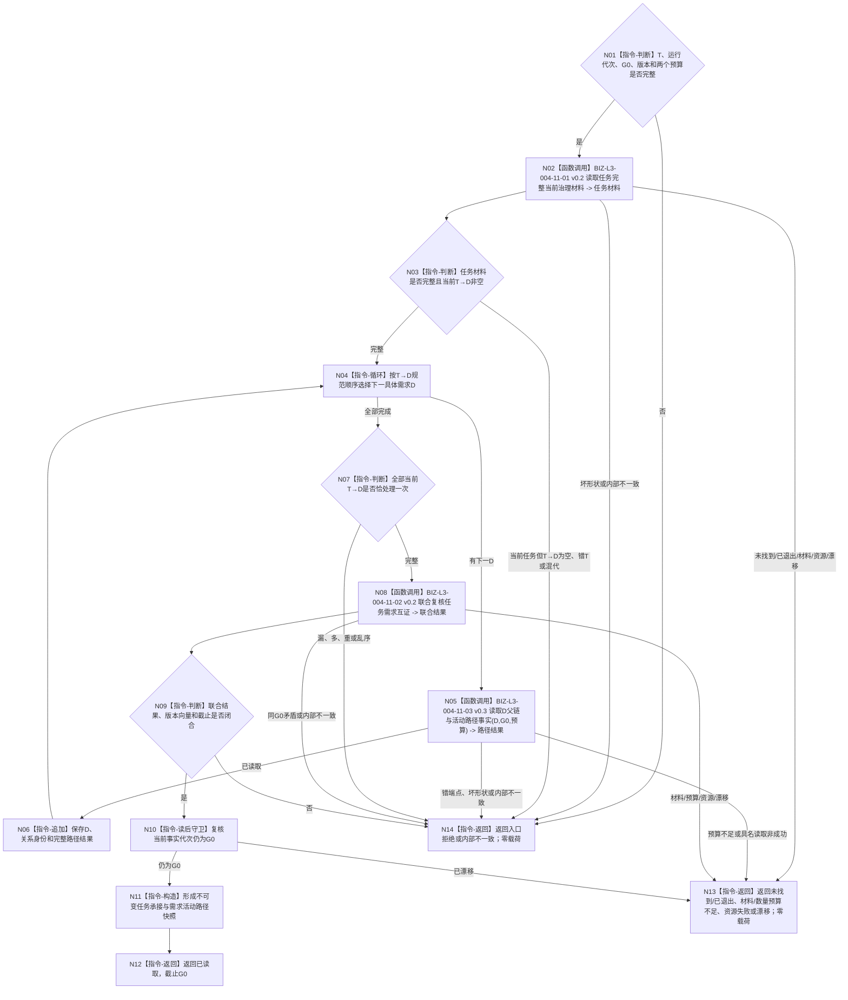

# BIZ-L2-004-11 完整读回任务承接与需求活动路径目标函数流程图 v0.2

更新时间：2026-08-27

## 依据与替代

```text
0050、3100、3200、4260 v0.9、5090、5210 v1.1、5220 v0.2、5230 v1.2、8100
父线程函数：BIZ-L1-T03 v0.6 任务管理线程::运行结果上行循环
子图：BIZ-L3-004-11-01/02 v0.2、BIZ-L3-004-11-03 v0.3
复用叶：BIZ-L4-004-02-02-10/11 v0.1
```

本图完整替代 v0.1。旧图读取“任务单目标副本、任务治理存在和任务治理状态”，并把合法等待当作读取失败；这些口径均退出。任务没有目标副本和治理私有存在，主阶段唯一由正式 `T→E` 所指存在 `E` 上的 ARCH-L2 当前状态选择表达。筹办前尚无选择、等待阶段有具名等待事实、执行阶段有选择 / 实例 / 冻结，都是完整当前材料的不同合法形状。

## 身份与边界

正式目标函数设计图。函数以任务 `T` 和非零共同截止 `G0` 为唯一读取锚点，同截止读取任务核心与身份来源、固定 `T→L`、唯一正式 `T→E` 和 `E` 身份来源、当前任务轮次、`E` 上的当前主阶段、完整当前 `T→D` 关系组、每个具体需求的当前目标材料、阶段要求的可空选择 / 实例 / 冻结与具名等待事实，以及每个来源需求的父链和活动路径；最后只做值式联合互证。

本函数不重判父任务等待，不发布阶段、轮次、需求满足或任务结果，也不从查询锚点、列表成员、兼容任务虚拟存在、旧任务治理状态、队列、线程、缓存或日志补造任一业务事实。

## 函数合同

```text
根函数：运行期只读查询组合器::完整读回任务承接与需求活动路径
归属模块 / 文件 / 目标分解深度：运行期只读查询 / 海中鱼巣/领域/组合.运行期只读查询.ixx / BIZ-L2
现有或待新增：待新增目标组合；HEAD只有分散任务读取和当前选择读取，缺正式T→D/T→E/当前轮次及同G0阶段组合
完整签名：任务承接活动路径读回结果 运行期只读查询组合器::完整读回任务承接与需求活动路径(const 任务承接活动路径读回请求& 请求) const noexcept
参数：请求只读借用；含任务T、运行代次、非零G0、事实/任务/需求/阶段/路径/活动/读取规则版本，以及父链深度预算和当前子关系总数量预算；不接收调用方声明的任务目标、治理存在、阶段、来源需求组、选择或等待结论
返回结果：已读取、未找到、已退出、材料不足、数量预算不足、当前性漂移、版本漂移、入口拒绝、资源失败或内部不一致；已读取时携带T/L/E/T→E、当前任务轮次、ARCH-L2当前主阶段、规范有序非空T→D、逐来源目标材料、逐来源父链/活动路径、阶段所需可空选择/实例/冻结/等待事实、完整版本向量和截止G0；其它状态零业务载荷。DATA读取不产生许可拒绝；历史下层枚举若保留该数值也不得由本新合同返回
被调函数流程图：BIZ-L3-004-11-01 v0.2；BIZ-L3-004-11-03 v0.3逐来源调用；BIZ-L3-004-11-02 v0.2
线程归属：T03在输入槽和队列锁外调用；只读，不取得task、需求、存在、状态或等待owner写权
```

## 流程图



## 节点合同

| 节点 | 类型 | 输入绑定 | 输出绑定 | 事实读写 | 验证 |
| --- | --- | --- | --- | --- | --- |
| N01—N03 | 判断 / 组合读取 | T、G0、版本 | T/L/E/当前R/阶段、完整T→D和阶段材料 | 只读task、存在、状态、需求owner | 未找到、已退出、0/N来源、阶段可空材料、混代 |
| N04—N07 | 循环 / 逐来源读取 | 规范T→D组、同一G0和预算 | 与关系一一对应的需求父链/活动路径组 | 只读需求owner | 根需求、深链、空活动组、预算、环、漏/多/重 |
| N08/N09 | 纯值互证 | 任务材料和逐来源路径 | 联合闭合结果 | 无写入 | 目标同义、关系集合、端点、阶段材料和版本逐字段一致 |
| N10—N12 | 读后守卫 / 构造 / 返回 | 完整联合材料 | 不可变成功快照 | 只读事实代次；无业务写入 | G0前后稳定，成功截止恰为G0 |
| N13/N14 | 返回 | 具名非成功 | 零业务载荷 | 无写入 | 错误类别不折叠，不返回前缀路径 |

## 关键边界

- 任务目标只能由非空当前 `T→D` 逐项回源具体需求并按正式目标合同互证形成；任务和查询锚点都不保存目标副本。
- `T→E` 是任务唯一正式存在引用。兼容 `任务虚拟存在`只可在正式 `T→E/E` 已读回后作等值投影，不能进入本图成功条件。
- 当前主阶段只由 `E` 上的 ARCH-L2 当前状态选择读取；旧 `L2任务治理状态`、生命周期枚举、队列位置和线程状态不得参与阶段裁决。
- 选择 / 实例 / 冻结和等待事实按阶段可空：筹办前的正式空值是完整结果；阶段要求非空而缺失才是材料不足或内部不一致。
- 本图只提供完整当前材料。单项具名回流是否解除当前等待、下一阶段是什么、目标是否满足、是否派发，分别由004-12 v0.2、004-13、004-01/06和003-03裁决。
- 本图及全部新下层读取不执行调用权限裁决；旧 `许可拒绝` 只可作为历史ABI解码值保留，不进入当前结果矩阵。

## 当前代码实现对照

- HEAD已发布`读取任务`、`按任务读取当前方法选择`和`按任务读取当前实例方法`，但仍保留旧任务虚拟存在/需求列表项字段。
- HEAD尚无`按任务读取来源需求关系组`、`读取任务正式存在关系`、`读取任务轮次`的生产实现，也无本根组合器和按阶段完整空见证读取；因此本图不证明代码已实现。
- 已有BIZ-L4-004-02-02-10/11、BIZ-L3-004-11-03 v0.3等目标合同可复用；不得另建第二T→D或需求路径读取权威。

## v0.2 校正记录

- 按0050/20260827 DATA中性边界删除新读取合同中的许可拒绝分支；历史枚举只可兼容解码，不进入当前结果。
- 删除已被本图及直接子图替代、但仍自称正式目标图的004-11 v0.1物理文件；旧任务目标副本、治理存在、治理状态和第二来源枚举不再保留并列入口。
- 删除任务目标副本、任务治理存在、旧治理状态和通用授权读取。
- 成功材料改为正式T→E/E、当前任务轮次、E上的ARCH-L2阶段和完整T→D逐需求回源。
- 合法等待不再是读取失败；等待阶段以完整阶段和具名等待事实成功返回。
- 增加阶段可空选择/冻结矩阵、逐来源活动路径一一守恒和G0读后守卫。
