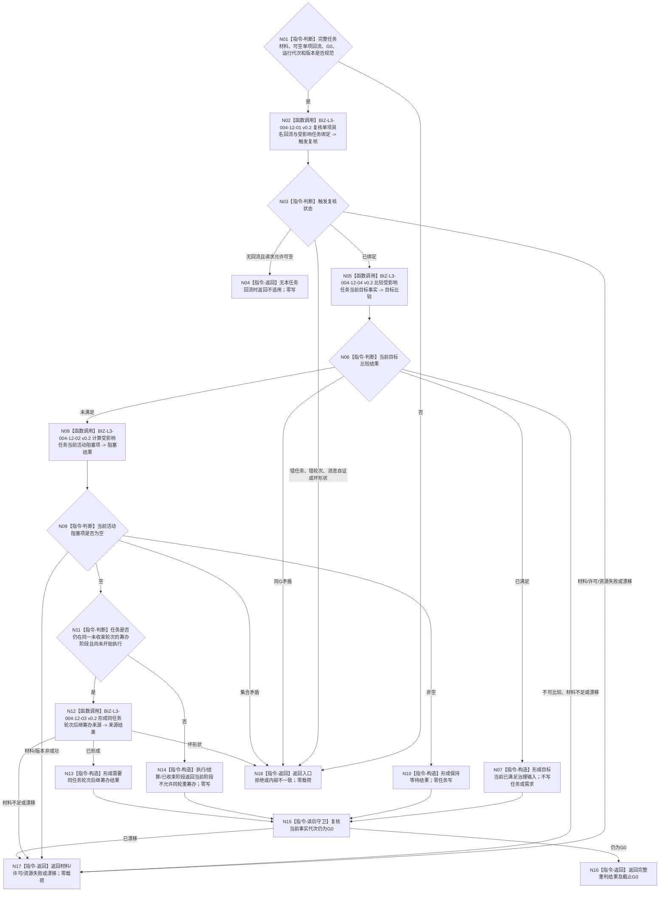

# BIZ-L2-004-12 按单项具名回流重判受影响任务目标函数流程图 v0.2

更新时间：2026-08-27

## 依据与替代

```text
0050、3200、4260 v0.9、5090 v0.7、5210 v1.1、5220 v0.2、5230 v1.2、8100
父线程函数：BIZ-L1-T03 v0.5 任务管理线程::运行结果上行循环
输入：BIZ-L2-004-11 v0.2 完整任务材料，以及已经由正式 owner 读回的单项具名回流事实
相邻目标合同：BIZ-L3-004-08-04 v0.2 上级调用返回与调用槽结算
```

本图完整替代 v0.1。旧图请求调用方直接给出“父任务”，恢复了 4260 已废止的任务父子结构；又把保持等待、目标完成和待重筹办包装成一套自造联合事务，并读取任务目标副本和旧 `L2任务治理状态`。这些语义全部退出。

## 身份与边界

正式目标函数设计图。函数只处理一项已经正式形成、且能逐字段绑定当前任务具名等待槽的回流事实。它不从需求树、结果相似性、线程消息、队列顺序或名称猜测“父任务”；有明确上级调用时，只使用发起调用与已结算调用槽中显式保存的上级任务和任务轮次。其它需求或任务不因本次结果被批量结算，轮到自身实际使用时再 fresh 复核当前目标。

函数在同一 `G0` 复核触发绑定、比较受影响任务当前目标、重算当前活动阻塞项，并只形成以下值式治理输入之一：不适用、保持等待、目标当前已满足、需要同任务轮次后继筹办、当前阶段不允许同轮重筹办。它不发布需求满足、任务阶段、筹办轮次、路径、实例、冻结、调用返回或 self 后继事实。

## 函数合同

```text
根函数：任务等待回流重判组合器::按单项具名回流重判受影响任务
归属模块 / 文件 / 目标分解深度：任务内部治理组合 / 海中鱼巣/领域/内部治理/服务.任务等待回流重判.ixx / BIZ-L2
现有或待新增：待新增目标组合；HEAD现有“任务子目标回流重判提供者::重判父需求并准备筹办”属于旧模型，不能直接复用
完整签名：任务等待回流重判结果 任务等待回流重判组合器::按单项具名回流重判受影响任务(const 任务等待回流重判请求& 请求) const noexcept
参数：请求只读借用；含BIZ-L2-004-11 v0.2完整任务材料、可空单项具名回流读取结果、运行代次、G0、回流/目标比较/阻塞/阶段规则版本；不接收父任务、任务目标副本、旧治理状态或调用方拼装阻塞集合
返回结果：不适用、保持等待、目标当前已满足、需要同任务轮次后继筹办、当前阶段不允许同轮重筹办、材料不足、当前性/版本漂移、入口/许可拒绝、资源失败或内部不一致；成功形状携带受影响T/R、触发事实、目标比较、当前阻塞项、可选同轮后继筹办来源和截止G0
被调函数流程图：BIZ-L3-004-12-01—04 v0.2；复用BIZ-L2-004-11 v0.2、BIZ-L3-004-01-01/02及BIZ-L3-004-08-04 v0.2的正式读回结果
线程归属：T03在单一主阶段治理槽和队列锁外调用；只读，不取得task、需求、状态、调用或self owner写权
```

## 流程图



## 节点合同

| 节点 | 类型 | 输入绑定 | 输出绑定 | 事实读写 | 验证 |
| --- | --- | --- | --- | --- | --- |
| N02—N04 | 触发复核 / 返回 | 正式读回回流事实、当前T/R/等待槽 | 不适用或唯一受影响任务绑定 | 无写入 | 0/1触发、错T/R、调用槽、等待条件版本、消息自证 |
| N05—N07 | fresh比较 / 构造 | 004-11逐需求同义目标投影、当前正式事实 | 当前目标已满足/未满足 | 只读目标与当前事实owner | 不读取任务目标副本，不用子结果替代当前事实 |
| N08—N10 | 纯值重算 | 当前活动路径、具名等待槽和本次触发 | 规范有序当前阻塞项或保持等待 | 无写入 | 历史项退出、单项即时重判、空集合不等于目标满足 |
| N11—N14 | 阶段分流 / 来源形成 | ARCH-L2当前主阶段、当前R/筹办轮次和执行开始事实 | 同轮后继筹办来源或禁止同轮重筹办 | 无写入 | 只允许未收束筹办阶段；执行、结算、收束后不回跳 |
| N15/N16 | 读后守卫 / 返回 | 全部完整材料 | 同G0不可变重判结果 | 只读代次；无业务写入 | 截止守恒，不返回半结果 |

## 关键边界

- 明确上级调用只允许由正式发起调用和已结算调用槽定位；需求父关系不是任务父子关系，也不能单独推出唯一上级任务。
- 任务结果不是可分配资源。直接上级任务因本次调用返回被唤醒；其它相关任务只在自己实际使用、筹办或派发前 fresh 复核当前状态。
- 目标当前已满足只形成当前任务轮次的零动作/结算治理输入；需求正式满足仍走 BIZ-L2-004-06，任务轮次收束仍走 BIZ-L3-004-08-03 v0.3。
- 保持等待是完整零写结果，不发布“保持等待事务”。阻塞清空也不直接写任务、需求或阶段。
- 同轮后继筹办只形成 5230 强类型来源，实际路径/选择/实例/冻结由 BIZ-L2-004-03 及 task owner 唯一入口发布；阶段变化由阶段 owner 发布。
- 执行、结算或轮次已收束后不得自动重筹办。已收束轮次只把新事实留作 self 后继裁决或后续实际使用时的 fresh 输入。

## 当前代码实现对照

- HEAD 已有 `任务子目标回流重判提供者::重判父需求并准备筹办`，但它从旧子目标承接记录的父需求和需求列表项读取/创建任务，并直接提交旧 `L2任务后继筹办准备记录事实`。
- 该实现仍依赖任务虚拟存在、需求列表项、`实际结果未达成/子目标回流`旧触发枚举和按筹办分区直接递增轮次；没有读取正式T→E/E、当前任务轮次、ARCH-L2阶段、完整T→D或具名等待槽。
- HEAD没有本图组合器、正式上级调用槽生产ABI、004-11 v0.2完整读回或5230同轮来源的现行生产入口。因此本图只校正目标合同，不证明代码已实现。

## 仍需上游裁决

`DRIFT-BIZ-004-12-EARLY-WAIT-SUCCESSOR-SOURCE-UNFROZEN`：5210/5220允许任务在尚无当前路径/实例时形成具名等待并在条件回流后建立新筹办轮次；5230现行“同任务轮次后继筹办来源”却要求逐项保存旧路径和旧实例。两者未冻结“早期等待无旧选择”的强类型来源形状。该分支必须返回材料不足且零写，不能用空身份、旧任务虚拟存在或当前筹办轮次整数补造。

## v0.2 校正记录

- 删除任务父子、父任务请求字段、任务目标副本、旧治理状态和自造联合事务。
- 单项回流只定位明确受影响任务；直接上级调用使用正式调用边，其它任务延后到实际使用时 fresh 复核。
- 保持等待改为完整零写；目标已满足只形成治理输入；同轮后继筹办只形成强类型来源，不在本函数发布选择、阶段或需求结算。
- 旧 BIZ-L4-004-12-03-01—05 自建候选事务全部退出当前调用树。
