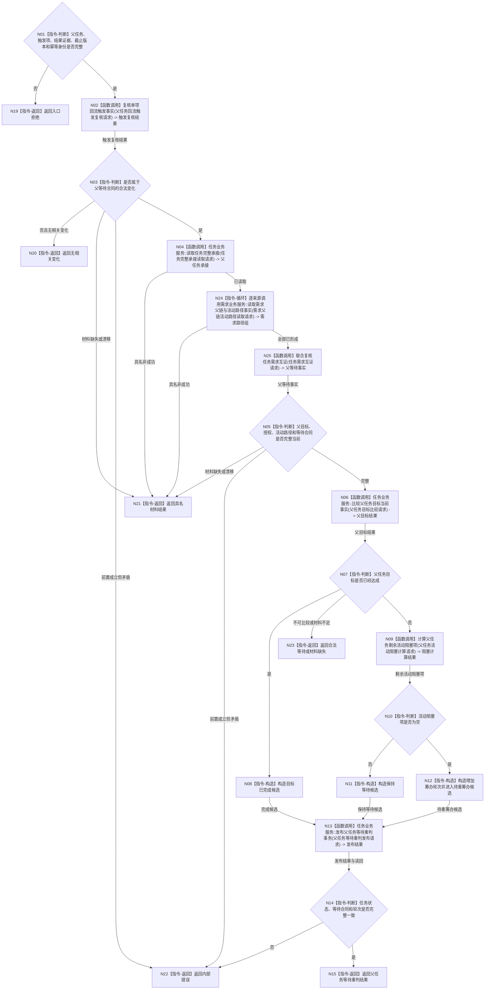

# BIZ-L2-004-12 重判父任务等待条件与活动阻塞项目标函数流程图 v0.1

更新时间：2026-08-03

## 依据

```text
5110、5210、5220、5230、8100
父线程函数：BIZ-L1-T03 任务管理线程::运行治理循环
当前代码：任务生命周期服务具备状态迁移相邻能力；缺按单项子结果重读等待合同和活动阻塞集合的专用入口
```

## 身份与边界

正式目标函数设计图。根函数由任务领域根据正式子结果和等待合同重判父任务是否保持等待、进入新筹办轮次或目标已自然完成；不直接写父需求满足。

## 函数合同

```text
根函数：重判父任务等待条件与活动阻塞项
归属模块 / 文件 / 层级：任务领域服务 / 海中鱼巣/领域/服务.任务.ixx / L2
现有或待新增：适配扩展；复用任务读取和生命周期提交，新增等待合同与活动阻塞集合
完整签名：父任务等待重判结果 任务业务服务::重判父任务等待条件与活动阻塞项(const 父任务等待重判请求& 请求)
参数：
  请求：const 父任务等待重判请求&，只读借用；必须携带父任务、触发子任务 / 子需求、正式结果证据、任务承接快照、事实截止版本、期望轮次和幂等身份
返回结果：
  父任务等待重判结果；包含保持等待、进入待重筹办、目标已完成、无相关变化、合法等待、材料缺失、版本漂移、入口拒绝或内部错误，以及剩余活动阻塞项、新轮次触发和发布版本
被调函数流程图：BIZ-L3-004-12-01 复核单项回流触发事实；复用BIZ-L3-004-11-01、BIZ-L3-002-04-02与BIZ-L3-004-11-02形成父任务等待一致事实；BIZ-L3-004-12-04 任务业务服务::比较父任务目标当前事实；BIZ-L3-004-12-02 计算父任务剩余活动阻塞项；BIZ-L3-004-12-03 任务业务服务::发布父任务等待重判事务
```

## 流程图



## 节点合同

| 节点 | 类型 | 输入绑定 | 输出绑定 | 事实读写 | 验证 |
| --- | --- | --- | --- | --- | --- |
| N02 | 函数调用 | 子任务 / 子需求和正式结果证据 | 合法触发结论 | 只读正式事实 | 相关、无关、缺失或错误 | 子结束枚举不自证触发 |
| N04/N24/N25 | 函数调用 / 循环 / 函数调用 | 父任务和截止版本 | 父等待一致事实 | 只读任务 / 需求事实 | 完整或具名返回 | 复用完整承接、逐来源路径和联合互证 |
| N06 | 函数调用 | 父目标当前事实 | 目标比较结果 | 只读目标事实 | 达成、未达成或材料结果 | 子完成不等于父完成 |
| N09/N10 | 函数调用 / 判断 | 互证快照、等待合同与本次回流 | 剩余阻塞集合 | 无写入 | 空或非空 | 历史子项不继续阻塞；单项即时重判 |
| N13/N14 | 函数调用 / 判断 | 完整候选 | 发布结果和读回 | 任务领域事务 | 全确认或错误 | 单项回流、轮次单调、幂等 |

## 关键边界

- 任一活动子项形成合法回流后立即重判父任务，不等待同层全部子项整批结束。
- 已无阻塞项只进入新的筹办轮次；不能直接把父任务或父需求写成完成。
- 父任务完成必须由父任务自身目标实际达成证明；父需求满足仍由需求领域裁决。
- 同一触发的并发重复按稳定身份幂等收束，不重复增加筹办轮次。
