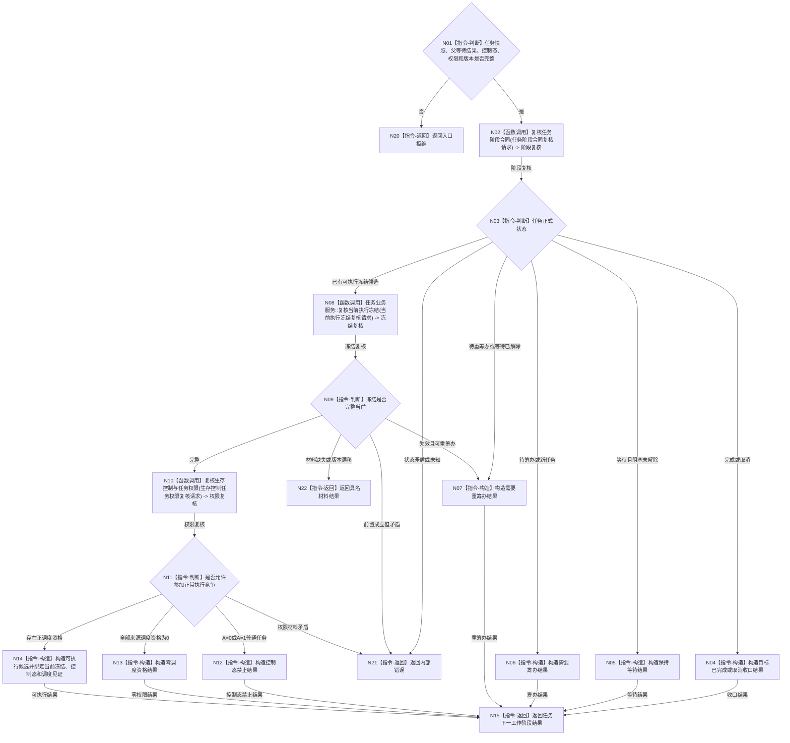

# BIZ-L2-004-13 裁决任务下一工作阶段目标函数流程图 v0.1

更新时间：2026-08-03

## 依据

```text
5090、5210—5230、6150、6170、8100、8200
父线程函数：BIZ-L1-T03 任务管理线程::运行治理循环
```

## 身份与边界

正式目标函数设计图。根函数只根据正式任务状态、等待合同、执行冻结、生存控制态和当前调度资格裁决筹办、重筹办、执行、等待或收口；不执行筹办和方法动作，也不发放通用执行许可。

## 函数合同

```text
根函数：裁决任务下一工作阶段
归属模块 / 文件 / 层级：任务领域服务 / 海中鱼巣/领域/服务.任务.ixx / L2
现有或待新增：适配扩展；复用任务生命周期、当前选择和执行冻结读取，新增统一工作阶段裁决
完整签名：任务下一工作阶段结果 任务业务服务::裁决任务下一工作阶段(const 任务下一工作阶段请求& 请求) const
参数：
  请求：const 任务下一工作阶段请求&，只读借用；必须携带完整任务承接快照、父等待重判、生存控制态、当前调度资格、事实截止版本、运行代次和规则版本
返回结果：
  任务下一工作阶段结果；包含需要筹办、需要重筹办、可执行、保持等待、目标已完成、取消收口、权限为零、材料缺失、版本漂移、入口拒绝或内部错误，以及工作阶段、轮次、冻结 / 等待引用和来源版本
被调函数流程图：BIZ-L3-004-13-01 复核任务阶段合同；BIZ-L3-004-13-02 任务业务服务::复核当前执行冻结；BIZ-L3-004-13-03 复核生存控制与任务权限
```

## 流程图



## 节点合同

| 节点 | 类型 | 输入绑定 | 输出绑定 | 事实读写 | 验证 |
| --- | --- | --- | --- | --- | --- |
| N02 | 函数调用 | 任务快照和父等待结果 | 正式阶段复核 | 只读任务事实 | 互斥阶段或错误 | 状态、轮次和等待合同 |
| N08 | 函数调用 | 任务、轮次和截止版本 | 当前执行冻结 | 只读任务 / 方法事实 | 当前、失效、缺失或错误 | 方法、输入、授权和版本 |
| N10 | 函数调用 | 控制态和任务调度资格 | 正常竞争准入 | 只读 6150 / 6170 投影 | 正、零、控制禁止或错误 | 多来源最高调度资格与版本 |
| N14 | 指令-构造 | 当前冻结、主动运行态和正调度资格 | 可执行候选 | 无写入 | 现实改变还必须绑定当前唯一自我授权 | 不等于已经派发或执行 |

## 关键边界

- 任务管理线程根据本结果决定派发筹办包还是执行包；工作线程不能自行转换工作种类。
- 调度资格为零保留需求、任务、方法、筹办历史和材料，只是不参加正常执行竞争；它不是“未授权”。
- 可执行只证明当前冻结与权限允许形成执行工作包，不证明有空闲线程、动作成功或任务完成。
- 不存在旧通用工作项许可；现实改变使用唯一自我现实执行授权，动作开始前另行 fresh 复核技术许可与安全硬否决。
- 状态矛盾和执行期才暴露的冻结前结构缺口属于内部错误，不包装为普通等待。
