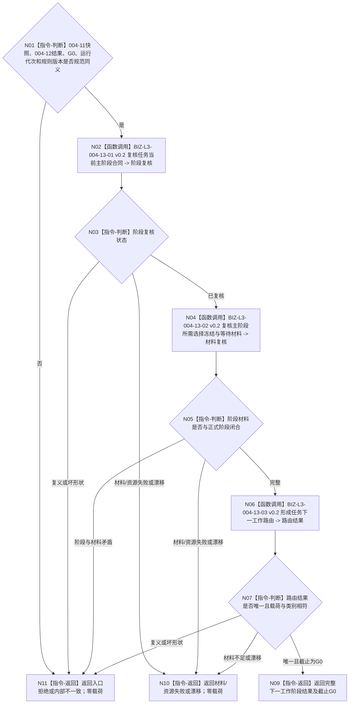

# BIZ-L2-004-13 裁决任务下一工作阶段目标函数流程图 v0.2

更新时间：2026-08-27

## 依据与替代

```text
0050 v1.9、3200、4260 v0.9、5090 v0.7、5210 v1.1、5230 v1.2、8100 v0.7
父线程函数：BIZ-L1-T03 v0.6 任务管理线程::运行结果上行循环
输入：BIZ-L2-004-11 v0.2 完整任务材料；BIZ-L2-004-12 v0.2 单项回流重判结果
普通派发后继：BIZ-L2-003-03 v0.5
零动作收束后继：BIZ-L2-004-17 v0.3
```

本图完整替代 v0.1。旧图把任务生命周期枚举、旧父等待结果、控制态和多来源调度资格放进同一个阶段裁决，并在这里选择最高权限来源；这会恢复第二阶段权威，也会绕过冻结后统一普通派发选择。v0.2只解释正式 ARCH-L2 当前主阶段 / 业务状态段和同截止任务材料，形成下一类工作路由，不读取或计算调度资格。

## 身份与边界

正式目标函数设计图。函数只消费 `004-11 v0.2` 已经同 `G0` 完整读回的任务、正式存在、当前任务轮次、ARCH-L2阶段、当前 `T→D`、可空选择 / 实例 / 冻结和具名等待事实，以及 `004-12 v0.2` 的值式重判结果。它不再次读取 DATA 或任务 / 方法事实，不发布状态、路径、选择、冻结、结果、授权或消息。`004-11/12` 各自负责其读取链的 `G0` 读前 / 读后守卫；本纯值函数只逐字段互证两份输入截止均为同一 `G0`。任何后继发布或普通派发仍必须携带该 `G0`，由对应 owner 的 CAS 或 fresh 入口重新守卫当前性。

任务处于筹办阶段且尚未开始执行时，目标当前已满足可形成“需要零动作收束”路由；该路由必须交 `004-17` 形成合法无执行短路结果并完成轮次收束，不能直接通知 self。任务已经进入执行、结算或轮次已收束时，本函数不因随后观察到目标已满足而回跳筹办或伪造零动作。

## 函数合同

```text
根函数：任务主阶段治理组合器::裁决任务下一工作阶段
归属模块 / 文件 / 目标分解深度：任务主阶段只读治理 / 海中鱼巣/领域/内部治理/服务.任务主阶段治理.ixx / BIZ-L2
现有或待新增：待新增目标组合；HEAD只有旧重筹办槽和部分筹办推进链，没有本合同
完整签名：任务下一工作阶段结果 任务主阶段治理组合器::裁决任务下一工作阶段(const 任务下一工作阶段请求& 请求) const noexcept
参数：004-11完整任务材料、004-12回流重判结果、运行代次、非零G0、阶段/路由规则版本；不接收任务生命周期枚举、旧治理状态、控制态、调度资格、线程槽状态或调用方声明的下一阶段
返回结果：需要初次筹办、需要同任务轮次后继筹办、执行冻结完成待普通派发、需要自我现实执行授权、需要零动作收束、保持具名等待、保持当前在途阶段、轮次已收束等待self决议、生命周期已收口、材料不足、当前性/版本漂移、入口拒绝、资源失败或内部不一致；成功载荷绑定T/R、当前阶段、路由所需强类型来源和截止G0；不产生许可结论
被调函数流程图：BIZ-L3-004-13-01—03 v0.2
线程归属：T03在主阶段治理槽和队列锁外调用；只读，不取得任何事实owner写权
```

## 流程图



## 路由矩阵

| 正式当前形状 | 004-12结果 | 唯一路由 | 禁止行为 |
| --- | --- | --- | --- |
| 生命周期正式结束 / 取消收口 | 任意不改变既有终态的同义结果 | 生命周期已收口 | 不新建任务轮次或筹办轮次 |
| 轮次已收束 | 不适用 / 当前阶段不允许同轮重筹办 | 轮次已收束等待self决议 | 不把目标未达成、方法可用或回流自动变成继续 |
| 执行 / 结算 | 不适用、目标当前已满足或阶段不允许 | 保持当前在途阶段 | 不回跳筹办，不把目标比较改成零动作 |
| 筹办 / 待初次筹办 | 不适用 | 需要初次筹办 | 只携带5230初次筹办来源，不写选择 |
| 筹办 / 具名等待 | 保持等待 | 保持具名等待 | 完整零写；不建立“保持等待事务” |
| 筹办且尚未开始执行 | 需要同轮后继筹办 | 需要同任务轮次后继筹办 | 只透传5230强类型来源；实际发布归004-03/task owner |
| 筹办且尚未开始执行 | 目标当前已满足 | 需要零动作收束 | 必须进入004-17；不得直接发self消息 |
| 筹办 / 可执行已冻结 | 不适用 | 执行冻结完成待普通派发 | 只进入003-03 v0.5；不在本函数读取控制态或调度资格 |
| 筹办 / 待自我现实执行授权 | 不适用 / 保持等待 | 需要自我现实执行授权或保持具名等待 | 不把授权当调度资格，不改变冻结 |
| 筹办中且已有工作在途 | 不适用 | 保持当前在途阶段 | 不重复派发第二筹办包 |

## 关键边界

- 当前阶段只来自正式 `T→E/E` 上 ARCH-L2 当前状态选择；生命周期只表达当前 / 结束 / 取消 / 历史，不能代替主阶段。
- 控制态、调度配额、基础优先级和安全来源只在冻结完成后由 `003-03 v0.5` fresh 形成普通派发选择，不进入本函数输入。
- `004-12 v0.2` 的“当前阶段不允许同轮重筹办”是只读结果；本函数按正式执行 / 结算 / 收束阶段保持现状，不把它包装成失败。
- 目标当前已满足只在尚未执行的当前任务轮次形成零动作短路输入；需求满足仍由需求自身实际使用时 fresh 独立核算。
- 本函数返回“下一工作阶段”只表示 T03 路由，不等于阶段迁移已经发布。
- 本函数是 `A00` 纯值裁决，不调用 DATA 读取，也不产生业务许可结论；下游不得因本函数成功省略自己的 `G0` 当前性守卫。

## 当前代码实现对照

- HEAD没有本根函数；现有 manager 重筹办槽仍读取旧待重筹办状态并直接准备执行冻结请求。
- 当前发布源码中的旧治理骨架把控制态 / 权限和执行冻结放在一个未激活入口中，不能证明本合同已实现。
- `004-11 v0.2`、`004-12 v0.2`、`003-03 v0.5`和`004-17 v0.3`均是目标合同；代码接线必须分别闭合，不能用旧任务治理枚举或队列到达顺序补位。

## v0.2 校正记录

- 删除父等待、待重筹办、任务生命周期枚举和控制 / 调度资格输入。
- 阶段权威改为正式E上的ARCH-L2主阶段 / 业务状态段，阶段材料只消费004-11同G0快照。
- 普通派发统一交003-03；阶段裁决不再过滤零资格或选择最高权限来源。
- 补齐筹办期目标已满足的零动作收束路由，并禁止直接通知self。
- 删除新合同中的许可拒绝和伪装成纯值指令的第二次当前代次读取；输入同截止互证与下游 owner / fresh 守卫分账。
