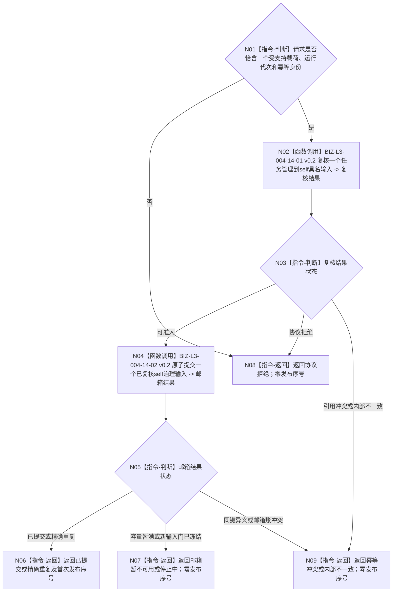

# BIZ-L2-004-14 提交一个任务管理到self具名输入目标函数流程图 v0.2

更新时间：2026-08-27

## 依据与替代

```text
0050、3200 v1.0、5090 v0.7、6340、8100 v0.7、8200 v0.7
BIZ-L1-T03 v0.5、BIZ-L1-T02 v0.6、BIZ-L2-002-01 v0.2、BIZ-L2-002-03 v0.4
```

本图完整替代 v0.1“提交自我治理消息”。旧图允许任务结果、等待、许可、派生需求等模糊载荷，并让桥保存第二份待重发状态和自定义消息优先级；v0.2每次只提交一个由 T03 已经形成的具名强类型输入，重试材料由 T03 原处理槽持有，邮箱只按停止优先和稳定到达顺序冻结批次。

## 身份与边界

当前 T03 允许提交的业务类型只有：

1. `任务轮次结算定位`：显式 `T / R / 轮次结算身份 / G`；
2. `自我现实执行授权请求`：原样携带冻结的任务、三轮次、冻结、实例方法、现实动作范围、截止、规则版本和请求身份；
3. `任务治理缺口定位`：只接受具名缺口生产者形成的强类型身份、影响范围、证据截止和合法后继；不可舍弃且无匹配的6340报告只能以该强类型结果进入。

合法等待留在 T03 的具名等待槽，不因“暂时没有工作”发送消息。任务实际结果、完成消息、原始外设报告、线程状态、日志、缓存刷新、停止和自定义优先级都不进入本函数。

## 函数合同

```text
根函数：任务管理上行桥::提交一个任务管理到self具名输入
归属模块 / 文件 / 目标分解深度：任务管理到self异步边界 / 海中鱼巣/线程/任务管理上行桥.ixx / BIZ-L2
现有或待新增：待适配；HEAD仍从正式任务实际结果直接构造旧任务结果复核消息
完整签名：任务管理到self输入提交结果 任务管理上行桥::提交一个任务管理到self具名输入(const 任务管理到self输入提交请求& 请求) noexcept
参数：恰一具名强类型载荷、运行代次和输入幂等身份；载荷内部保存自身正式截止和来源版本
返回结果：已提交、精确重复、邮箱暂不可用、停止中、协议拒绝、幂等冲突或内部不一致，以及输入类型、输入幂等身份和首次发布序号；只有成功/重复发布序号非零
被调函数流程图：BIZ-L3-004-14-01/02 v0.2
异步消费者：BIZ-L2-002-01 v0.2冻结批次，BIZ-L2-002-03 v0.4分类
```

## 流程图



## 停止、幂等与重试

- 幂等键固定为 `{运行代次, 输入幂等身份}`；同键完整载荷逐字段相等为精确重复，同键异义为幂等冲突。
- 幂等账查询先于停止门；已发布同义重试可在停发后收敛，新输入返回停止中。
- 容量不足时 T03 保留原处理槽、载荷和幂等身份，只重试本提交；桥不保存第二份待重发材料，不重读领域事实。
- 提交成功只证明输入进入 self 邮箱，不证明 T02 已冻结、分类或处理。
