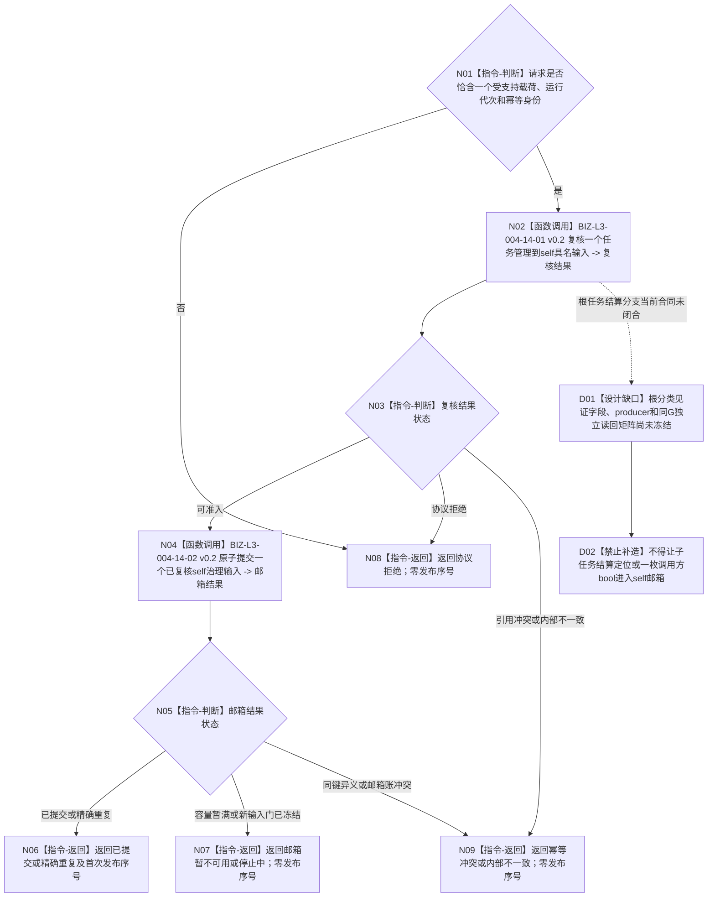

# BIZ-L2-004-14 提交一个任务管理到self具名输入目标函数流程图 v0.3

更新时间：2026-08-28

## 依据与替代

```text
0050 v1.9、3200 v1.0、5090 v0.7、6340、8100 v0.7、8200 v0.7
BIZ-L1-T03 v0.6、BIZ-L1-T02 v0.7、BIZ-L2-002-01 v0.2、BIZ-L2-002-03 v0.5
```

本图完整替代 v0.2。v0.2 已收窄为单项强类型输入，但其任务轮次结算定位没有限定根任务。v0.3要求结算分支只接受004-08/004-17在正式0条上级调用证明下形成的根任务轮次结算定位；恰一上级调用的子任务只回T03显式上级治理槽。重试材料仍由T03原处理槽持有，桥不建立第二待重发状态。

## 身份与边界

当前 T03 允许提交的业务类型只有以下四类：

1. `根任务轮次结算定位`：显式 `T / R / 轮次结算身份 / G / 根分类见证`，且根分类必须可由T02在同G独立互证；
2. `自我现实执行授权请求`：原样携带冻结的任务、三轮次、冻结、实例方法、现实动作范围、截止、规则版本和请求身份；
3. `派生需求三件套`：保持来源报告、目标候选及来源 / 归属材料的完整强类型绑定；它只是后继治理候选，不是已建立需求或任务，不得改名包装为缺口；
4. `结构化治理缺口定位`：只接受具名任务缺口、结构化事实缺口或能力缺口生产者形成的强类型身份、缺口类型、影响范围、证据截止和合法后继；不接受裸文本。

合法等待留在 T03 的具名等待槽，不因“暂时没有工作”发送消息。子任务调用返回、任务实际结果、完成消息、原始外设报告、线程状态、日志、缓存刷新、停止和自定义优先级都不进入本函数。

## 函数合同

```text
根函数：任务管理上行桥::提交一个任务管理到self具名输入
归属模块 / 文件 / 目标分解深度：任务管理到self异步边界 / 海中鱼巣/线程/任务管理上行桥.ixx / BIZ-L2
现有或待新增：待适配；HEAD仍从正式任务实际结果直接构造旧任务结果复核消息
完整签名：任务管理到self输入提交结果 任务管理上行桥::提交一个任务管理到self具名输入(const 任务管理到self输入提交请求& 请求) noexcept
参数：四类受支持载荷中的恰一具名强类型载荷、运行代次和输入幂等身份；根任务结算载荷还必须携带正式根分类见证；载荷内部保存自身正式截止和来源版本
返回结果：已提交、精确重复、邮箱暂不可用、停止中、协议拒绝、幂等冲突或内部不一致，以及输入类型、输入幂等身份和首次发布序号；只有成功/重复发布序号非零
被调函数流程图：BIZ-L3-004-14-01/02 v0.2
异步消费者：BIZ-L2-002-01 v0.2冻结批次，BIZ-L2-002-03 v0.5分类
```

## 流程图



## 停止、幂等与重试

- 幂等键固定为 `{运行代次, 输入幂等身份}`；同键完整载荷逐字段相等为精确重复，同键异义为幂等冲突。
- 幂等账查询先于停止门；已发布同义重试可在停发后收敛，新输入返回停止中。
- 容量不足时 T03 保留原处理槽、载荷和幂等身份，只重试本提交；桥不保存第二份待重发材料，不重读领域事实。
- 提交成功只证明输入进入 self 邮箱，不证明 T02 已冻结、分类或处理。
- 派生需求三件套和结构化治理缺口定位是两个不同协议类别；完整载荷、幂等比较和异步路由均不得在桥内互相转换。
- 根任务结算分支只负责移动已形成的正式定位，不在桥内读取调用组或裁决根分类。根分类ABI未闭合期间该分支零施工；其它三类输入不受影响。

## v0.3 校正记录

- 任务轮次结算定位限定为正式零上级调用根任务，并要求携带可独立互证的根分类见证。
- 子任务调用返回退出self输入宇宙，只在T03内部形成显式上级T/R主阶段治理槽。
- 根分类合同仍为具名DRIFT；桥、邮箱和纯值协议不得自行发明证明。
