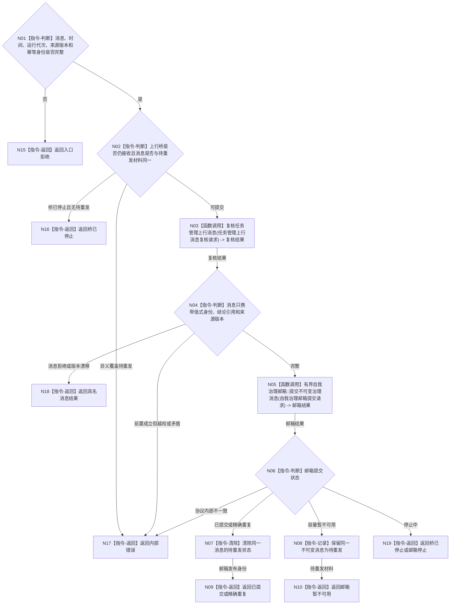

# BIZ-L2-004-14 提交自我治理消息目标函数流程图 v0.1

更新时间：2026-08-03

## 依据

```text
4050、5090、8100、8200
父线程函数：BIZ-L1-T03 任务管理线程::运行治理循环
当前代码：任务管理上行桥已能把强类型执行回执转换为自我治理消息并提交有界邮箱；目标需支持通用值式治理消息和重发
```

## 身份与边界

正式目标函数设计图。根函数把任务管理已经独立读回和裁决的值式治理消息提交给自我治理邮箱；不复制任务事实，不直接触发需求结算。

## 函数合同

```text
根函数：提交自我治理消息
归属模块 / 文件 / 层级：任务管理上行桥 / 海中鱼巣/线程/任务管理上行桥.ixx / L2
现有或待新增：适配扩展；复用现有邮箱准入和幂等，增加同一消息待重发状态
完整签名：自我治理消息提交结果 任务管理上行桥::提交自我治理消息(const 自我治理消息提交请求& 请求)
参数：
  请求：const 自我治理消息提交请求&，只读借用；必须携带不可变治理消息、当前时间、运行代次、来源任务 / 工作项版本和消息幂等身份
返回结果：
  自我治理消息提交结果；包含已提交、精确重复、邮箱暂不可用、桥已停止、消息拒绝、版本漂移、入口拒绝或内部错误，以及消息身份、邮箱结果和待重发材料
被调函数流程图：BIZ-L3-004-14-01 复核任务管理上行消息；BIZ-L3-004-14-02 有界自我治理邮箱::提交不可变治理消息
```

## 流程图



## 节点合同

| 节点 | 类型 | 输入绑定 | 输出绑定 | 事实读写 | 验证 |
| --- | --- | --- | --- | --- | --- |
| N03 | 函数调用 | 消息和来源版本 | 上行消息复核 | 无业务写入 | 完整、拒绝、漂移或错误 | 任务 / 需求 / 工作项绑定 |
| N04 | 指令-判断 | 消息载荷 | 值式边界结论 | 无写入 | 完整或越权 | 无服务引用、锁、事务令牌和线程地址 |
| N05 | 函数调用 | 不可变消息和时间 | 邮箱结果 | 只写消息队列 | 提交、重复、暂不可用或停止 | 幂等和顺序 |
| N08 | 指令-记录 | 同一消息 | 待重发材料 | 上行桥恢复材料 | 后续只重试消息 | 不重复任务提交或实际回读 |

## 关键边界

- 自我治理消息不是任务、需求或世界事实；自我线程必须在下一批独立复核后再调用正式领域入口。
- 邮箱满载只重发同一消息；不得重复提交任务结果、重新执行方法或重新生成不同回执。
- 纯线程生命周期消息不进入本函数，必须进入 8110 控制面板线程信息链。
- 提交成功只证明消息进入邮箱，不证明自我已经处理、需求满足或服务结算完成。
