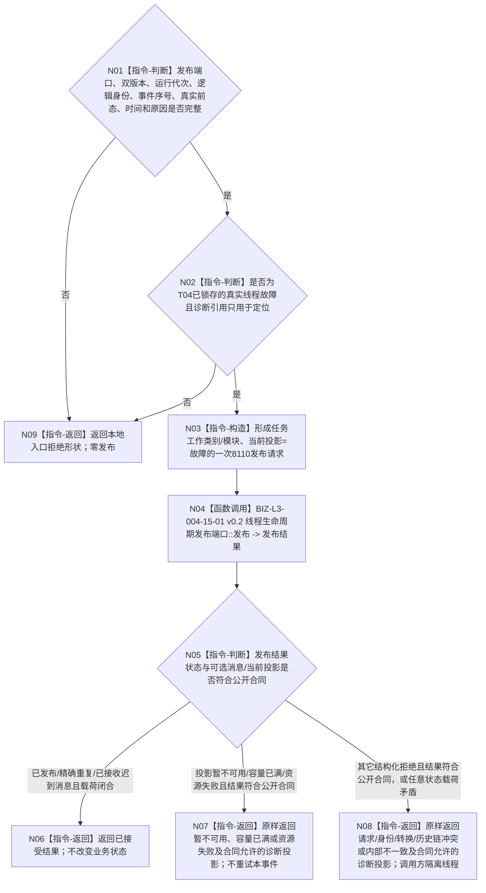

# BIZ-L2-004-15 报告一次任务工作线程故障生命周期投影目标函数流程图 v0.2

更新时间：2026-08-27

## 依据与替代

```text
4050、8100 v0.7、8110 v0.3、8200 v0.7
THREAD-LIFECYCLE-PROJECTION-SERVICE 详细设计 v0.1
BIZ-L1-T04 v0.3
```

本图完整替代 v0.1“提交任务工作线程故障材料”。旧图又建立生命周期消息队列、队列版本和桥内待重发材料；现行发布基座已经由唯一 `线程生命周期发布端口` 与投影服务拥有消息账、幂等、迟到链和当前投影。具体线程只形成一次真实物理事件并尝试发布，不建立第二队列或第二重试状态。

## 身份与边界

正式目标函数设计图。根函数只在 T04 已经锁存真实线程故障并停止领取新工作时调用。它把当前物理前态、故障事件序号和可选任务 / 工作项诊断引用组成一条 8110 发布请求，然后恰一次调用通用生命周期发布端口。

线程生命周期投影与业务工作结果彼此分账，不是二选一：普通业务拒绝但线程仍健康时不得伪报故障；真实线程故障发生时必须尝试本投影，即使同一工作包仍能形成或需要继续形成结构化业务结果。可选诊断引用只建立定位联系，不把两类结果合并。

投影发布不是业务恢复门禁。发布暂不可用、容量已满或资源失败只留下可解释事件序号缺口，不得阻塞工作线程保护既有动作后材料、不得重做动作，也不得反向改变物理线程前态。具名管理者只有在独立确认线程实际退出后，才能补充异常退出事件。

## 函数合同

```text
根函数：任务工作线程::报告一次生命周期故障
归属模块 / 文件 / 目标分解深度：任务工作线程私有生命周期适配 / 海中鱼巣/线程/任务工作线程.ixx / BIZ-L2
现有或待新增：待适配；复用已发布线程生命周期发布端口，不新建上报模块或消息队列
完整签名：线程生命周期发布结果 任务工作线程::报告一次生命周期故障(const 任务工作线程生命周期故障报告请求& 请求) noexcept
参数：请求携带合同/消息版本、运行代次、线程逻辑身份、非零事件序号、可选系统线程身份、真实前一投影、发生时间毫秒、原因键和可选任务/工作项诊断引用；发布端口为任务工作线程构造时冻结的窄成员依赖
返回结果：原样保留线程生命周期发布结果；已发布、精确重复和已接收迟到消息表示已接受，其它状态表示本次未接受或结构冲突；不携带业务回执、任务阶段或待重发材料
被调函数流程图：BIZ-L3-004-15-01 v0.2 线程生命周期发布端口::发布
```

## 流程图



## 关键边界

- 故障事件序号由具体线程真实物理事件流单调取得；发布失败后不得复用该序号表达另一个事件，也不得回退物理前态。
- `故障`不是终态。真实后继可以是停止请求中、收尾中、退出前、已退出或异常退出；本函数不补造这些尚未发生的事件。
- 可选任务 / 工作项引用只帮助诊断，不证明任务失败、等待、完成或轮次收束。
- 已受保护的动作后材料继续由004-07恢复；生命周期投影结果不得决定是否重做动作或丢弃业务材料。
- 生命周期故障投影不以“业务结果无法形成”为前置。同一真实故障可以同时产生一条8110故障投影和一份由004-07守恒形成的业务结构化结果；两者分别收束。
- 适配层原样返回provider公开结果。`已接受()`与`已成为当前()`必须分账；任何非接受状态都不得被本函数擅自要求为空，因为消息身份冲突、容量已满等状态可以按公开合同携带既有当前投影供诊断。
