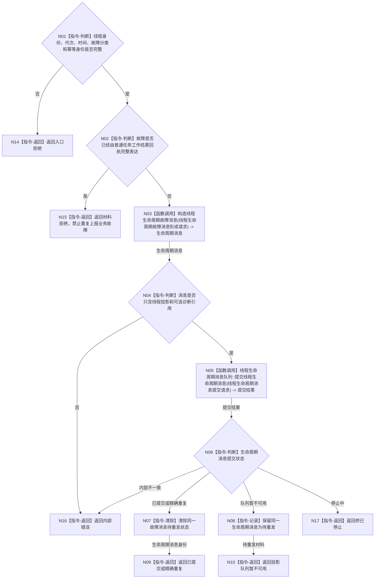

# BIZ-L2-004-15 提交任务工作线程故障材料目标函数流程图 v0.1

更新时间：2026-08-03

## 依据

```text
4050、8110、8100
父线程函数：BIZ-L1-T04 v0.2 任务工作线程::运行强类型执行循环
```

## 身份与边界

正式目标函数设计图。根函数把工作线程自身无法归入普通工作回执的结构化故障发布到线程生命周期信息链；不把线程故障直接写成任务失败或需求状态。

## 函数合同

```text
根函数：提交任务工作线程故障材料
归属模块 / 文件 / 层级：线程生命周期上报 / 海中鱼巣/线程/上报.线程生命周期.ixx / L2
现有或待新增：待新增；复用 8110 生命周期消息合同和只读投影入口
完整签名：线程故障材料提交结果 线程生命周期上报器::提交任务工作线程故障材料(const 任务工作线程故障提交请求& 请求)
参数：
  请求：const 任务工作线程故障提交请求&，只读借用；必须携带线程逻辑身份、运行代次、发生时间、故障分类、当前工作项诊断引用、恢复边界和幂等身份
返回结果：
  线程故障材料提交结果；包含已提交、精确重复、投影队列暂不可用、材料拒绝、桥已停止或内部错误，以及生命周期消息身份和待重发材料
被调函数流程图：BIZ-L3-004-15-01 构造线程生命周期故障消息；BIZ-L3-004-15-02 线程生命周期消息队列::提交线程生命周期消息
```

## 流程图



## 节点合同

| 节点 | 类型 | 输入绑定 | 输出绑定 | 事实读写 | 验证 |
| --- | --- | --- | --- | --- | --- |
| N02 | 指令-判断 | 故障分类和普通工作回执 | 诊断链唯一性 | 无写入 | 生命周期故障或普通回执二选一 | 不重复记录同一责任 |
| N03 | 函数调用 | 线程身份、时间和诊断引用 | 8110 生命周期消息 | 无业务写入 | 消息完整 | 逻辑 ID 与可选系统 ID 分离 |
| N04 | 指令-判断 | 生命周期消息 | 业务隔离结论 | 无写入 | 仅线程投影 | 不含任务阶段 / 需求结论 |
| N05 | 函数调用 | 生命周期消息 | 提交结果 | 只写线程信息链 | 提交、重复、暂不可用或停止 | 控制面板不可用不阻塞业务事实 |
| N08 | 指令-记录 | 同一消息 | 待重发材料 | 线程恢复材料 | 后续只重试消息 | 不重复工作包或动作 |

## 关键边界

- 线程故障、异常退出和堵塞不是任务失败、等待或完成；任务状态仍由任务领域依据工作项和正式事实裁决。
- 普通筹办 / 执行拒绝已经由任务工作结果回执表达时，不再用生命周期故障复制第二份业务含义。
- 控制面板或线程投影不可用不撤销已经完成的领域提交，也不触发重复动作。
- 可选任务 / 工作项引用只用于定位运行载体，不能推导业务结论。
