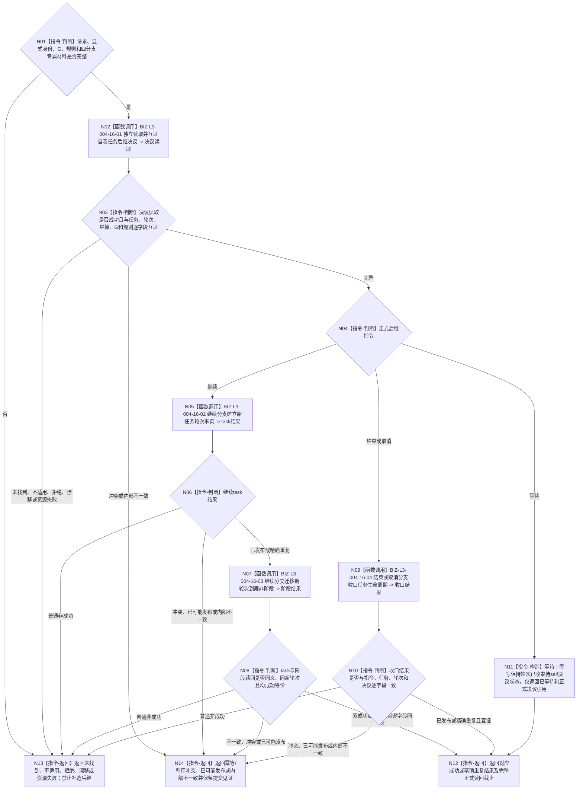

# BIZ-L2-004-16 消费自我任务后继决议目标函数流程图 v0.1

更新时间：2026-08-26

## 依据

```text
0050、5090 v0.8、8100 v0.8、8200
SELF-GOVERNANCE-CLOSURE-L4-INTEGRATED 业务流程图 v0.3 与详细设计 v0.6
父线程函数：BIZ-L1-T03 v0.3 任务管理线程::运行结果上行循环
当前工作区候选入口：海中鱼巣/领域/内部治理/服务.任务主阶段治理.ixx
```

## 身份与边界

正式目标函数设计图。任务轮次已经收束后，本函数只按显式自我、任务、已收束轮次、轮次结算、决议身份和共同截止读取正式 self 后继决议，并由 task owner 机械消费 `继续 / 结束 / 等待 / 取消` 四个分支。

本函数不是 self 决议 owner，也不重新判断需求是否存在或目标是否满足。只有 `继续`可以建立新任务轮次和新筹办轮次并迁移到筹办阶段；`等待`零写保持停驻；`结束/取消`只发布对应任务生命周期收口。任何分支都不得复用旧路径、实例方法、执行冻结或现实执行授权。

## 函数合同

```text
根函数：消费自我任务后继决议
归属模块 / 文件 / 目标分解深度：海中鱼巣.领域.内部治理.服务.任务主阶段治理 / 海中鱼巣/领域/内部治理/服务.任务主阶段治理.ixx / BIZ-L2
现有或待新增：当前共享工作区已有未发布同名WIP；目标合同已由5090、8100与SELF详细设计冻结，不能据此宣称main已实现
完整签名：任务后继消费结果 任务主阶段治理提供者::消费自我任务后继决议(const 任务后继消费请求& 请求) noexcept
参数：请求显式携带task写入/阶段迁移幂等身份、自我、决议、任务、已收束任务轮次、轮次结算、可选停止证据、新轮次序号、来源共同事实截止、发生时间、规则版本和仅继续分支所需阶段迁移
返回结果：已继续、已结束、已等待、已取消、精确重复、决议未找到、决议不适用、入口/许可拒绝、当前性漂移、幂等/引用冲突、资源失败、内部不一致或已可能发布；成功结果逐字段携带对应新轮次/筹办/治理动作/决议引用/阶段迁移/生命周期收口和正式读回截止
被调函数流程图：BIZ-L3-004-16-01—04分别冻结决议读回、继续task事务、继续阶段迁移和结束/取消收口；等待分支是本函数零写指令
线程归属：T03锁外调用；不持有任务管理输入队列、工作队列或self邮箱锁
```

## 流程图



## 分支合同

| 指令 | task owner写入 | 阶段写入 | 成功形状 | 禁止行为 |
| --- | --- | --- | --- | --- |
| 继续 | 原子建立新任务轮次、新筹办轮次、治理动作和决议引用 | 新轮次迁移到筹办中 | task与阶段均正式读回且同义 | 不跨轮复用旧冻结、授权或方法实例 |
| 结束 | 发布正常结束生命周期收口和决议引用 | 无 | 收口正式读回完整 | 不建立新轮次，不顺带发布需求满足 |
| 等待 | 无 | 无 | 正式决议已读回，任务继续停驻 | 不把等待改写为结束、取消或自动重筹办 |
| 取消 | 发布取消生命周期收口和决议引用 | 无 | 收口正式读回完整 | 不删除永久任务/轮次历史 |

## 关键边界

- `取出一个不可变任务管理输入`只证明消息到达，不能承担本函数的 task owner 写入；`裁决任务下一工作阶段`只读当前任务材料，也不能代替后继消费事务。
- 继续分支的 task 写入与阶段写入是两个正式 owner 的相邻提交；任一提交后读回失败必须保留具名见证和同键重试，不能假报零写。
- 等待是唯一合法零写成功分支；未找到、材料不足、漂移或资源失败不是等待指令。
- 本函数只消费已经正式发布的self决议，不从目标未达成、队列顺序、线程当前值或旧请求推导后继。
