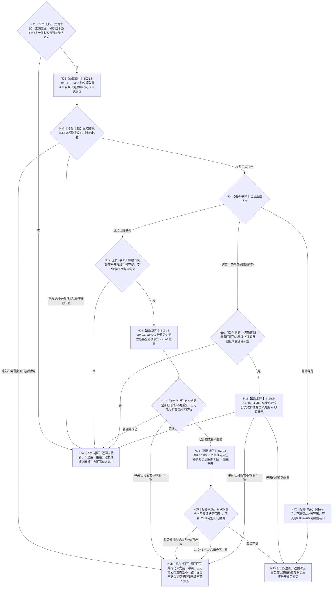

# BIZ-L2-004-16 消费自我任务后继决议目标函数流程图 v0.2

更新时间：2026-08-27

## 依据

```text
0050、3200 v0.9、4260 v0.11、5090 v0.8、5210、8100 v0.8、8200
SELF-GOVERNANCE-CLOSURE-L4-INTEGRATED 详细设计 v0.3 第5.2节
BIZ-L1-T03 v0.5、BIZ-L2-002-09、BIZ-L2-004-09 v0.3
```

## 身份与边界

正式目标函数设计图。任务轮次已经正式收束后，本函数只按显式自我、任务、已收束任务轮次、轮次结算、决议身份和来源共同事实截止读取 self owner 的正式后继决议，再机械消费 `继续当前任务 / 结束当前任务 / 保持等待 / 取消任务` 四个分支。

本函数不是 self 决议 owner，不重新判断需求是否存在、目标是否满足或是否应继续。只有正式 `继续当前任务` 可以先由 task owner 建立新任务轮次、首个筹办轮次、继续治理动作和决议引用，再由 ARCH-L2 阶段端口迁移到 `{筹办,筹办中}`。`保持等待`是唯一零 task 写、零阶段调用的成功分支；`结束当前任务 / 取消任务`只建立对应生命周期收口，不建立新轮次。

## 函数合同

```text
根函数：消费自我任务后继决议
完整签名：任务后继消费结果 任务主阶段治理提供者::消费自我任务后继决议(const 任务后继消费请求& 请求) noexcept
归属模块 / 文件 / 目标分解深度：海中鱼巣.领域.内部治理.服务.任务主阶段治理 / 海中鱼巣/领域/内部治理/服务.任务主阶段治理.ixx / BIZ-L2
实现状态：已发布详细设计已冻结最终公开合同；HEAD 09b40d6c 尚无该 module、DTO 或生产调用，未发布工作区材料不得作为当前实现证据
参数：合同版本、task请求头、task写入幂等身份、阶段迁移幂等身份、自我、决议身份、任务、已收束任务轮次、轮次结算、任务运行停止证据、新任务轮次序号、新筹办轮次序号、来源共同事实截止、发生时间、规则版本和可选继续阶段迁移
返回结果：已继续、已结束、已等待、已取消、精确重复、决议未找到、决议不适用、入口/许可拒绝、当前性漂移、幂等/引用冲突、资源失败、内部不一致或已可能发布；载荷严格遵守四分支状态矩阵
被调函数流程图：BIZ-L3-004-16-01—04 v0.2
线程归属：T03 在队列锁外调用；任务管理线程只路由结构化结果
```

## 流程图



## 四分支状态与载荷

| 决议 | 首次 / 重放状态 | 必有载荷 | 必空载荷与截止 |
| --- | --- | --- | --- |
| 继续当前任务 | 首次`已继续`；完整同键重放`精确重复`并回显继续 | 新任务轮次、新筹办轮次、继续治理动作、决议引用、阶段迁移证据、task与阶段两个非零正式读回截止 | 生命周期收口、两类提交见证 |
| 结束当前任务 | 首次`已结束`；完整同键重放`精确重复`并回显结束 | 决议引用、正常结束生命周期收口、非零task正式读回截止 | 新R/P、继续动作、阶段证据、阶段截止、两类提交见证 |
| 保持等待 | 每次均`已等待` | 仅状态与指令 | 全部optional载荷、task/阶段两个截止；task零写、阶段零调用 |
| 取消任务 | 首次`已取消`；完整同键重放`精确重复`并回显取消 | 决议引用、取消生命周期收口、非零task正式读回截止 | 新R/P、继续动作、阶段证据、阶段截止、两类提交见证 |

## 分段提交与失败边界

- 继续分支固定为两个 owner 的相邻提交：task owner 一个写集建立四项事实并读回；随后阶段端口迁移并读回。两段各有自己的提交代次和正式读回截止，不得伪称跨 owner 单一 `G1`。
- task 提交已确认但读回失败，只返回 `已可能发布 + task提交见证`。task 已完整收敛后，阶段提交已确认但读回失败，返回 `已可能发布 + 已读回task四事实 + 阶段提交见证`。
- 后段失败不得删除、回滚或隐藏已经发布的task事实；原双幂等身份重放必须先收敛task同键，再重放阶段请求。
- 结束/取消在一个 task owner 写集内同时建立决议引用和生命周期收口；同键异义为幂等冲突，前态或引用不一致在交换前结构化失败。
- self读取非成功时task owner零调用；消息正文、目标未达成、线程当前值、旧请求、旧路径或旧冻结都不能补造决议。

## v0.2 校正记录

- 删除“等待成功带完整正式读回截止”的错误；等待结果只有状态和指令，全部载荷与两个截止均为空或零。
- self读取沿正式`已形成/精确重复`成功谓词与发布设计状态映射，不再发明读取专属`已读取/不适用`状态。
- 结束/取消必须携带匹配的非零任务运行停止证据；停止证据不再写成可选业务材料。
- 删除对未发布工作区WIP的能力声明，明确HEAD未实现和目标详细设计已冻结分账。
- 补齐继续分支两个owner不同提交代次、后段失败保留前段事实、已可能发布见证及四分支精确状态×载荷矩阵。
