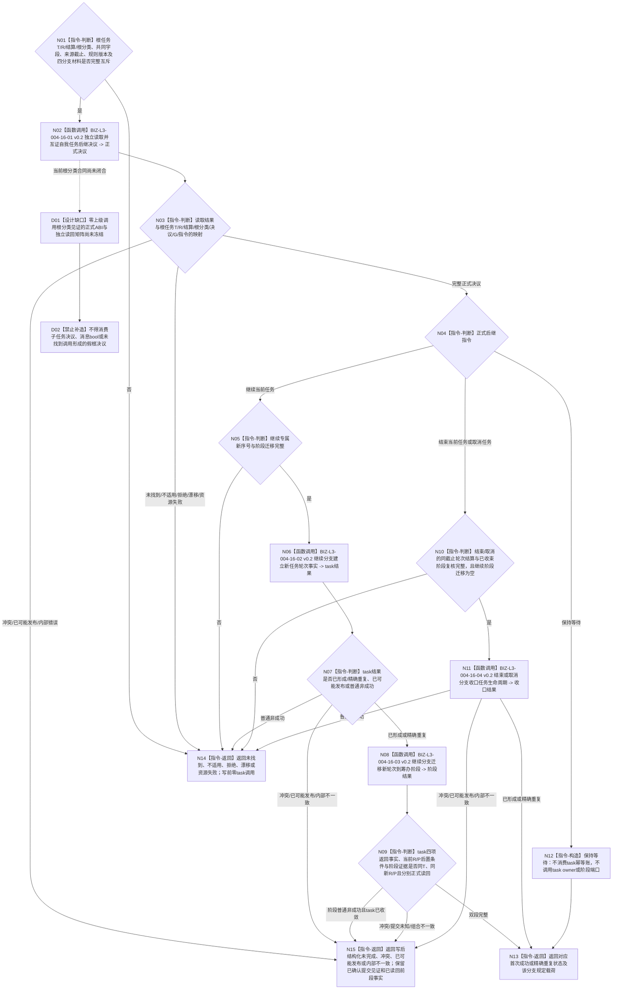

# BIZ-L2-004-16 消费自我任务后继决议目标函数流程图 v0.3

更新时间：2026-08-28

## 依据

```text
0050 v2.1、3200 v1.0、4260 v0.9、5090 v0.7、5210、8100 v0.7、8200 v0.7
SELF-GOVERNANCE-CLOSURE-L4-INTEGRATED 详细设计 v0.3 第5.2节
BIZ-L1-T03 v0.6、BIZ-L2-002-09 v0.2、BIZ-L2-004-09 v0.4
```

## 身份与边界

正式目标函数设计图。只有正式证明零上级调用的根任务轮次已经收束后，本函数才按显式自我、根任务、已收束任务轮次、轮次结算、根分类绑定、决议身份和来源共同事实截止读取 self owner 的正式后继决议，再机械消费 `继续当前任务 / 结束当前任务 / 保持等待 / 取消任务` 四个分支。恰一上级调用的子任务不形成self决议，也不得进入本函数。

本函数不是 self 决议 owner，不重新判断需求是否存在、目标是否满足或是否应继续。只有正式 `继续当前任务` 可以先由 task owner 建立新任务轮次、首个筹办轮次、继续治理动作和决议引用，同时把任务的当前轮次引用切换到新轮次并建立新轮次的当前筹办轮次引用，再由 ARCH-L2 阶段端口迁移到 `{筹办,筹办中}`。`保持等待`是唯一零 task 写、零阶段调用的成功分支；`结束当前任务 / 取消任务`只建立对应生命周期收口，不建立新轮次。

本流程入口已经位于`轮次已收束`之后。结束与普通取消只复核同截止轮次结算和已收束阶段，不要求调用方重复携带任务运行停止证据；若任务仍在动作执行，则属于3200第19.2节的紧急取消合同，不得进入本流程。

## 函数合同

```text
根函数：消费自我任务后继决议
完整签名：任务后继消费结果 任务主阶段治理提供者::消费自我任务后继决议(const 任务后继消费请求& 请求) noexcept
归属模块 / 文件 / 目标分解深度：海中鱼巣.领域.内部治理.服务.任务主阶段治理 / 海中鱼巣/领域/内部治理/服务.任务主阶段治理.ixx / BIZ-L2
实现状态：四分支与分段提交方向已冻结，但根分类见证ABI未闭合；发布源码尚无该module、DTO或生产调用。详细设计v0.3与当前R/P引用切换、根分类字段仍须同步，不得据未发布WIP施工
参数：合同版本、task请求头、task写入幂等身份、阶段迁移幂等身份、自我、决议身份、根任务、已收束任务轮次、轮次结算、根分类见证、新任务轮次序号、新筹办轮次序号、来源共同事实截止、发生时间、规则版本和可选继续阶段迁移
返回结果：已继续、已结束、已等待、已取消、精确重复、决议未找到、决议不适用、入口拒绝、当前性漂移、幂等/引用冲突、资源失败、内部不一致或已可能发布；载荷严格遵守四分支状态矩阵
被调函数流程图：BIZ-L3-004-16-01—04 v0.2
线程归属：T03 在队列锁外调用；任务管理线程只路由结构化结果
```

## 流程图



## 四分支状态与载荷

| 决议 | 首次 / 重放状态 | 必有载荷 | 必空载荷与截止 |
| --- | --- | --- | --- |
| 继续当前任务 | 首次`已继续`；完整同键重放`精确重复`并回显继续 | 新任务轮次、新筹办轮次、继续治理动作、决议引用、阶段迁移证据、task与阶段两个非零正式读回截止 | 生命周期收口、两类提交见证 |
| 结束当前任务 | 首次`已结束`；完整同键重放`精确重复`并回显结束 | 决议引用、正常结束生命周期收口、非零task正式读回截止 | 新R/P、继续动作、阶段证据、阶段截止、两类提交见证 |
| 保持等待 | 每次均`已等待` | 仅状态与指令 | 全部optional载荷、task/阶段两个截止；task零写、阶段零调用 |
| 取消任务 | 首次`已取消`；完整同键重放`精确重复`并回显取消 | 决议引用、取消生命周期收口、非零task正式读回截止 | 新R/P、继续动作、阶段证据、阶段截止、两类提交见证 |

## 分段提交与失败边界

- 继续分支固定为两个 owner 的相邻提交：task owner 一个写集建立四项返回事实、切换当前R/P引用并读回；随后阶段端口迁移并读回。两段各有自己的提交代次和正式读回截止，不得伪称跨 owner 单一 `G1`。
- task 提交已确认但读回失败，只返回 `已可能发布 + task提交见证`。task 已完整收敛后，阶段提交已确认但读回失败，返回 `已可能发布 + 已读回task四项返回事实 + 阶段提交见证`。
- 后段失败不得删除、回滚或隐藏已经发布的task事实；原双幂等身份重放必须先收敛task同键，再重放阶段请求。
- 结束/取消在一个 task owner 写集内同时建立决议引用和生命周期收口；同键异义为幂等冲突，前态或引用不一致在交换前结构化失败。
- self读取非成功时task owner零调用；消息正文、目标未达成、线程当前值、旧请求、旧路径、旧冻结或子任务调用返回都不能补造根任务决议。

## v0.3 校正记录

- 删除“等待成功带完整正式读回截止”的错误；等待结果只有状态和指令，全部载荷与两个截止均为空或零。
- self读取沿正式`已形成/精确重复`成功谓词与发布设计状态映射，不再发明读取专属`已读取/不适用`状态。
- 删除结束/普通取消重复携带任务运行停止证据的错误；本入口复核轮次结算和已收束阶段，执行中紧急取消另走3200第19.2节合同。
- 补齐继续写集必须切换`T→当前任务轮次`并建立新轮次当前筹办轮次引用的后置条件。
- 删除对未发布工作区WIP的能力声明，明确发布源码未实现，并记录详细设计停止证据字段与当前引用切换仍需同步。
- 删除新合同中的旧`许可拒绝`状态；该数值只供历史ABI和持久材料解码。
- 补齐继续分支两个owner不同提交代次、后段失败保留前段事实、已可能发布见证及四分支精确状态×载荷矩阵。
- 消费入口限定为正式零上级调用根任务决议；子任务只回显式上级T/R，不形成或消费self决议。
- 撤回未发布4260 v0.11、5090/8100 v0.8依据；根分类ABI未闭合期间本入口零施工。
