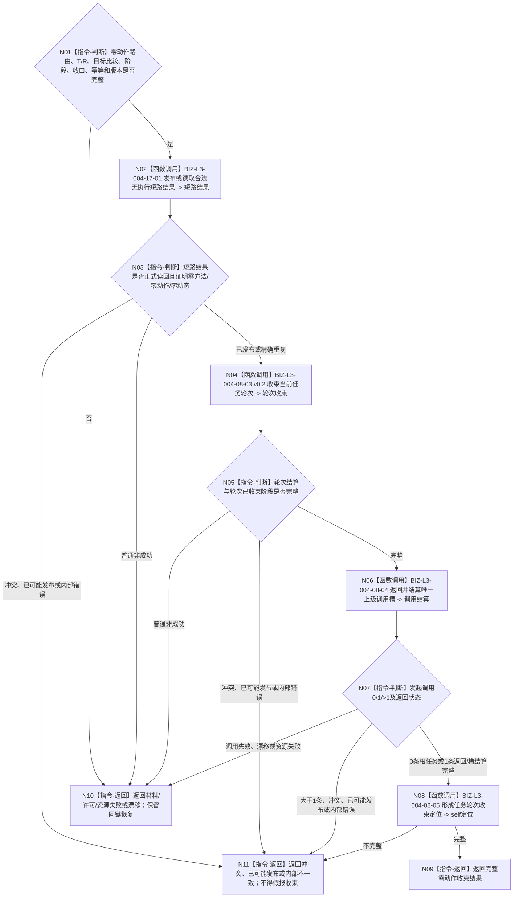

# BIZ-L2-004-17 形成零动作结果并收束当前任务轮次目标函数流程图 v0.1

更新时间：2026-08-27

## 依据

```text
0050、3200、4260 v0.9、5090 v0.7、5210 v1.1、5230 v1.2、8100 v0.7
父线程：BIZ-L1-T03 v0.5
前驱：BIZ-L2-004-13 v0.2 的“需要零动作收束”结果
复用后继：BIZ-L3-004-08-03 v0.2、BIZ-L3-004-08-04—05
```

## 身份与边界

正式目标函数设计图。函数只处理“任务仍在当前未收束轮次的筹办阶段、实例执行尚未开始、当前目标 fresh 比较已满足”的零动作短路。它先由任务结果 owner 发布并独立读回一项合法无执行短路结果，再复用当前轮次收束、0..1上级调用返回和 self 轮次结算定位链。

合法无执行短路结果不是方法执行事实，不伪造动作完成消息、实例执行结果、预计动态或实际动态；它也不是需求满足结论。需求仍在自己实际使用时按 `004-06 v0.2` fresh 独立核算。

## 函数合同

```text
根函数：任务零动作收束提供者::形成合法无执行短路结果并收束当前任务轮次
归属模块 / 文件 / 目标分解深度：任务零动作结果与轮次收束 / 海中鱼巣/领域/内部治理/服务.任务零动作收束.ixx / BIZ-L2
现有或待新增：待新增；HEAD没有合法无执行短路结果生产入口
完整签名：任务零动作收束结果 任务零动作收束提供者::形成合法无执行短路结果并收束当前任务轮次(const 任务零动作收束请求& 请求) noexcept
参数：004-13 v0.2零动作路由、T/R、fresh目标比较证据、当前阶段/选择/冻结/授权收口材料、共同来源截止、运行代次、零动作结果/轮次结算/阶段迁移/调用返回幂等身份和规则版本
返回结果：已收束根任务、已收束且上级调用槽已结算、精确重复、入口/许可拒绝、材料不足、当前性/版本漂移、引用/幂等冲突、资源失败、已可能发布或内部不一致；成功携带合法无执行短路结果、轮次结算、阶段迁移、可选上级T/R回流定位、self轮次结算定位和共同正式读回截止
被调函数流程图：BIZ-L3-004-17-01；复用BIZ-L3-004-08-03 v0.2、BIZ-L3-004-08-04—05
线程归属：T03在主阶段治理槽和队列锁外调用；写入只经各事实owner公开入口
```

## 流程图



## 关键边界

- 只有筹办阶段且执行尚未开始才能形成零动作短路；执行、结算或轮次已收束阶段调用属于入口拒绝或内部不一致。
- 零动作结果必须保存T/R、目标比较合同、当前事实证据、共同截止、规则版本和“未执行”的强类型分支；不得生成虚假方法、动作、动态或完成消息。
- 形成短路结果后仍必须完成本轮必要验证 / 归因的适用性收口、冻结 / 授权退出、运行停止、轮次结算和阶段迁移；不能只写一个“已满足”布尔值。
- 0..1上级调用返回与self定位和执行结果路径相同；其它任务或需求不被批量结算。

## 当前代码实现对照

- HEAD无合法无执行短路结果DTO、owner入口或T03生产调用。
- 现有结果上行链只接受筹办 / 执行工作定位；把零动作伪装成执行定位会要求不存在的完成消息、动作顺序和权威动作后结果。
- 本图是必要新增能力，不证明代码已实现。
