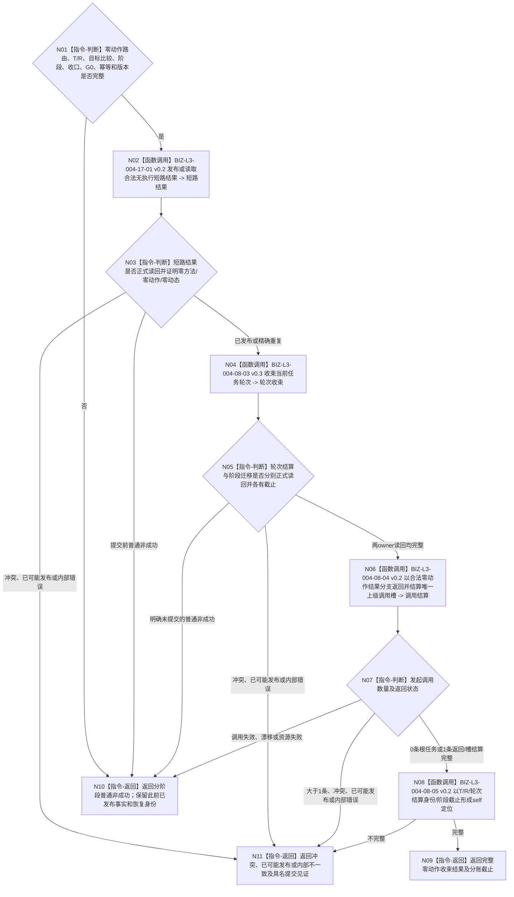

# BIZ-L2-004-17 形成零动作结果并收束当前任务轮次目标函数流程图 v0.2

更新时间：2026-08-27

## 依据与替代

```text
0050、3200、4260、5090、5210、5230、8100
用户2026-08-27裁决：任务结果不是可分配资源；唯一明确上级调用即时返回，其它需求/任务在实际使用时fresh复核
父线程：BIZ-L1-T03 v0.5
前驱：BIZ-L2-004-13 v0.2 的“需要零动作收束”结果
被调图：BIZ-L3-004-17-01 v0.2、BIZ-L3-004-08-03 v0.3、BIZ-L3-004-08-04 v0.2、BIZ-L3-004-08-05 v0.2
```

本图完整替代 v0.1。v0.1 把不同 owner 的写入结果压成一个“共同正式读回截止”，并允许 self 定位承载结果和上级调用结算材料；v0.2 将共同来源截止与各 owner 的提交 / 正式读回截止分账，self 定位只交付显式 `T / R / 轮次结算身份 / G`。

## 身份与边界

用户已裁决的正式目标业务图。函数只处理“任务仍在当前未收束轮次的筹办阶段、实例执行尚未开始、当前目标 fresh 比较已满足”的零动作短路。它先由既有任务结果业务 owner 以与实际执行结果互斥的强类型分支发布并独立读回合法无执行短路结果，再建立并读回任务轮次结算、迁移并读回轮次已收束阶段、处理零或一条正式上级调用，最后形成一份最小 self 轮次结算定位。

合法无执行短路结果不是方法执行事实，不伪造动作完成消息、实例执行结果、预计动态或实际动态；它也不是需求满足结论。唯一明确上级调用可以即时返回并结算该调用槽；其它相关任务或需求只在自身实际使用时 fresh 核算。

当前发布边界：HEAD正式3200/5090仍残留旧“全部T→D一次核算/结果分配”文字，且合法无执行短路分支的ARCH-L4持久DTO与任务结果owner公开写读尚未冻结。用户业务口径高于旧规范，但本图不能据此宣称实现ABI可施工；须先发布规范同步并把该分支并入同一任务结果owner，禁止另建第二结果owner。

## 函数合同

```text
根函数：任务零动作收束提供者::形成合法无执行短路结果并收束当前任务轮次
归属模块 / 文件 / 目标分解深度：任务零动作结果与轮次收束 / 海中鱼巣/领域/内部治理/服务.任务零动作收束.ixx / BIZ-L2
现有或待新增：目标业务组合待新增；HEAD没有合法无执行短路结果生产入口；ARCH-L4任务结果owner的互斥分支DTO与公开写读ABI待正式设计
完整签名：任务零动作收束结果 任务零动作收束提供者::形成合法无执行短路结果并收束当前任务轮次(const 任务零动作收束请求& 请求) noexcept
参数：004-13 v0.2 零动作路由、T/R、fresh目标比较证据、当前阶段/选择/冻结/授权收口材料、共同来源截止G0、运行代次、各owner独立幂等身份和规则版本
返回结果：已收束根任务、已收束且上级调用槽已结算、精确重复、入口拒绝、材料不足、当前性/版本漂移、引用/幂等冲突、资源失败、已可能发布或内部不一致；结构化结果分别承载短路结果、轮次结算、阶段迁移、可选上级调用返回/槽结算和self定位，以及各自正式读回截止或提交见证
被调函数流程图：BIZ-L3-004-17-01 v0.2、BIZ-L3-004-08-03 v0.3、BIZ-L3-004-08-04 v0.2、BIZ-L3-004-08-05 v0.2
线程归属：T03在主阶段治理槽和队列锁外调用；写入只经各事实owner公开入口
```

## 流程图



## 截止与恢复分账

| 阶段 | 正式结果 | 截止 / 见证 | 后段失败时 |
| --- | --- | --- | --- |
| 任务结果 owner（合法无执行短路互斥分支） | 合法无执行短路结果 | `G短路结果` 或短路结果提交见证 | 不撤销；原键恢复 |
| task owner | 任务轮次结算 | `G任务结算` 或轮次结算提交见证 | 不撤销短路结果或结算；原键恢复 |
| ARCH-L2 阶段 owner | 轮次已收束阶段迁移 | `G阶段` 或阶段提交见证 | 不回滚任务轮次结算；原键恢复 |
| 调用返回 / 调用槽 owner | 可选上级调用返回与槽结算 | 各自正式截止或提交见证 | 不重做子任务动作、短路结果或轮次收束 |
| self 定位 | 值式 `T/R/轮次结算身份/G阶段` | 邮箱发布序号由 004-14 产生 | 不携带前述事实正文 |

## 关键边界

- `G0` 只冻结本次来源读取；不同 owner 紧邻写入前取得自己的当前代次并返回自己的正式读回截止，禁止要求所有提交截止相等。
- 形成短路结果后仍必须完成本轮必要验证 / 归因适用性收口、冻结 / 授权退出、运行停止、轮次结算和阶段迁移；后段失败不得把已经发布的前段事实伪装成零写或回滚。
- 只按子任务轮次读取正式 `0..1` 条发起调用。零条是根任务；一条即时返回并结算唯一上级调用槽；多条为引用冲突。
- 上级调用返回只唤醒上级任务在使用时 fresh 复核，不直接写上级目标满足；不得扫描或批量结算其它相关任务 / 需求。
- self 定位不携带短路结果、阶段证据、执行轮次、实例、调用结算或其它事实正文。
- 合法无执行短路结果与正式实际执行结果属于同一任务结果业务owner的互斥分支；不得因为物理组合器独立而建立第二持久owner或第二“任务结果当前”权威。
- 新合同不得产生旧`许可拒绝`；旧数值只供历史ABI和持久材料解码。

## 当前代码实现对照

- HEAD 无合法无执行短路结果 DTO、owner 入口或 T03 生产调用。
- 现有结果上行链只接受筹办 / 执行工作定位；把零动作伪装成执行定位会要求不存在的完成消息、动作顺序和权威动作后结果。
- 本图是必要业务能力，不证明代码已实现；正式规范同步和同一任务结果owner互斥分支ABI是施工前门禁。
