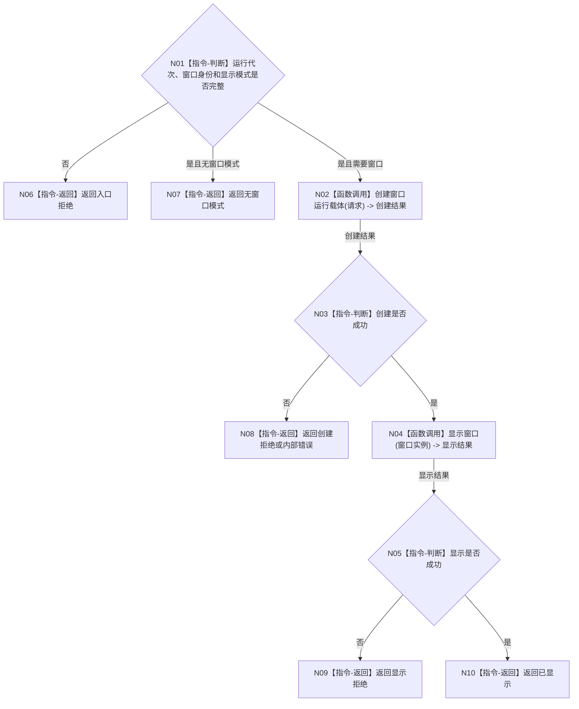

# BIZ-L2-005-01 创建并显示控制面板窗口目标函数流程图 v0.1

更新时间：2026-08-03

## 依据

```text
8110、8120；父函数 BIZ-L1-T05
当前代码：海中鱼巣/界面/控制面板窗口.h、控制面板窗口.cpp
```

## 身份与边界

正式目标函数设计图。根函数只建立控制面板运行载体，不读取或写入业务事实。

## 函数合同

```text
根函数：创建并显示控制面板窗口
归属模块 / 文件 / 层级：控制面板窗口 / 海中鱼巣/界面/控制面板窗口.cpp / L2
现有或待新增：适配扩展；复用现有 Win32/WebView2 窗口实现，补值式结构化结果
完整签名：控制面板窗口创建结果 控制面板窗口端口::创建并显示控制面板窗口(const 控制面板窗口创建请求& 请求)
参数：请求：const 控制面板窗口创建请求&，只读借用；包含运行代次、窗口实例稳定身份、显示模式和宿主句柄材料，身份与模式必须有效
返回结果：控制面板窗口创建结果；包含已显示、无窗口模式、创建拒绝、显示拒绝或内部错误，以及窗口实例稳定身份和可选本地句柄诊断值
被调函数流程图：BIZ-L3-005-01-01 创建窗口运行载体；BIZ-L3-005-01-02 显示窗口
```

## 流程图



## 节点合同

| 节点 | 类型 | 输入绑定 | 输出绑定 | 事实读写 | 验证 |
| --- | --- | --- | --- | --- | --- |
| N02 | 函数调用 | 创建请求 | 窗口实例 | 只建立 UI 运行载体 | 重复创建、句柄失败 |
| N04 | 函数调用 | 窗口实例 | 显示结果 | 人读界面副作用 | 显示失败隔离 |

## 关键边界

- 本函数成功只证明窗口载体可用，不证明任何业务服务或业务事实成立。
- 本地窗口句柄只作进程内诊断和调用材料，不是跨线程机器身份。
