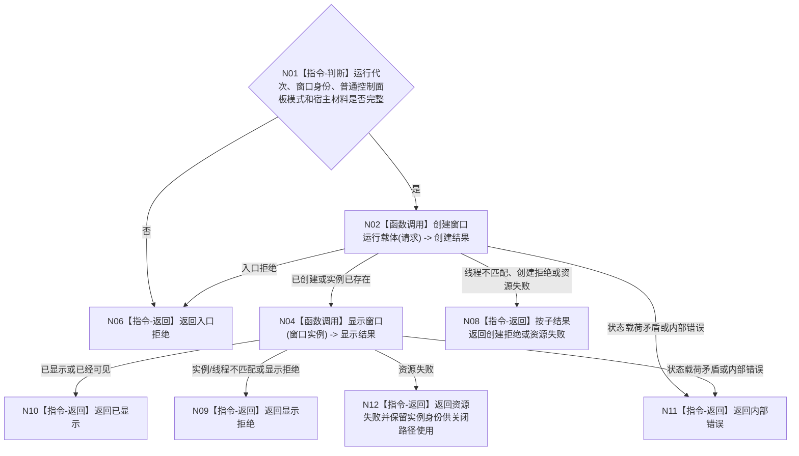

# BIZ-L2-005-01 创建并显示控制面板窗口目标函数流程图 v0.2

更新时间：2026-08-28

## 依据

```text
8110 v0.3、8120 v0.10；父函数 BIZ-L1-T05 v0.5
发布源码证据基线 `472914a8`：不存在控制面板线程、窗口或界面目录生产实现；普通控制面板模式仍运行无窗口宿主
```

## 身份与边界

正式目标函数设计图。根函数只建立控制面板运行载体，不读取或写入业务事实。

## 函数合同

```text
根函数：创建并显示控制面板窗口
归属模块 / 文件 / 目标分解深度：控制面板窗口 / 物理模块与文件待窗口宿主及内容技术详细设计冻结 / BIZ-L2
现有或待新增：待新增；发布源码只有按模式启动的bool空壳，无可复用窗口、内容呈现或交互实现，平台API只属于未来叶子边界
候选签名（非ABI冻结）：控制面板窗口创建结果 控制面板窗口端口::创建并显示控制面板窗口(const 控制面板窗口创建请求& 请求) noexcept
参数：请求：const 控制面板窗口创建请求&，只读借用；包含运行代次、窗口实例稳定身份、普通控制面板模式和宿主材料，身份与模式必须有效；无窗口模式不会创建T05
返回结果：控制面板窗口创建结果；包含已显示、入口拒绝、创建拒绝、显示拒绝、资源失败或内部错误，以及窗口实例稳定身份和可选本地句柄诊断值
被调函数流程图：BIZ-L3-005-01-01 创建窗口运行载体；BIZ-L3-005-01-02 显示窗口；二者不再预拆未选平台BIZ-L4叶
```

## 流程图



## 节点合同

| 节点 | 类型 | 输入绑定 | 输出绑定 | 事实读写 | 验证 |
| --- | --- | --- | --- | --- | --- |
| N02 | 函数调用 | 创建请求 | 窗口实例 | 只建立 UI 运行载体 | 重复创建、句柄失败 |
| N04 | 函数调用 | 窗口实例 | 显示结果 | 人读界面副作用 | 显示失败隔离 |

## 关键边界

- 无窗口常驻模式由BIZ-L2-001-09返回无需启动，不进入本函数，也不创建隐藏窗口。
- 本函数成功只证明窗口载体可用，不证明任何业务服务或业务事实成立。
- 本地窗口句柄只作进程内诊断和调用材料，不是跨线程机器身份。
- 8120没有冻结WebView、HTML或原生控件等内容技术；本函数只能消费后继详细设计明确选择的单一适配实现，不能把候选技术写成业务前置。
- 窗口类注册、宿主窗口API和内容资源组只是旧候选技术分解，现从正式目标子树退出；详细设计选择单一窗口/内容技术后再决定真实项目函数边界。
