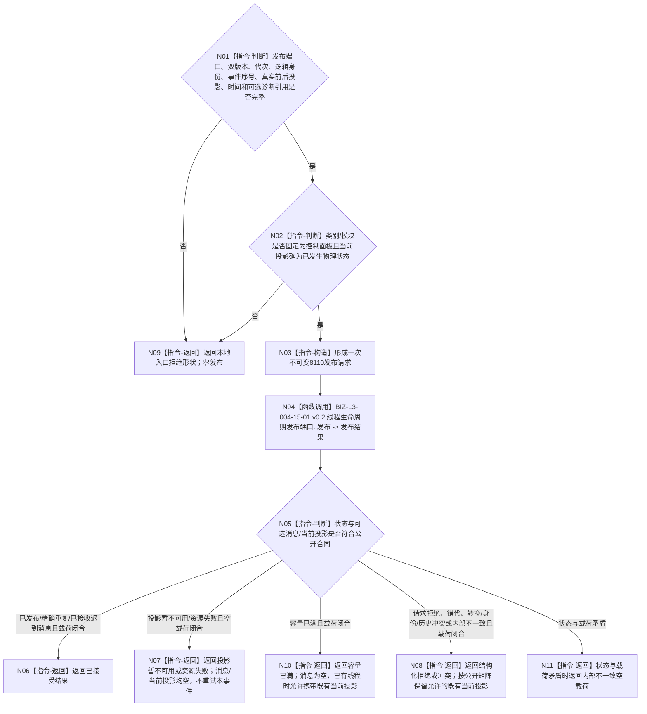

# BIZ-L2-005-02 报告一次控制面板线程生命周期投影目标函数流程图 v0.2

更新时间：2026-08-27

## 依据

```text
4050、8110 v0.3；条件父函数 BIZ-L1-T05 v0.5（仅独立T05拓扑）
复用BIZ-L3-004-15-01 v0.2唯一线程生命周期发布provider
HEAD 92e8b492：线程生命周期发布端口、唯一消息账/当前投影事务已实现；控制面板线程与适配调用未实现
```

## 身份与边界

正式目标函数设计图。根函数把T05已经真实发生的一次创建后生命周期变化，组成一条8110发布请求并恰一次调用唯一线程生命周期发布端口。它适用于运行中、等待、停止请求中、收尾中、退出前、已退出、故障或异常退出，不替T05决定尚未发生的物理状态。

## 函数合同

```text
根函数：控制面板线程::报告一次生命周期投影
归属模块 / 文件 / 目标分解深度：控制面板线程私有生命周期适配 / 海中鱼巣/线程/控制面板线程.ixx / BIZ-L2
现有或待新增：待适配；复用已发布线程生命周期发布端口，不新建消息形成器、消息队列或桥内重试槽
完整签名：线程生命周期发布结果 控制面板线程::报告一次生命周期投影(const 控制面板线程生命周期报告请求& 请求) noexcept
参数：请求携带合同/消息版本、运行代次、线程逻辑身份、非零事件序号、可选非零系统线程身份、真实前一投影、真实当前投影、非零发生时间、原因键字段和可选有效诊断引用；类别/模块固定为控制面板；原因键0是现行公开ABI允许值，本适配器不得改写或拒绝
返回结果：本地前置拒绝返回公开请求拒绝形状；实际调用后原样保留线程生命周期发布结果。已发布、精确重复和已接收迟到消息表示已接受；容量已满或冲突类状态按provider公开合同可携带既有当前投影，其它状态同样保持公开分账；不携带业务结果或待重发材料
被调函数流程图：复用BIZ-L3-004-15-01 v0.2 线程生命周期发布端口::发布
```

## 流程图



## 节点合同

| 节点 | 类型 | 输入绑定 | 输出绑定 | 事实读写 | 验证 |
| --- | --- | --- | --- | --- | --- |
| N01—N03 | 判断/构造 | 已发生T05物理事件 | 一次8110请求 | 无业务写入 | 双版本、事件序号、真实前后态 |
| N04/N05 | 函数调用/判断 | 生命周期发布请求 | 原样公开结果 | 只写唯一线程投影provider | 重复、迟到、满载、冲突 |

## 关键边界

- 线程创建者负责创建事件；T05只报告进入后的真实变化。内部启动/完成见证与8110投影分账。
- 生命周期发布失败不阻塞UI资源保护，不重写事件序号，不反向补写业务事实，也不自动升级为程序致命故障。
- 窗口创建或显示失败可以形成故障投影，但不形成任务失败、需求缺口或程序崩溃事实。
- 未接受事件只留下序号缺口；本薄适配不建立第二队列或重试槽。后继事件继续携带真实物理前态，是否因历史缺口成为前置不完整只由唯一provider裁决。
