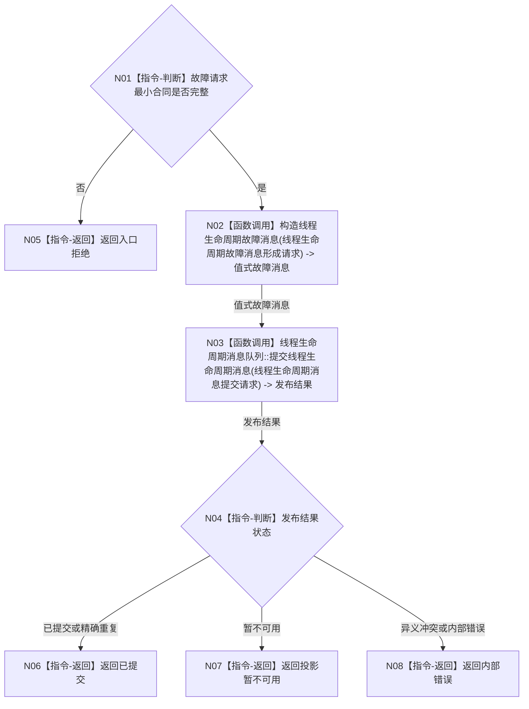

# BIZ-L2-005-02 提交控制面板线程故障消息目标函数流程图 v0.1

更新时间：2026-08-03

## 依据

```text
8110；父函数 BIZ-L1-T05
```

## 身份与边界

正式目标函数设计图。根函数发布纯线程生命周期故障材料，不推导业务失败。

## 函数合同

```text
根函数：提交控制面板线程故障消息
归属模块 / 文件 / 层级：线程生命周期上报 / 海中鱼巣/线程/上报.线程生命周期.ixx / L2
现有或待新增：待新增；与 BIZ-L2-004-15 共用 8110 生命周期发布基座
完整签名：线程故障材料提交结果 线程生命周期上报器::提交控制面板线程故障消息(const 控制面板线程故障提交请求& 请求)
参数：请求：const 控制面板线程故障提交请求&，只读借用；包含消息身份、运行代次、线程逻辑身份、发生时间、原因键和可选窗口诊断引用
返回结果：线程故障材料提交结果；包含已提交、精确重复、入口拒绝、投影暂不可用或内部错误
被调函数流程图：复用BIZ-L3-004-15-01 构造线程生命周期故障消息；复用BIZ-L3-004-15-02 线程生命周期消息队列::提交线程生命周期消息
```

## 流程图



## 节点合同

| 节点 | 类型 | 输入绑定 | 输出绑定 | 事实读写 | 验证 |
| --- | --- | --- | --- | --- | --- |
| N02 | 函数调用 | 故障请求 | 8110 消息 | 无业务写入 | 复用通用故障消息合同，字段完整、原因强类型化 |
| N03 | 函数调用 | 生命周期消息 | 发布结果 | 只写线程投影输入 | 重复、满载、冲突 |

## 关键边界

- 窗口创建或显示失败只形成线程故障投影，不形成任务失败、需求缺口或程序崩溃事实。
- 生命周期发布失败不得反向补写业务事实。
