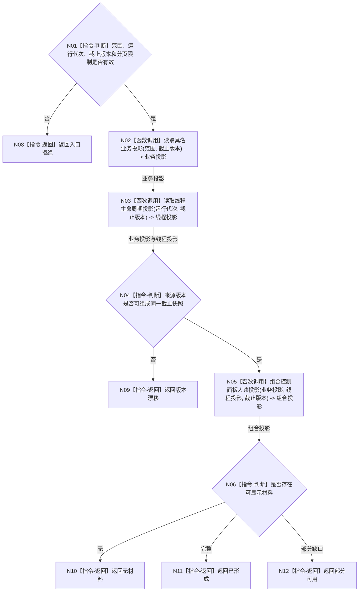

# BIZ-L2-005-03 读取控制面板只读投影目标函数流程图 v0.1

更新时间：2026-08-03

## 依据

```text
4020、4030、8110；父函数 BIZ-L1-T05
当前代码：海中鱼巣/领域/控制面板服务.h
```

## 身份与边界

正式目标函数设计图。根函数在一个截止版本形成值式人读投影，不返回仓库、锁或可写服务引用。

## 函数合同

```text
根函数：读取控制面板只读投影
归属模块 / 文件 / 层级：控制面板投影服务 / 海中鱼巣/领域/控制面板服务.h / L2
现有或待新增：适配扩展；复用按需读取能力，补同代次截止版本和结构化缺口
完整签名：控制面板只读投影结果 控制面板投影服务::读取控制面板只读投影(const 控制面板只读投影请求& 请求) const
参数：请求：const 控制面板只读投影请求&，只读借用；包含运行代次、投影范围、截止版本和分页限制，范围必须具名且限制非零
返回结果：控制面板只读投影结果；包含已形成、部分可用、无材料、版本漂移、入口拒绝或内部错误，以及值式业务摘要、线程投影和缺口组
被调函数流程图：BIZ-L3-005-03-01 读取具名业务投影；BIZ-L3-005-03-02 读取线程生命周期投影；BIZ-L3-005-03-03 组合控制面板人读投影
```

## 流程图



## 节点合同

| 节点 | 类型 | 输入绑定 | 输出绑定 | 事实读写 | 验证 |
| --- | --- | --- | --- | --- | --- |
| N02/N03 | 函数调用 | 具名范围和同一截止版本 | 值式来源投影 | 只读 | 并发发布、来源缺失 |
| N05 | 函数调用 | 两类值式投影和截止版本 | 人读组合投影 | 无写入 | 不补造缺失业务事实 |

## 关键边界

- 投影缺失、迟到或部分可用不改变权威业务事实，也不能作为业务拒绝依据。
- SQL、日志、页面缓存若参与，只能作为非权威人读材料来源。
- 本函数没有业务写入口；投影字段即使由用户编辑，也只能形成新的正式请求材料，不能直接覆盖来源事实。
