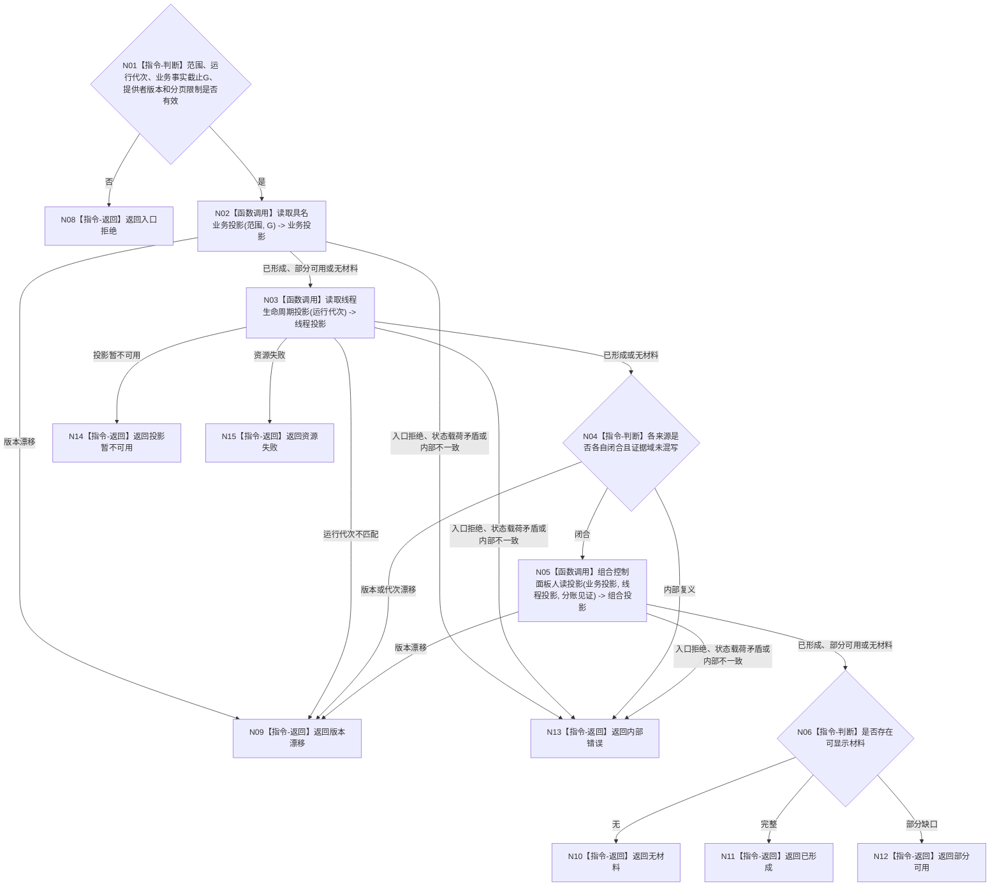

# BIZ-L2-005-03 读取控制面板只读投影目标函数流程图 v0.2

更新时间：2026-08-27

## 依据

```text
4020、4030、8110 v0.3、8120 v0.10；父函数 BIZ-L1-T05 v0.4
HEAD d8a692af：控制面板投影服务不存在；线程生命周期读取端口已发布
```

## 身份与边界

正式目标函数设计图。根函数读取带事实截止的具名业务投影和当前线程生命周期投影，再形成带分账来源见证的值式人读投影；不返回仓库、锁或可写服务引用，不声称跨证据域同截止。

## 函数合同

```text
根函数：读取控制面板只读投影
归属模块 / 文件 / 层级：控制面板投影服务 / 海中鱼巣/领域/控制面板服务.h / L2
现有或待新增：待新增组合器；具名业务读取提供者需逐项冻结，线程部分直接复用已发布读取端口
完整签名：控制面板只读投影结果 控制面板投影服务::读取控制面板只读投影(const 控制面板只读投影请求& 请求) const noexcept
参数：请求：const 控制面板只读投影请求&，只读借用；包含运行代次、具名业务投影范围、业务事实截止G、提供者版本和分页限制
返回结果：控制面板只读投影结果；包含已形成、部分可用、无材料、版本漂移、投影暂不可用、资源失败、入口拒绝或内部错误，以及值式业务摘要、线程当前投影组、缺口组、业务来源截止组和线程当前消息身份组
被调函数流程图：BIZ-L3-005-03-01 读取具名业务投影；BIZ-L3-005-03-02 读取线程生命周期投影；BIZ-L3-005-03-03 组合控制面板人读投影
```

## 流程图



## 节点合同

| 节点 | 类型 | 输入绑定 | 输出绑定 | 事实读写 | 验证 |
| --- | --- | --- | --- | --- | --- |
| N02/N03 | 函数调用 | 具名业务范围/G与线程运行代次 | 两个证据域的值式来源投影 | 只读 | 并发发布、来源缺失、错代 |
| N05 | 函数调用 | 两类值式投影和截止版本 | 人读组合投影 | 无写入 | 不补造缺失业务事实 |

## 关键边界

- 业务事实截止G只约束具名业务provider；线程投影只按运行代次读取当前组并保留逐项当前消息身份。二者不得比较数值、冒充共同事务或共同截止。
- 投影缺失、迟到或部分可用不改变权威业务事实，也不能作为业务拒绝依据。
- SQL、日志、页面缓存若参与，只能作为非权威人读材料来源。
- 本函数没有业务写入口；投影字段即使由用户编辑，也只能形成新的正式请求材料，不能直接覆盖来源事实。
