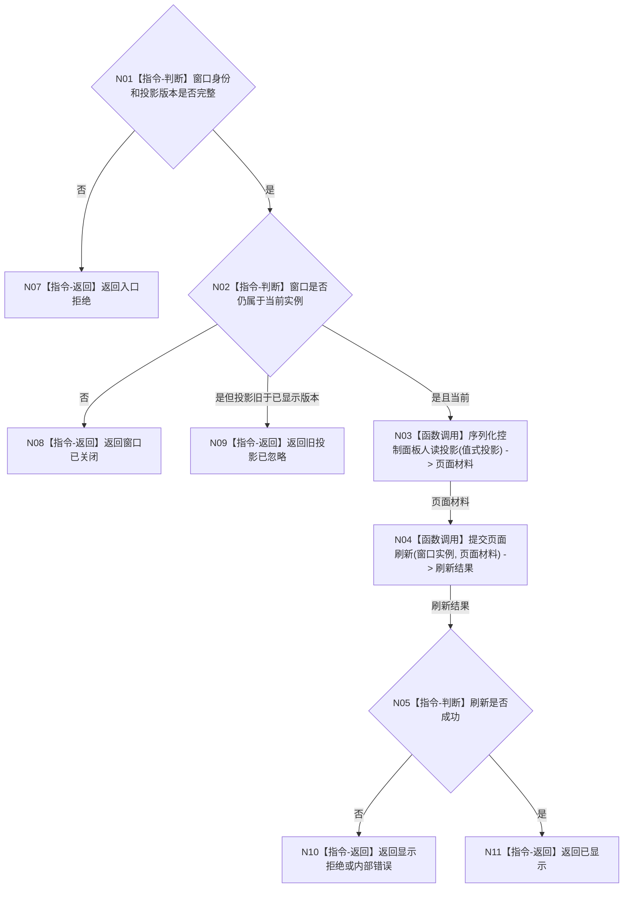

# BIZ-L2-005-04 显示只读投影目标函数流程图 v0.1

更新时间：2026-08-03

## 依据

```text
8110、8120；父函数 BIZ-L1-T05
当前代码：海中鱼巣/界面/控制面板窗口.cpp
```

## 身份与边界

正式目标函数设计图。根函数只把值式投影交给窗口显示，不解析显示文本形成机器裁决。

## 函数合同

```text
根函数：显示只读投影
归属模块 / 文件 / 层级：控制面板窗口 / 海中鱼巣/界面/控制面板窗口.cpp / L2
现有或待新增：适配扩展；复用现有页面刷新能力，补投影版本和窗口实例校验
完整签名：控制面板显示结果 控制面板窗口端口::显示只读投影(const 控制面板显示请求& 请求)
参数：请求：const 控制面板显示请求&，只读借用；包含窗口实例身份、投影版本和值式投影，调用期有效
返回结果：控制面板显示结果；包含已显示、窗口已关闭、旧投影已忽略、显示拒绝或内部错误
被调函数流程图：BIZ-L3-005-04-01 序列化控制面板人读投影；BIZ-L3-005-04-02 提交控制面板页面刷新
```

## 流程图



## 节点合同

| 节点 | 类型 | 输入绑定 | 输出绑定 | 事实读写 | 验证 |
| --- | --- | --- | --- | --- | --- |
| N03 | 函数调用 | 值式投影 | 页面材料 | 人读转换 | 特殊字符、空投影 |
| N04 | 函数调用 | 窗口实例和页面材料 | 刷新结果 | 仅 UI 副作用 | 关闭竞争、刷新失败 |

## 关键边界

- 页面材料和显示版本不是业务事实版本，也不得回写业务服务。
- 显示失败不撤销已发布业务事实。
- 页面交互不得把显示模型变成可写业务模型；任何业务意图必须重新构造正式请求并交给对应入口裁决。
