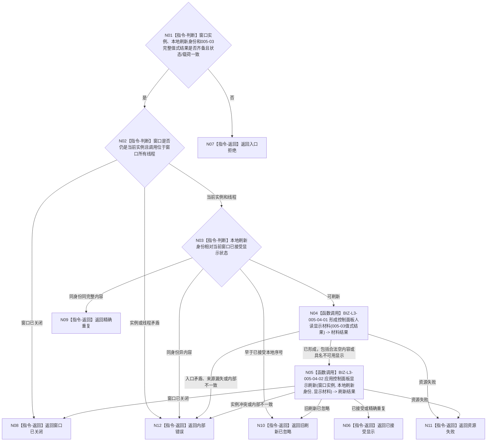

# BIZ-L2-005-04 显示只读投影目标函数流程图 v0.2

更新时间：2026-08-28

## 依据

```text
4020、8110 v0.3、8120 v0.10；父函数 BIZ-L1-T05 v0.5
BIZ-L2-005-01 v0.2、BIZ-L2-005-03 v0.2
HEAD 4a8972db：不存在控制面板窗口、内容适配或显示刷新生产实现
```

## 身份与边界

正式目标职责图。根函数只把 BIZ-L2-005-03 返回的值式人读投影或具名不可用状态交给当前窗口的单一内容适配端口，不读取、补齐或重新裁决业务事实。

8120只把控制面板窗口运行交给程序宿主，没有选择 WebView、HTML、原生控件、页面模型、同步渲染或异步消息投递。005-03 的业务 provider 集合、强类型读取键、版本、状态 / 载荷和必要分页 ABI 仍待详细设计冻结，因此本图只能冻结显示职责、窗口实例隔离和本地刷新顺序；请求 / 结果 DTO 与最终签名尚不可施工。

## 函数合同

```text
根函数：控制面板窗口端口::显示只读投影
归属模块 / 文件 / 目标分解深度：控制面板窗口 / 具体文件待内容技术详细设计选择 / BIZ-L2
现有或待新增：待新增；职责已冻结，最终 ABI 依赖 BIZ-L2-005-03 输出合同和 BIZ-L2-005-01 选定的单一内容适配端口
候选签名（非ABI冻结）：控制面板显示结果 控制面板窗口端口::显示只读投影(const 控制面板显示请求& 请求) noexcept
参数最低职责：当前窗口实例身份、本地显示刷新身份或序号、005-03 完整值式结果；不得拆散后由显示层补造业务 / 线程来源见证
返回结果最低分类：已接受显示、精确重复、旧刷新已忽略、窗口已关闭、入口拒绝、资源失败、内部错误
被调目标：BIZ-L3-005-04-01 形成控制面板人读显示材料；BIZ-L3-005-04-02 应用控制面板显示刷新
施工门禁：005-03 最终输出 ABI 与 005-01 单一内容适配技术均已在详细设计冻结
```

## 流程图



## 节点合同

| 节点 | 类型 | 参数 / 输入绑定 | 结果 / 输出绑定 | 事实读写 | 后继条件 | 验证 |
| --- | --- | --- | --- | --- | --- | --- |
| N01—N03 | 指令 | 窗口实例、本地刷新身份、005-03完整结果 | 当前、重复、旧、关闭或错误 | 只读进程内窗口状态 | 分类完成 | 状态 / 载荷矛盾、同键异义、关闭竞争 |
| N04 | 函数调用 | 005-03完整值式结果原样传入 | 人读显示材料结果 | 纯表示转换 | 具名结果 | 完整/部分/空/不可用输入均不补造业务事实 |
| N05 | 函数调用 | 当前实例、本地刷新身份、不可变显示材料 | 刷新结果 | 只写进程内显示状态和 UI 资源 | 具名结果 | 重复、乱序、关闭、资源失败 |

## 状态与显示边界

- 005-03 的完整或部分人读投影可形成显示材料；合法空投影形成明确空态，不作为入口拒绝。
- 005-03 的未找到、暂不可用或其它允许展示的具名非成功只能显示同名不可用状态；显示层不得从旧缓存、默认值或其它 provider 补成当前事实。
- 旧显示材料可以明确标记为历史显示，但不得冒充当前。业务事实截止与线程当前消息身份分别展示，不得比较两者数值来裁决新旧。
- “已接受显示”只证明单一内容适配端口已经拥有或复制本次不可变材料；不证明像素已绘制、用户已看到、业务事实正确或业务闭环完成。
- 同步、异步、队列、回调和平台消息均由后继详细设计在选定内容技术后决定；目标图不预选 `PostMessage`、HTML 或任何页面运行环境。
- 显示文本、颜色、排序、折叠、布局、摘要、缓存和控件状态均不取得机器语义，不得被业务入口反向解析。

## 当前实现与施工门禁

| 项目 | HEAD 事实 | 裁决 |
| --- | --- | --- |
| 控制面板窗口与内容端口 | 不存在生产文件或公开入口 | 未实现 |
| 005-03线程投影读取叶 | 8110当前组读取 provider 已发布 | 可复用底层；不等于005-03组合结果已冻结 |
| 005-03业务投影链 | provider集合、逐项键、版本和状态 / 载荷 ABI 未冻结 | 本函数最终输入合同被阻断 |
| 内容技术 | 8120未选择 WebView、HTML、原生控件或其它实现 | 由后继详细设计选择一个适配实现 |

本图完成的是目标职责校正，不是可执行详细设计、代码实现或显示验收。

逐项投影转换器不是已冻结业务叶；005-03输出联合和内容技术未确定前，本层不得预建通用项分派或字符串/HTML转换器。
