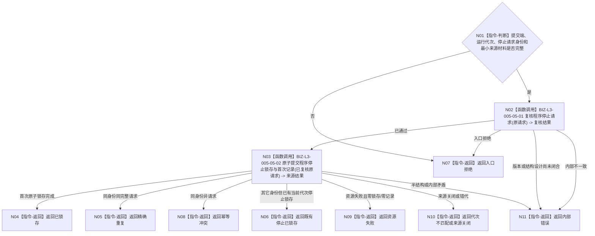

# BIZ-L2-005-05 提交程序控制消息目标函数流程图 v0.2

更新时间：2026-08-27

## 依据

```text
4050、8100 v0.7、8120 v0.10；父函数 BIZ-L1-T05 v0.5
BIZ-L2-001-02 v0.2、BIZ-L2-001-10 v0.1
HEAD 67e08bf5：只有进程停止信号租约；程序控制来源、提交端和读取端均不存在
```

## 身份与边界

正式目标职责图。根目标只向 BIZ-L2-001-02 为本运行代次创建的同一程序控制来源提交一份强类型程序停止请求；它不创建第二邮箱、不直接锁存 T01 停止阶段、不停止任何线程，也不写任务、需求、世界或价值事实。

现行目标只允许“请求程序停止”，没有第二种控制动作。因此不需要可扩展控制类型枚举、通用业务载荷、规范化消息或“控制隔离见证”。停止来源必须在一次短临界区内原子形成不可变首次记录及其当前停止锁存；通知只负责唤醒 BIZ-L2-001-10，不能成为停止请求权威或提交成功条件。

BIZ-L2-001-02 已明确完整 DTO、枚举值和专属版本仍待详细设计冻结；本图只冻结职责、幂等优先序、原子副作用和非破坏性读回边界，不把候选字段或容量写成已发布 ABI。

## 函数合同

```text
根目标：向程序控制停止来源提交不可变停止请求
归属模块 / 文件 / 目标分解深度：程序控制来源 / 物理模块待停止来源详细设计统一选择 / BIZ-L2
现有或待新增：待新增；必须复用001-02交付给T01和T05的同一来源拥有体
候选签名：程序停止请求提交结果 程序控制提交端口::提交程序停止请求(const 程序停止请求提交请求& 请求) noexcept
参数最低职责：非零运行代次、停止请求稳定身份、来源逻辑身份及由详细设计冻结的最小诊断材料；原完整请求在资源失败时重试
返回结果最低分类：已锁存、精确重复、既有停止已锁存、入口拒绝、代次不匹配、来源关闭、幂等冲突、资源失败、内部错误
被调目标：BIZ-L3-005-05-01 复核程序停止请求；BIZ-L3-005-05-02 原子提交程序停止锁存与首次记录
异步消费者：BIZ-L2-001-10 只经同一来源读取端非破坏性重读锁存及首次记录
施工门禁：001-02/001-10与本链共享的停止来源DTO、租约分面、版本和关闭语义已在同一详细设计冻结
```

## 流程图



## 节点合同

| 节点 | 类型 | 参数 / 输入绑定 | 结果 / 输出绑定 | 事实读写 | 后继条件 | 验证 |
| --- | --- | --- | --- | --- | --- | --- |
| N01/N02 | 指令/函数调用 | 同一原完整停止请求 | 已通过或具名非成功 | 纯值复核 | 复核完成 | 零代次、错来源、坏身份、未知字段 |
| N03 | 函数调用 | 已复核原完整请求 | 当前锁存与首次记录结果 | 只写同一程序控制来源 | 具名结果 | 首次、精确重复、同键异义、既有锁存、资源失败 |
| N04—N11 | 返回 | 来源结果 | 薄映射结果 | 无新增副作用 | 终止 | 不把唤醒、日志或T01阶段误报为提交结果 |

## 幂等与原子边界

- 判定顺序固定为：同身份同完整请求精确重复；同身份异请求幂等冲突；其它身份遇到既有当前代次锁存返回既有停止已锁存；否则才允许首次提交。
- 首次提交必须在同一来源短临界区内同时形成不可变首次记录和当前停止锁存。二者不能先后对外可见，也不能只形成通知或队列项。
- 资源失败只允许发生在原子锁存前，并保证锁存、首次记录和幂等结果均未形成；调用方保留同一原完整请求重试。
- 原子锁存完成后，唤醒通知失败、延迟或合并都不得撤销或降级已锁存结果；BIZ-L2-001-10 通过有界等待和非破坏性正式重读收敛。
- 读取端不得出队、删除或仅凭通知判断停止；重复观察必须返回同一当前代次锁存及同一首次记录。

## 关键边界

- T05 的停止按钮和窗口关闭只能形成停止请求，不能直接停止 T02—T06、修改线程生命周期投影或调用进程退出。
- “已锁存”只证明程序控制来源成立；T01 仍须把它与其它停止来源验真后，唯一锁存宿主停止阶段并按 BIZ-L0-03 分阶段收口。
- 程序控制来源在无窗口模式仍由001-02创建，允许其它后继正式宿主管理入口使用；T05不是邮箱 owner。
- 来源身份、诊断原因、时间、版本、容量、租约分面和关闭矩阵均须由同一详细设计与001-02/001-10一次冻结；当前图不擅自指定。
- 本图不是通用程序命令总线；新增暂停、重启或其它控制动作必须另有正式目标和合同，不能复用“控制类型”枚举偷渡。

本图完成的是停止提交职责校正，不是可执行详细设计、代码实现或程序停止验收。
