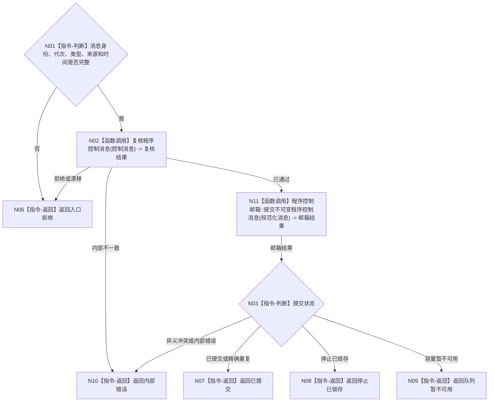

# BIZ-L2-005-05 提交程序控制消息目标函数流程图 v0.2

更新时间：2026-08-27

## 依据

```text
4050、8120 v0.10；父函数 BIZ-L1-T05 v0.4，异步后继 BIZ-L2-001-10
HEAD d8a692af：只有进程信号租约；程序控制协议和邮箱均不存在
```

## 身份与边界

正式目标函数设计图。根函数只发布程序级控制意图；是否进入停止阶段由程序宿主裁决。

## 函数合同

```text
根函数：提交程序控制消息
归属模块 / 文件 / 层级：程序控制消息桥 / 海中鱼巣/线程/程序控制消息桥.ixx / L2
现有或待新增：待新增；程序控制邮箱与进程信号是两个独立停止来源，不适配或改写停止信号租约
完整签名：程序控制消息提交结果 程序控制消息桥::提交程序控制消息(const 程序控制消息提交请求& 请求) noexcept
参数：请求：const 程序控制消息提交请求&，只读借用；包含消息身份、运行代次、控制类型、来源线程、发生时间和原因键；当前只允许请求停止
返回结果：程序控制消息提交结果；包含已提交、精确重复、入口拒绝、队列暂不可用、停止已锁存或内部错误
被调函数流程图：BIZ-L3-005-05-01 复核程序控制消息；BIZ-L3-005-05-02 提交不可变程序控制消息
```

## 流程图



## 节点合同

| 节点 | 类型 | 输入绑定 | 输出绑定 | 事实读写 | 验证 |
| --- | --- | --- | --- | --- | --- |
| N02 | 函数调用 | 值式程序控制消息 | 规范化消息与隔离见证 | 无写入 | 类型、版本和业务隔离 |
| N11 | 函数调用 | 规范化不可变消息 | 邮箱结果 | 只写程序控制邮箱 | 重复、满载、停止竞争 |

## 关键边界

- UI 只能请求程序停止，不能直接停止业务线程、修改任务状态或伪造生存控制结果。
- 消息提交成功不等于程序已经停止。
- 同一用户停止意图在暂不可用时保留原消息身份重试；停止已锁存是程序宿主控制状态，不是另一个业务事实。
