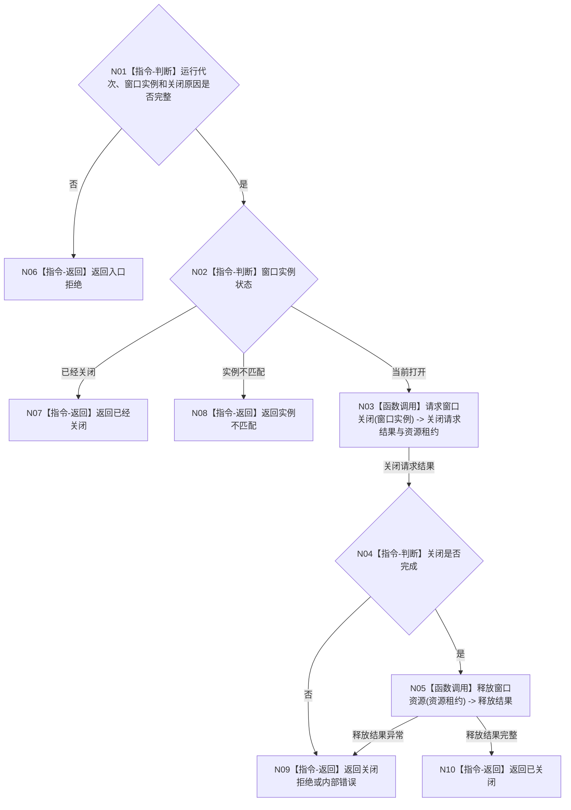

# BIZ-L2-005-06 关闭控制面板窗口目标函数流程图 v0.1

更新时间：2026-08-03

## 依据

```text
8110、8120；父函数 BIZ-L1-T05
当前代码：海中鱼巣/界面/控制面板窗口.cpp
```

## 身份与边界

正式目标函数设计图。根函数只收口本窗口实例，不负责停止其它线程。

## 函数合同

```text
根函数：关闭控制面板窗口
归属模块 / 文件 / 层级：控制面板窗口 / 海中鱼巣/界面/控制面板窗口.cpp / L2
现有或待新增：适配扩展；复用现有窗口关闭能力，补实例身份和幂等结果
完整签名：控制面板窗口关闭结果 控制面板窗口端口::关闭控制面板窗口(const 控制面板窗口关闭请求& 请求)
参数：请求：const 控制面板窗口关闭请求&，只读借用；包含运行代次、窗口实例身份和关闭原因
返回结果：控制面板窗口关闭结果；包含已关闭、已经关闭、实例不匹配、关闭拒绝或内部错误
被调函数流程图：BIZ-L3-005-06-01 请求控制面板窗口关闭；BIZ-L3-005-06-02 释放控制面板窗口资源
```

## 流程图



## 节点合同

| 节点 | 类型 | 输入绑定 | 输出绑定 | 事实读写 | 验证 |
| --- | --- | --- | --- | --- | --- |
| N03/N05 | 函数调用 | 当前窗口实例 | 关闭和释放结果 | 仅 UI 资源 | 重复关闭、部分初始化、异常退出 |

## 关键边界

- 窗口关闭不等于普通宿主停止完成；程序停止阶段仍由 T01 收口。
- 资源释放失败只形成线程诊断，不改变业务完成状态。
