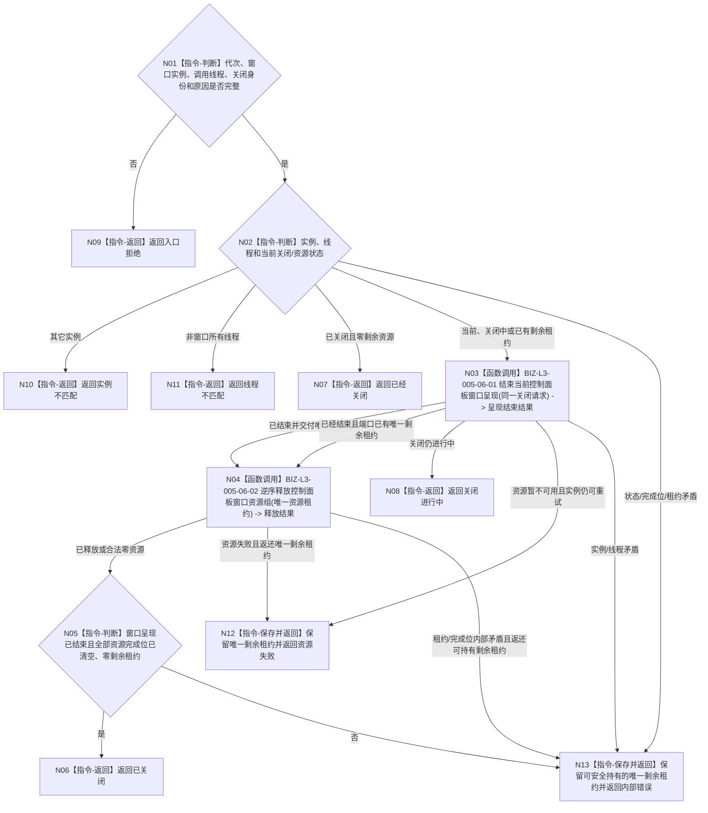

# BIZ-L2-005-06 关闭控制面板窗口目标函数流程图 v0.2

更新时间：2026-08-27

## 依据

```text
8110 v0.3、8120 v0.10；父函数 BIZ-L1-T05 v0.4
BIZ-L2-005-01 v0.2、BIZ-L4-005-01-01-03 v0.2
HEAD 1c13ace8：不存在控制面板窗口、内容适配或资源收口生产实现
```

## 身份与边界

正式目标职责图。根目标只在当前控制面板窗口所有线程上收口指定窗口实例及其唯一资源租约，不停止其它线程、不锁存程序停止阶段，也不写业务事实。

8120没有选择具体窗口和内容技术，因此本图不冻结 `DestroyWindow`、WebView、HTML、原生控件、菜单或平台回调。关闭过程只依赖005-01创建时形成的稳定窗口实例、单一内容适配端口、资源完成位和唯一移动资源租约。

窗口呈现已经结束不等于资源已经完整释放。任何资源收口未完成结果都必须由窗口端口继续持有或随结果返还唯一剩余租约；禁止消费租约、只记诊断并把结果伪装成已关闭。

## 函数合同

```text
根目标：控制面板窗口端口::关闭控制面板窗口
归属模块 / 文件 / 目标分解深度：控制面板窗口 / 具体文件待窗口与内容技术详细设计选择 / BIZ-L2
现有或待新增：待新增；职责已冻结，最终ABI依赖005-01单一窗口/内容适配合同
候选签名：控制面板窗口关闭结果 控制面板窗口端口::关闭控制面板窗口(const 控制面板窗口关闭请求& 请求) noexcept
参数最低职责：运行代次、当前窗口实例身份、调用线程身份、关闭请求身份和最小关闭原因；同一请求用于进行中/资源失败重试
返回结果最低分类：已关闭、已经关闭、关闭进行中、入口拒绝、实例不匹配、线程不匹配、资源失败、内部错误
被调目标：BIZ-L3-005-06-01 结束当前控制面板窗口呈现；BIZ-L3-005-06-02 逆序释放控制面板窗口资源组
施工门禁：005-01选定的窗口/内容适配技术、关闭完成谓词、资源完成位和剩余租约返还ABI已在详细设计冻结
```

## 流程图



## 节点合同

| 节点 | 类型 | 参数 / 输入绑定 | 结果 / 输出绑定 | 事实读写 | 后继条件 | 验证 |
| --- | --- | --- | --- | --- | --- | --- |
| N01/N02 | 指令 | 关闭请求和窗口端口状态 | 准入、当前、进行中、关闭或错误 | 只读进程内窗口状态 | 分类完成 | 错代、错实例、线程亲和、关闭竞争 |
| N03 | 函数调用 | 同一关闭请求 | 呈现结束状态和唯一资源租约 | UI副作用 | 结束、进行中或失败 | 同步/异步适配、重复关闭、平台失败 |
| N04/N05 | 函数调用/判断 | 唯一资源租约 | 释放结果和零剩余证明 | 释放UI资源 | 全部完成或保留剩余 | 部分初始化、释放失败、租约返还 |
| N12/N13 | 指令 | 未完成/矛盾结果 | 结构化非成功与唯一剩余所有权 | 只保存进程内资源租约 | 调用方可重试或诊断 | 零租约遗失、零重复所有者 |

## 关键边界

- 用户关闭窗口路径必须先由005-05可靠形成程序停止请求；宿主正式停止路径不再另造请求。两条路径最终都在T05窗口所有线程调用本目标。
- “关闭进行中”允许所选技术继续处理必要的窗口事件或回调；不得阻塞错误线程、跨线程直接销毁或把请求已投递冒充关闭完成。
- “已关闭”必须同时证明呈现已结束、全部创建完成位清空且零剩余资源租约；仅窗口句柄失效、回调到达或显示不可见都不充分。
- 资源失败可重试同一关闭请求；窗口端口必须持有或结果必须返还唯一剩余租约，不能依赖对象析构、进程退出或日志清理。
- 窗口关闭不等于T05外层wrapper已退出、线程完成见证已发布、其它线程已连接或程序已经结束。
- 关闭/释放失败只影响T05资源与程序结果诊断，不反写任何业务事实；但也不能被降级为已关闭成功。

本图完成的是技术中性关闭职责校正，不是可执行详细设计、代码实现或资源泄漏验收。
